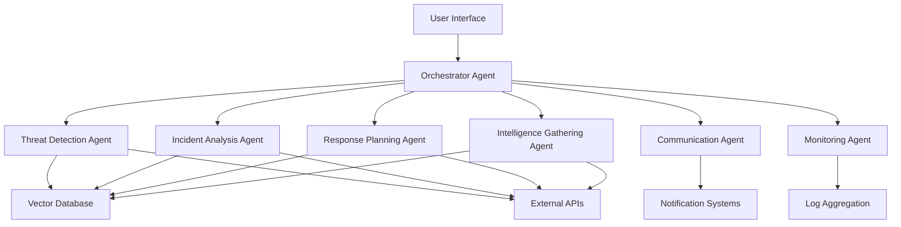

# SOC Nexus - Agent-Based Architecture

## Overview

This implementation transforms the SOC Nexus system into a multi-agent architecture where specialized AI agents collaborate to provide comprehensive security operations center functionality. Each agent has specific responsibilities and can communicate with other agents to achieve complex security tasks.

## Agent-Based Architecture Advantages

### 1. **Modularity & Specialization**
- Each agent specializes in a specific security domain
- Easy to add, remove, or modify individual agents without affecting others
- Clear separation of concerns and responsibilities

### 2. **Scalability**
- Agents can be deployed independently across different infrastructure
- Horizontal scaling by adding more instances of specific agents
- Load distribution across specialized agents

### 3. **Fault Tolerance**
- Individual agent failures don't bring down the entire system
- Redundant agents can be deployed for critical functions
- Graceful degradation when specific agents are unavailable

### 4. **Intelligence & Adaptability**
- Each agent can learn and adapt to its specific domain
- Agents can share knowledge and insights with each other
- Continuous improvement through agent collaboration

### 5. **Real-time Collaboration**
- Agents can work simultaneously on different aspects of security incidents
- Parallel processing of complex security tasks
- Coordinated response to multi-faceted threats

## Agent Architecture



## Agent Responsibilities

### 1. **Orchestrator Agent**
- **Purpose**: Central coordinator for all agent interactions
- **Responsibilities**:
  - Route user requests to appropriate agents
  - Manage agent communication and collaboration
  - Coordinate multi-agent workflows
  - Maintain system state and context
  - Handle agent lifecycle management

### 2. **Threat Detection Agent**
- **Purpose**: Identify and classify security threats
- **Responsibilities**:
  - Analyze security logs and events
  - Detect anomalies and suspicious patterns
  - Classify threat types and severity levels
  - Correlate events across different data sources
  - Generate threat intelligence reports

### 3. **Incident Analysis Agent**
- **Purpose**: Deep analysis of security incidents
- **Responsibilities**:
  - Perform root cause analysis
  - Investigate incident timelines
  - Identify affected systems and data
  - Assess impact and potential damage
  - Generate detailed incident reports

### 4. **Response Planning Agent**
- **Purpose**: Develop and execute response strategies
- **Responsibilities**:
  - Create incident response playbooks
  - Prioritize response actions
  - Coordinate with other agents for execution
  - Monitor response effectiveness
  - Update response strategies based on outcomes

### 5. **Intelligence Gathering Agent**
- **Purpose**: Collect and analyze threat intelligence
- **Responsibilities**:
  - Gather external threat intelligence
  - Monitor threat feeds and sources
  - Analyze threat actor behavior
  - Correlate internal and external intelligence
  - Provide proactive threat insights

### 6. **Communication Agent**
- **Purpose**: Handle all external communications
- **Responsibilities**:
  - Send notifications and alerts
  - Generate status reports
  - Communicate with stakeholders
  - Manage escalation procedures
  - Handle external API integrations

### 7. **Monitoring Agent**
- **Purpose**: Continuous system and security monitoring
- **Responsibilities**:
  - Monitor system health and performance
  - Track security metrics and KPIs
  - Detect system anomalies
  - Generate monitoring reports
  - Alert on critical issues

## Agent Communication Protocol

### Message Format
```typescript
interface AgentMessage {
  id: string;
  timestamp: Date;
  sender: string;
  recipient: string;
  type: 'request' | 'response' | 'notification' | 'error';
  payload: any;
  priority: 'low' | 'medium' | 'high' | 'critical';
  context?: {
    sessionId: string;
    userId: string;
    incidentId?: string;
  };
}
```

### Communication Patterns
1. **Request-Response**: Direct communication between agents
2. **Publish-Subscribe**: Broadcast notifications to interested agents
3. **Event-Driven**: Trigger actions based on system events
4. **Workflow Orchestration**: Sequential agent collaboration

## Implementation Details

### Agent Framework
- Built on React with TypeScript for type safety
- Uses React Context for agent state management
- Implements message passing between agents
- Supports async/await for agent operations

### State Management
- Centralized state store for shared data
- Agent-specific state isolation
- Real-time state synchronization
- Persistent state storage

### Security Considerations
- Agent authentication and authorization
- Secure inter-agent communication
- Audit logging for all agent actions
- Data encryption in transit and at rest

## Deployment Architecture

### Frontend Agents
- Deployed as React components
- Run in the browser environment
- Communicate via WebSocket for real-time updates
- Use local storage for persistence

### Backend Agents
- Deployed as AWS Lambda functions
- Use API Gateway for external communication
- Store data in Aurora Serverless and Pinecone
- Cache frequently accessed data in Redis

### Agent Scaling
- Horizontal scaling for high-demand agents
- Load balancing across agent instances
- Auto-scaling based on workload
- Geographic distribution for global deployments

## Monitoring and Observability

### Agent Metrics
- Response times and throughput
- Error rates and failure modes
- Resource utilization
- Communication patterns

### Health Checks
- Individual agent health monitoring
- System-wide health status
- Dependency health tracking
- Automated recovery procedures

## Future Enhancements

### Machine Learning Integration
- Agent learning from historical data
- Predictive threat detection
- Automated response optimization
- Continuous model improvement

### Advanced Collaboration
- Multi-agent reasoning
- Consensus building
- Conflict resolution
- Knowledge sharing

### Edge Computing
- Agent deployment at network edges
- Local threat detection
- Reduced latency
- Offline capabilities
