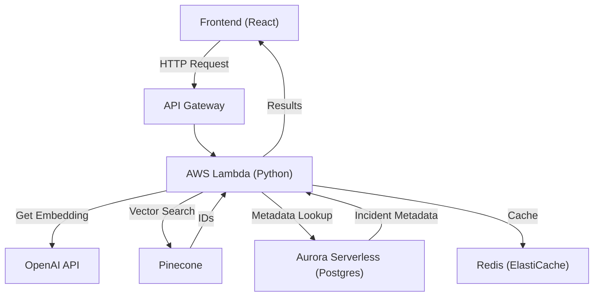

# Migration Notice

The backend is being re-implemented using AWS Lambda (Python), Pinecone (vector database), Aurora Serverless (Postgres), and Redis (ElastiCache). The following documentation will be updated to reflect the new architecture after implementation.

---

# SOC-AI Portal Architecture (Serverless Backend)

## Overview
The backend is implemented using AWS Lambda (Python), Pinecone (vector database), Aurora Serverless (Postgres), Redis (ElastiCache), and API Gateway. This architecture provides scalable, cost-effective, and high-performance semantic search and incident management.

---

## High-Level Architecture Diagram



---

## Component Responsibilities

- **Frontend (React):** Sends search queries and displays results.
- **API Gateway:** Exposes RESTful endpoints to the frontend.
- **AWS Lambda (Python):**
  - Receives search queries.
  - Checks Redis for cached embeddings/results.
  - Calls OpenAI API for embeddings if not cached.
  - Queries Pinecone for vector similarity search.
  - Fetches incident metadata from Aurora Serverless.
  - Returns results to the frontend.
- **Pinecone:** Stores and searches vector embeddings for semantic similarity.
- **Aurora Serverless (Postgres):** Stores incident metadata.
- **Redis (ElastiCache):** Caches embeddings and search results for performance.
- **OpenAI API:** Generates embeddings for queries and incidents.

---

## Semantic Search Flow

1. **User enters a query** in the frontend.
2. **Frontend** sends the query to the API Gateway endpoint.
3. **API Gateway** routes the request to the Lambda function.
4. **Lambda**:
   - Checks Redis for a cached embedding/result.
   - If not cached, calls OpenAI API to generate the embedding and caches it.
   - Queries Pinecone for similar vectors (incident IDs).
   - Fetches incident metadata from Aurora for those IDs.
   - Returns the results to the frontend.
5. **Frontend** displays the results to the user.

---

## Infrastructure (CloudFormation)
- All resources are provisioned via `backend/cloudformation.yaml`:
  - VPC, subnets, security groups
  - Aurora Serverless (Postgres)
  - ElastiCache (Redis)
  - API Gateway
  - AWS Lambda (Python)
  - IAM roles
  - Parameters for secrets and API keys

---

## Data Ingestion Pipeline
- Use `backend/scripts/ingest_to_pinecone.py` to:
  - Connect to Aurora and fetch all incidents.
  - Generate embeddings for each incident using OpenAI.
  - Upsert embeddings into Pinecone.
- Use `backend/scripts/aurora_schema.sql` to create the incidents table in Aurora.

---

## Environment Variables
- All secrets and connection info are passed as environment variables to Lambda and scripts.
- See CloudFormation template for details.

---

## Migration Notes
- The previous Supabase-based backend is deprecated and replaced by this serverless architecture.
- All API calls from the frontend now go through API Gateway to Lambda.

---

## 📁 Project Structure

```
src/
├── components/
│   ├── ui/                    # shadcn/ui base components
│   ├── SOCDashboard.tsx       # Main container component
│   ├── AlertFeed.tsx          # Real-time alert management
│   ├── AIAssistant.tsx        # AI-powered investigation helper
│   ├── CollaborationPanel.tsx # Multi-tier analyst workflow
│   ├── IncidentManagement.tsx # Incident lifecycle management
│   ├── KPIMetrics.tsx         # Performance dashboards
│   ├── ThreatMap.tsx          # Global threat intelligence
│   └── ReportGenerator.tsx    # Automated report generation
├── hooks/
│   ├── useAlerts.ts           # Alert management hook
│   ├── useAIAssistant.ts      # AI integration hook
│   ├── useCollaboration.ts    # Comments and collaboration
│   ├── useKPIMetrics.ts       # Performance metrics hook
│   ├── useThreatIntelligence.ts # Threat intelligence hook
│   ├── useSemanticSearch.ts   # Vector search capabilities
│   ├── use-toast.ts           # Toast notification system
│   └── use-mobile.tsx         # Responsive breakpoint detection
├── pages/
│   ├── Index.tsx              # Main entry point
│   ├── AuthPage.tsx           # Authentication interface
│   └── NotFound.tsx           # 404 error handling
├── contexts/
│   └── AuthContext.tsx        # Authentication state management
├── integrations/
│   └── supabase/
│       ├── client.ts          # Supabase client configuration
│       └── types.ts           # Database type definitions
├── lib/
│   └── utils.ts               # Utility functions (cn helper)
└── index.css                  # Design system & CSS variables

supabase/
├── functions/
│   ├── get-alerts/            # Alert fetching with filtering
│   ├── ai-assistant/          # AI chat and analysis
│   ├── calculate-kpis/        # Performance metrics calculation
│   ├── generate-embeddings/   # Vector embedding generation
│   ├── generate-report/       # Automated report generation
│   └── semantic-search/       # Vector-based search
├── migrations/                # Database schema evolution
└── config.toml               # Supabase configuration
```

## 🗄️ Database Schema

### Core Tables

```sql
-- User profiles for multi-tier access
CREATE TABLE profiles (
  id UUID PRIMARY KEY DEFAULT gen_random_uuid(),
  user_id UUID NOT NULL UNIQUE,
  username TEXT,
  full_name TEXT,
  avatar_url TEXT,
  role TEXT NOT NULL DEFAULT 'analyst_tier1',
  department TEXT DEFAULT 'security',
  created_at TIMESTAMP WITH TIME ZONE DEFAULT NOW(),
  updated_at TIMESTAMP WITH TIME ZONE DEFAULT NOW()
);

-- Security alerts with real-time updates
CREATE TABLE alerts (
  id UUID PRIMARY KEY DEFAULT gen_random_uuid(),
  title TEXT NOT NULL,
  description TEXT,
  severity TEXT NOT NULL CHECK (severity IN ('critical', 'high', 'medium', 'low')),
  status TEXT NOT NULL DEFAULT 'open',
  source TEXT NOT NULL,
  alert_type TEXT NOT NULL,
  source_ip INET,
  destination_ip INET,
  affected_systems TEXT[],
  indicators TEXT[],
  assigned_to UUID,
  metadata JSONB DEFAULT '{}',
  embedding VECTOR,
  created_at TIMESTAMP WITH TIME ZONE DEFAULT NOW(),
  updated_at TIMESTAMP WITH TIME ZONE DEFAULT NOW(),
  resolved_at TIMESTAMP WITH TIME ZONE
);

-- Incident management and correlation
CREATE TABLE incidents (
  id UUID PRIMARY KEY DEFAULT gen_random_uuid(),
  title TEXT NOT NULL,
  description TEXT,
  severity TEXT NOT NULL,
  status TEXT NOT NULL,
  assignee TEXT,
  alert_count INTEGER DEFAULT 0,
  tags TEXT[],
  embedding VECTOR,
  created_at TIMESTAMP WITH TIME ZONE DEFAULT NOW(),
  updated_at TIMESTAMP WITH TIME ZONE DEFAULT NOW()
);

-- Comments for collaboration
CREATE TABLE comments (
  id UUID PRIMARY KEY DEFAULT gen_random_uuid(),
  user_id UUID NOT NULL,
  incident_id UUID,
  alert_id UUID,
  content TEXT NOT NULL,
  comment_type TEXT DEFAULT 'note',
  is_internal BOOLEAN DEFAULT true,
  created_at TIMESTAMP WITH TIME ZONE DEFAULT NOW(),
  updated_at TIMESTAMP WITH TIME ZONE DEFAULT NOW()
);

-- KPI metrics tracking
CREATE TABLE kpi_metrics (
  id UUID PRIMARY KEY DEFAULT gen_random_uuid(),
  metric_name TEXT NOT NULL,
  metric_category TEXT NOT NULL,
  current_value NUMERIC NOT NULL,
  previous_value NUMERIC,
  target_value NUMERIC,
  unit TEXT DEFAULT 'count',
  trend TEXT,
  period_start TIMESTAMP WITH TIME ZONE NOT NULL,
  period_end TIMESTAMP WITH TIME ZONE NOT NULL,
  calculated_at TIMESTAMP WITH TIME ZONE DEFAULT NOW(),
  metadata JSONB DEFAULT '{}'
);

-- Threat intelligence data
CREATE TABLE threat_intelligence (
  id UUID PRIMARY KEY DEFAULT gen_random_uuid(),
  indicator_type TEXT NOT NULL,
  indicator_value TEXT NOT NULL,
  threat_type TEXT NOT NULL,
  source TEXT NOT NULL,
  confidence_score INTEGER,
  tags TEXT[],
  country_code TEXT,
  latitude NUMERIC,
  longitude NUMERIC,
  first_seen TIMESTAMP WITH TIME ZONE DEFAULT NOW(),
  last_seen TIMESTAMP WITH TIME ZONE DEFAULT NOW(),
  is_active BOOLEAN DEFAULT true,
  metadata JSONB DEFAULT '{}',
  created_at TIMESTAMP WITH TIME ZONE DEFAULT NOW(),
  updated_at TIMESTAMP WITH TIME ZONE DEFAULT NOW()
);

-- AI interaction logging
CREATE TABLE ai_interactions (
  id UUID PRIMARY KEY DEFAULT gen_random_uuid(),
  user_id UUID NOT NULL,
  session_id UUID DEFAULT gen_random_uuid(),
  message_type TEXT NOT NULL,
  content TEXT NOT NULL,
  context_type TEXT,
  context_id UUID,
  metadata JSONB DEFAULT '{}',
  created_at TIMESTAMP WITH TIME ZONE DEFAULT NOW()
);

-- Report generation and management
CREATE TABLE reports (
  id UUID PRIMARY KEY DEFAULT gen_random_uuid(),
  title TEXT NOT NULL,
  report_type TEXT NOT NULL,
  status TEXT DEFAULT 'draft',
  content JSONB NOT NULL DEFAULT '{}',
  generated_by UUID NOT NULL,
  generated_for TEXT[],
  template_id TEXT,
  file_url TEXT,
  is_recurring BOOLEAN DEFAULT false,
  recurrence_pattern TEXT,
  scheduled_for TIMESTAMP WITH TIME ZONE,
  created_at TIMESTAMP WITH TIME ZONE DEFAULT NOW(),
  updated_at TIMESTAMP WITH TIME ZONE DEFAULT NOW()
);
```

## 🧩 Core Components & Backend Integration

### 1. AlertFeed Component
**Files:** 
- `src/components/AlertFeed.tsx`
- `src/hooks/useAlerts.ts`
- `supabase/functions/get-alerts/`

**Backend Integration:**
- Real-time alert fetching via `get-alerts` edge function
- Status updates directly to alerts table
- Filtering and pagination support
- Row-level security for multi-tenant access

**Key Features:**
- Severity-based filtering and color coding
- Real-time status updates (acknowledge, investigate, resolve)
- Assignment management
- Toast notifications for user feedback

### 2. AIAssistant Component
**Files:**
- `src/components/AIAssistant.tsx`
- `src/hooks/useAIAssistant.ts`
- `supabase/functions/ai-assistant/`

**Backend Integration:**
- OpenAI GPT-4o-mini integration for intelligent responses
- Conversation history stored in `ai_interactions` table
- Context-aware suggestions and analysis
- Session management for conversation continuity

**Key Features:**
- Real-time AI chat interface
- Contextual security analysis
- Investigation assistance
- Artifact generation (IOCs, scripts, reports)

### 3. KPIMetrics Component
**Files:**
- `src/components/KPIMetrics.tsx`
- `src/hooks/useKPIMetrics.ts`
- `supabase/functions/calculate-kpis/`

**Backend Integration:**
- Automated KPI calculation via edge function
- Metrics stored in `kpi_metrics` table
- Trend analysis and target tracking
- Real-time performance monitoring

**Key Metrics:**
- Mean Time to Detection (MTTD)
- Mean Time to Response (MTTR)
- False Positive Rate
- Alert Resolution Rate
- Escalation Rate

### 4. ThreatMap Component
**Files:**
- `src/components/ThreatMap.tsx`
- `src/hooks/useThreatIntelligence.ts`

**Backend Integration:**
- Geographic threat data from `threat_intelligence` table
- Real-time IOC feed updates
- Confidence scoring and source attribution
- Global threat distribution visualization

### 5. CollaborationPanel Component
**Files:**
- `src/components/CollaborationPanel.tsx`
- `src/hooks/useCollaboration.ts`

**Backend Integration:**
- Comment management via `comments` table
- Real-time collaboration features
- User activity tracking
- Multi-tier analyst workflow support

### 6. ReportGenerator Component
**Files:**
- `src/components/ReportGenerator.tsx`
- `supabase/functions/generate-report/`

**Backend Integration:**
- AI-powered report generation using OpenAI
- Template-based report creation
- Report storage in `reports` table
- Automated scheduling and distribution

### 7. IncidentManagement Component
**Files:**
- `src/components/IncidentManagement.tsx`

**Backend Integration:**
- Incident lifecycle management
- Alert correlation and grouping
- Status tracking and assignment
- Comprehensive incident search and filtering

## 🔄 Edge Functions Architecture

### 1. get-alerts Function
**Purpose:** Fetch and filter alerts with advanced querying
**Features:**
- Complex filtering (severity, status, assignee, date range)
- Pagination support
- Performance optimization
- Error handling and logging

### 2. ai-assistant Function
**Purpose:** OpenAI integration for intelligent analysis
**Features:**
- GPT-4o-mini integration
- Context-aware responses
- Conversation history management
- Security-focused prompting

### 3. calculate-kpis Function
**Purpose:** Automated performance metrics calculation
**Features:**
- Real-time KPI computation
- Trend analysis
- Target tracking
- Historical data processing

### 4. generate-embeddings Function
**Purpose:** Vector embedding generation for semantic search
**Features:**
- Text-to-vector conversion
- Batch processing support
- Integration with PostgreSQL vector extension

### 5. semantic-search Function
**Purpose:** Vector-based search across incidents and alerts
**Features:**
- Similarity search using cosine distance
- Configurable similarity thresholds
- Cross-table search capabilities

### 6. generate-report Function
**Purpose:** AI-powered report generation
**Features:**
- Template-based generation
- OpenAI integration for content creation
- Report storage and management
- Scheduled report generation

## 🎨 Design System Architecture

### CSS Variables & Semantic Tokens
**File:** `src/index.css`

The design system uses HSL-based CSS variables for consistent theming:

```css
:root {
  /* Core Theme */
  --background: 220 15% 8%;      /* Deep dark background */
  --foreground: 210 20% 95%;     /* High contrast text */
  --primary: 200 100% 45%;       /* Brand blue */
  --accent: 190 80% 50%;         /* Accent cyan */
  
  /* SOC-specific Severity Colors */
  --critical: 0 85% 60%;         /* Red for critical alerts */
  --high: 25 90% 55%;            /* Orange for high priority */
  --medium: 45 90% 55%;          /* Yellow for medium */
  --low: 120 50% 50%;            /* Green for low priority */
  
  /* Status Indicators */
  --success: 120 60% 50%;        /* Resolution/success */
  --warning: 45 90% 55%;         /* Investigation/warning */
  --error: 0 75% 55%;            /* Error states */
}
```

## 🔒 Security Architecture

### Row Level Security (RLS)
All tables implement RLS policies for secure multi-tenant access:

```sql
-- Example: Users can only view their own AI interactions
CREATE POLICY "Users can view their own AI interactions" 
ON ai_interactions FOR SELECT 
USING (auth.uid() = user_id);

-- Example: Alert visibility for all authenticated users
CREATE POLICY "Users can view all alerts" 
ON alerts FOR SELECT 
USING (true);
```

### Authentication & Authorization
- Supabase Auth for user management
- Role-based access control via profiles table
- JWT token validation in edge functions
- Session management with automatic timeout

### Data Protection
- Encrypted data transmission (HTTPS)
- Database-level encryption at rest
- Audit trails for security operations
- Input validation and sanitization

## 🚀 Performance Optimizations

### Frontend Optimizations
- Component-level code splitting
- Strategic memoization with `useMemo` and `useCallback`
- Debounced search and filtering
- Optimistic UI updates

### Backend Optimizations
- Database indexing for frequently queried columns
- Edge function caching strategies
- Batch operations for bulk updates
- Vector index optimization for semantic search

### Real-time Features
- Supabase real-time subscriptions
- WebSocket connections for live updates
- Efficient data synchronization
- Connection pooling and management

## 🔮 Future Enhancements

### Advanced AI Features
- Multi-modal AI analysis (text, images, logs)
- Automated threat hunting
- Predictive analytics for incident prevention
- Custom model training on organizational data

### Enhanced Visualization
- 3D threat correlation graphs
- Interactive network topology mapping
- Advanced charting and analytics
- Customizable dashboard layouts

### Integration Capabilities
- SIEM system connectors
- Threat intelligence feed integration
- Ticketing system synchronization
- Mobile application support

### Scalability Improvements
- Horizontal scaling architecture
- Advanced caching strategies
- Data archiving and retention policies
- Performance monitoring and alerting

---

*Last Updated: Based on implementation completed through backend integration and edge function deployment*