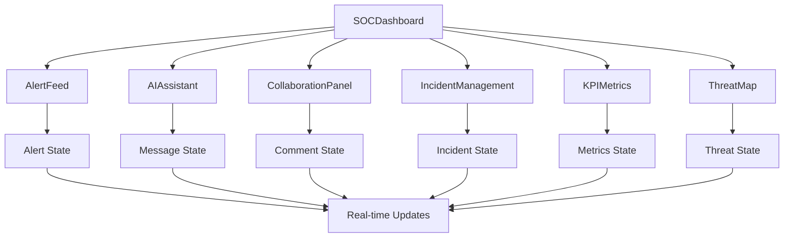

# SOC-AI Portal Architecture Documentation

## 🏗️ Architecture Overview

The SOC-AI Portal is a modern, React-based Security Operations Center dashboard designed to support multi-tier analyst workflows. Built with TypeScript, Tailwind CSS, and shadcn/ui components, it follows a modular architecture pattern optimized for real-time security operations.

### High-Level Architecture

```
┌─────────────────────────────────────────────────────────────┐
│                    SOC-AI Portal Frontend                   │
├─────────────────────────────────────────────────────────────┤
│  ┌───────────────┐  ┌──────────────┐  ┌─────────────────┐   │
│  │   Dashboard   │  │  Navigation  │  │   Components    │   │
│  │   Container   │  │   Sidebar    │  │     Layer       │   │
│  └───────────────┘  └──────────────┘  └─────────────────┘   │
├─────────────────────────────────────────────────────────────┤
│  ┌───────────────┐  ┌──────────────┐  ┌─────────────────┐   │
│  │  Design       │  │   State      │  │   UI Library    │   │
│  │  System       │  │ Management   │  │   (shadcn/ui)   │   │
│  └───────────────┘  └──────────────┘  └─────────────────┘   │
├─────────────────────────────────────────────────────────────┤
│  ┌───────────────┐  ┌──────────────┐  ┌─────────────────┐   │
│  │   React 18    │  │ TypeScript   │  │  Tailwind CSS   │   │
│  │   + Hooks     │  │   + Vite     │  │   + Animations  │   │
│  └───────────────┘  └──────────────┘  └─────────────────┘   │
└─────────────────────────────────────────────────────────────┘
```

## 📁 Project Structure

```
src/
├── components/
│   ├── ui/                    # shadcn/ui base components
│   ├── SOCDashboard.tsx       # Main container component
│   ├── AlertFeed.tsx          # Real-time alert management
│   ├── AIAssistant.tsx        # AI-powered investigation helper
│   ├── CollaborationPanel.tsx # Multi-tier analyst workflow
│   ├── IncidentManagement.tsx # Incident lifecycle management
│   ├── KPIMetrics.tsx         # Performance dashboards
│   └── ThreatMap.tsx          # Global threat intelligence
├── pages/
│   ├── Index.tsx              # Main entry point
│   └── NotFound.tsx           # 404 error handling
├── hooks/
│   ├── use-toast.ts           # Toast notification system
│   └── use-mobile.tsx         # Responsive breakpoint detection
├── lib/
│   └── utils.ts               # Utility functions (cn helper)
└── index.css                  # Design system & CSS variables
```

## 🧩 Core Components

### 1. SOCDashboard (Main Container)
**File:** `src/components/SOCDashboard.tsx`

**Purpose:** Central orchestrator and layout manager for the entire application.

**Key Features:**
- Navigation state management (`activeView`)
- Header with search, notifications, and user info
- Sidebar navigation with real-time counters
- View routing between different modules
- Alert count aggregation and display

**State Management:**
```typescript
const [activeView, setActiveView] = useState('alerts');
const [alertCount] = useState({
  critical: 3, high: 12, medium: 45, low: 18, total: 78
});
```

**Interactions:**
- Renders child components based on `activeView`
- Passes alert counts to navigation badges
- Handles view transitions with animations

### 2. AlertFeed (Real-time Alert Management)
**File:** `src/components/AlertFeed.tsx`

**Purpose:** Primary interface for SOC analysts to triage and manage security alerts.

**Key Features:**
- Severity-based color coding (critical, high, medium, low)
- AI-generated alert summaries and recommendations
- Real-time status indicators and timestamps
- Tagging system for threat categorization
- Assignment and collaboration features

**Data Structures:**
```typescript
interface Alert {
  id: string;
  title: string;
  severity: 'critical' | 'high' | 'medium' | 'low';
  source: string; // EDR, SIEM, Network, etc.
  timestamp: string;
  status: 'new' | 'investigating' | 'resolved';
  assignee?: string;
  description: string;
  aiSummary: string;
  tags: string[];
}
```

### 3. AIAssistant (Investigation Support)
**File:** `src/components/AIAssistant.tsx`

**Purpose:** Conversational AI interface for guided investigations and automated analysis.

**Key Features:**
- Real-time chat interface with typing indicators
- Contextual suggestions for common SOC tasks
- Artifact generation (scripts, IOCs, reports)
- Quick action buttons for investigations
- Message history with timestamps

**State Management:**
```typescript
const [messages, setMessages] = useState<Message[]>(mockMessages);
const [inputValue, setInputValue] = useState('');
const [isTyping, setIsTyping] = useState(false);
```

**Message Flow:**
1. User input → New message creation
2. AI processing simulation → Typing indicator
3. Response generation → Artifacts and suggestions
4. History persistence → Scroll to latest

### 4. CollaborationPanel (Multi-tier Workflow)
**File:** `src/components/CollaborationPanel.tsx`

**Purpose:** Facilitates collaboration between Tier 1, 2, and 3 analysts throughout incident lifecycle.

**Key Features:**
- Investigation timeline with comment threading
- Status change tracking and escalation workflows
- Assignment management across analyst tiers
- Tag management and team coordination
- Real-time activity logging

**Workflow States:**
```typescript
interface Comment {
  id: string;
  author: string;
  content: string;
  timestamp: string;
  type: 'comment' | 'status_change' | 'assignment';
  metadata?: { oldValue?: string; newValue?: string; };
}
```

### 5. IncidentManagement (Lifecycle Management)
**File:** `src/components/IncidentManagement.tsx`

**Purpose:** Comprehensive incident tracking from detection through resolution.

**Key Features:**
- Advanced filtering (status, severity, text search)
- Incident statistics and performance metrics
- Bulk operations and reporting capabilities
- Resolution time tracking
- Cross-alert correlation and grouping

**Data Model:**
```typescript
interface Incident {
  id: string;
  title: string;
  severity: 'critical' | 'high' | 'medium' | 'low';
  status: 'open' | 'investigating' | 'resolved' | 'closed';
  assignee: string;
  createdAt: string;
  lastUpdate: string;
  alertCount: number;
  description: string;
  tags: string[];
}
```

### 6. KPIMetrics (Performance Analytics)
**File:** `src/components/KPIMetrics.tsx`

**Purpose:** Real-time SOC performance monitoring and analytics dashboard.

**Key Metrics:**
- **MTTD (Mean Time to Detection):** 4.2 minutes
- **MTTR (Mean Time to Response):** 18.5 minutes
- **False Positive Rate:** 12.3%
- **Alert Resolution Rate:** 94.7%
- **Threat Intelligence Coverage:** 87.2%
- **Escalation Rate:** 15.8%

**Performance Tracking:**
```typescript
interface KPIMetric {
  title: string;
  value: string;
  change: number;
  changeType: 'increase' | 'decrease';
  description: string;
  target?: number;
  progress?: number;
}
```

### 7. ThreatMap (Global Intelligence)
**File:** `src/components/ThreatMap.tsx`

**Purpose:** Global threat intelligence visualization and correlation analysis.

**Key Features:**
- Geographic threat distribution mapping
- Real-time IOC (Indicators of Compromise) feed
- Threat intelligence confidence scoring
- Source attribution and timeline tracking
- Correlation graph placeholders for future integration

## 🎨 Design System Architecture

### CSS Variables & Semantic Tokens
**File:** `src/index.css`

The design system uses HSL-based CSS variables for consistent theming:

```css
:root {
  /* Core Theme */
  --background: 220 15% 8%;      /* Deep dark background */
  --foreground: 210 20% 95%;     /* High contrast text */
  --primary: 200 100% 45%;       /* Brand blue */
  --accent: 190 80% 50%;         /* Accent cyan */
  
  /* SOC-specific Severity Colors */
  --critical: 0 85% 60%;         /* Red for critical alerts */
  --high: 25 90% 55%;            /* Orange for high priority */
  --medium: 45 90% 55%;          /* Yellow for medium */
  --low: 120 50% 50%;            /* Green for low priority */
  
  /* Status Indicators */
  --success: 120 60% 50%;        /* Resolution/success */
  --warning: 45 90% 55%;         /* Investigation/warning */
  --error: 0 75% 55%;            /* Error states */
}
```

### Animation System
**File:** `tailwind.config.ts`

Custom animations enhance the real-time SOC experience:

```typescript
keyframes: {
  'pulse-glow': {
    '0%, 100%': { opacity: '0.8' },
    '50%': { opacity: '1', transform: 'scale(1.02)' }
  },
  'slide-in': {
    from: { transform: 'translateX(-100%)', opacity: '0' },
    to: { transform: 'translateX(0)', opacity: '1' }
  },
  'fade-in': {
    from: { opacity: '0' },
    to: { opacity: '1' }
  }
}
```

## 🔄 Component Interactions

### Data Flow Architecture



### Inter-Component Communication

1. **State Lifting:** Critical alert counts flow from `AlertFeed` to `SOCDashboard` for navigation badges
2. **Event Propagation:** Status changes in `CollaborationPanel` trigger updates across multiple views
3. **Cross-Reference:** Incidents in `IncidentManagement` correlate with alerts in `AlertFeed`
4. **AI Integration:** `AIAssistant` can reference data from any other component for contextual assistance

### Navigation Flow

```
Home (/) → SOCDashboard
├── alerts → AlertFeed
├── incidents → IncidentManagement  
├── ai-assistant → AIAssistant
├── collaboration → CollaborationPanel
├── metrics → KPIMetrics
└── threats → ThreatMap
```

## 🛠️ Technology Stack

### Frontend Framework
- **React 18** with hooks for state management
- **TypeScript** for type safety and developer experience
- **Vite** for fast development and optimized builds

### UI Library & Styling
- **shadcn/ui** for accessible, customizable components
- **Tailwind CSS** for utility-first styling
- **Radix UI** primitives for accessibility
- **Lucide React** for consistent iconography

### State Management Pattern
- **Local State:** `useState` for component-specific data
- **Props Drilling:** For parent-child communication
- **Context Pattern:** Ready for global state when needed

### Animation & UX
- **CSS Animations** via Tailwind utilities
- **Framer Motion** ready for complex animations
- **Responsive Design** with mobile-first approach

## 🔮 Future Integration Points

### Supabase Integration Architecture
```
┌─────────────────────────────────────────────────────────┐
│                  SOC-AI Portal                          │
├─────────────────────────────────────────────────────────┤
│  Authentication  │  Real-time Data  │  File Storage     │
│  (Multi-tier)    │  (Live Alerts)   │  (Reports/Logs)   │
├─────────────────────────────────────────────────────────┤
│                    Supabase Backend                     │
│  ┌─────────────┐ ┌─────────────┐ ┌─────────────────┐   │
│  │   Auth      │ │ PostgreSQL  │ │    Storage      │   │
│  │   + RLS     │ │ + Realtime  │ │   + CDN         │   │
│  └─────────────┘ └─────────────┘ └─────────────────┘   │
├─────────────────────────────────────────────────────────┤
│  ┌─────────────┐ ┌─────────────┐ ┌─────────────────┐   │
│  │  Edge       │ │   Webhooks  │ │    Functions    │   │
│  │ Functions   │ │    + Cron   │ │   + Triggers    │   │
│  └─────────────┘ └─────────────┘ └─────────────────┘   │
└─────────────────────────────────────────────────────────┘
```

### Database Schema (Planned)
```sql
-- Users with role-based access
CREATE TABLE analysts (
  id UUID PRIMARY KEY,
  email TEXT UNIQUE,
  name TEXT,
  tier INTEGER CHECK (tier IN (1, 2, 3)),
  created_at TIMESTAMP DEFAULT NOW()
);

-- Alerts with real-time updates
CREATE TABLE alerts (
  id UUID PRIMARY KEY,
  title TEXT,
  severity TEXT CHECK (severity IN ('critical', 'high', 'medium', 'low')),
  source TEXT,
  status TEXT DEFAULT 'new',
  assignee_id UUID REFERENCES analysts(id),
  ai_summary TEXT,
  created_at TIMESTAMP DEFAULT NOW(),
  updated_at TIMESTAMP DEFAULT NOW()
);

-- Collaborative comments
CREATE TABLE comments (
  id UUID PRIMARY KEY,
  alert_id UUID REFERENCES alerts(id),
  author_id UUID REFERENCES analysts(id),
  content TEXT,
  type TEXT DEFAULT 'comment',
  created_at TIMESTAMP DEFAULT NOW()
);
```

### Real-time Features (Planned)
- **Live Alert Feed:** WebSocket connections for instant alert updates
- **Collaborative Editing:** Real-time comment synchronization
- **Presence Indicators:** Show which analysts are active
- **Push Notifications:** Critical alert notifications

### AI Integration (Planned)
- **OpenAI/Claude API:** For intelligent alert analysis
- **Vector Embeddings:** For semantic search across incidents
- **Automated Reporting:** AI-generated incident summaries
- **Threat Correlation:** ML-powered pattern recognition

## 🔒 Security Considerations

### Role-Based Access Control (RBAC)
```typescript
// Future implementation
interface UserRole {
  tier: 1 | 2 | 3;
  permissions: {
    viewAlerts: boolean;
    assignAlerts: boolean;
    escalateIncidents: boolean;
    generateReports: boolean;
    manageTeam: boolean;
  };
}
```

### Data Protection
- **Row Level Security (RLS)** for multi-tenant isolation
- **Encrypted Storage** for sensitive threat intelligence
- **Audit Trails** for all security operations
- **Session Management** with automatic timeout

## 📊 Performance Optimization

### Current Optimizations
- **Code Splitting:** Component-level lazy loading ready
- **Memoization:** Strategic use of `useMemo` and `useCallback`
- **Animation Performance:** CSS-based animations over JavaScript
- **Bundle Size:** Tree-shaking enabled via Vite

### Future Optimizations
- **Virtual Scrolling:** For large alert/incident lists
- **Data Pagination:** Server-side filtering and sorting
- **Caching Strategy:** React Query for data fetching
- **CDN Integration:** Static asset optimization

## 🧪 Testing Strategy

### Component Testing
```typescript
// Example test structure
describe('AlertFeed', () => {
  test('displays alerts with correct severity colors');
  test('filters alerts by severity level');
  test('handles alert assignment flow');
  test('renders AI summaries correctly');
});
```

### Integration Testing
- **Cross-component workflows:** Alert → Incident → Collaboration
- **Real-time features:** WebSocket connection handling
- **Authentication flows:** Multi-tier access control

### End-to-End Testing
- **SOC Analyst Workflows:** Complete investigation scenarios
- **Performance Testing:** Large-scale alert processing
- **Security Testing:** Access control and data isolation

---

This architecture provides a solid foundation for a production-ready SOC platform, with clear separation of concerns, scalable patterns, and room for future enhancements. The modular design ensures that individual components can be developed, tested, and deployed independently while maintaining system cohesion.