# AI-First SOC Portal - High Level Architecture

## 🏗️ Complete System Architecture

```mermaid
graph TB
    %% User Interface Layer
    subgraph "🎯 User Interface Layer"
        UI[React Frontend]
        AI_Chat[AI Assistant Chat]
        Dashboard[SOC Dashboard]
        ThreatMap[Threat Map]
        Reports[Report Generator]
    end

    %% API Gateway Layer
    subgraph "🌐 API Gateway Layer"
        API[API Gateway]
        Auth[Authentication]
        RateLimit[Rate Limiting]
    end

    %% AI Processing Layer
    subgraph "🧠 AI Processing Layer"
        Lambda[Lambda Functions]
        SemanticSearch[Semantic Search]
        AIAssistant[AI Assistant]
        ThreatAnalysis[Threat Analysis]
        ReportGen[Report Generation]
        KPI[KPI Calculation]
    end

    %% External AI Services
    subgraph "🤖 External AI Services"
        OpenAI[OpenAI API]
        Embeddings[Text Embeddings]
        GPT4[GPT-4o-mini]
    end

    %% Data Storage Layer
    subgraph "💾 Data Storage Layer"
        Aurora[Aurora Serverless<br/>PostgreSQL]
        Pinecone[Pinecone<br/>Vector DB]
        Redis[Redis Cache<br/>ElastiCache]
    end

    %% Data Processing Layer
    subgraph "⚡ Data Processing Layer"
        Contextualization[Data Contextualization]
        Enrichment[Threat Intelligence Enrichment]
        Correlation[Threat Correlation]
        AnomalyDetection[Anomaly Detection]
    end

    %% Security Data Sources
    subgraph "🔒 Security Data Sources"
        SIEM[SIEM Logs]
        SOAR[SOAR Incidents]
        EDR[EDR Events]
        ThreatIntel[Threat Intelligence Feeds]
        Network[Network Data]
    end

    %% Infrastructure Layer
    subgraph "☁️ AWS Infrastructure"
        VPC[VPC & Security Groups]
        IAM[IAM Roles & Policies]
        CloudFormation[CloudFormation]
        Monitoring[CloudWatch Monitoring]
    end

    %% Data Flow Connections
    UI --> API
    AI_Chat --> API
    Dashboard --> API
    ThreatMap --> API
    Reports --> API

    API --> Auth
    API --> RateLimit
    API --> Lambda

    Lambda --> SemanticSearch
    Lambda --> AIAssistant
    Lambda --> ThreatAnalysis
    Lambda --> ReportGen
    Lambda --> KPI

    SemanticSearch --> OpenAI
    AIAssistant --> GPT4
    ReportGen --> GPT4
    ThreatAnalysis --> OpenAI

    OpenAI --> Embeddings
    Embeddings --> Pinecone

    Lambda --> Aurora
    Lambda --> Pinecone
    Lambda --> Redis

    Contextualization --> Enrichment
    Enrichment --> Correlation
    Correlation --> AnomalyDetection

    SIEM --> Contextualization
    SOAR --> Contextualization
    EDR --> Contextualization
    ThreatIntel --> Enrichment
    Network --> Contextualization

    Aurora --> Contextualization
    Pinecone --> SemanticSearch
    Redis --> Lambda

    Lambda --> VPC
    Aurora --> VPC
    Redis --> VPC
    VPC --> IAM
    CloudFormation --> VPC
    Monitoring --> Lambda

    %% Styling
    classDef frontend fill:#e1f5fe,stroke:#01579b,stroke-width:2px
    classDef api fill:#f3e5f5,stroke:#4a148c,stroke-width:2px
    classDef ai fill:#e8f5e8,stroke:#1b5e20,stroke-width:2px
    classDef external fill:#fff3e0,stroke:#e65100,stroke-width:2px
    classDef storage fill:#fce4ec,stroke:#880e4f,stroke-width:2px
    classDef processing fill:#f1f8e9,stroke:#33691e,stroke-width:2px
    classDef sources fill:#fff8e1,stroke:#f57f17,stroke-width:2px
    classDef infra fill:#fafafa,stroke:#424242,stroke-width:2px

    class UI,AI_Chat,Dashboard,ThreatMap,Reports frontend
    class API,Auth,RateLimit api
    class Lambda,SemanticSearch,AIAssistant,ThreatAnalysis,ReportGen,KPI,Contextualization,Enrichment,Correlation,AnomalyDetection ai
    class OpenAI,Embeddings,GPT4 external
    class Aurora,Pinecone,Redis storage
    class SIEM,SOAR,EDR,ThreatIntel,Network sources
    class VPC,IAM,CloudFormation,Monitoring infra
```

## 🔄 AI-First Data Flow

## 🧠 AI Processing Architecture

## 🗄️ Database Architecture

## 🚀 Deployment Architecture

## 🔧 Key Architecture Principles

### 1. **AI-First Design**
- Every component is designed around AI capabilities
- Natural language is the primary interface
- AI reasoning drives all decision making
- Continuous learning and adaptation

### 2. **Microservices Architecture**
- Serverless Lambda functions for each AI capability
- Independent scaling and deployment
- Clear separation of concerns
- API Gateway for unified access

### 3. **Multi-Database Strategy**
- **Aurora PostgreSQL**: Structured data with vector extensions
- **Pinecone**: Dedicated vector database for semantic search
- **Redis**: High-performance caching layer
- **Graph Database**: For threat relationship mapping

### 4. **Event-Driven Processing**
- Real-time data processing
- Asynchronous AI analysis
- Event-driven notifications
- Stream processing for continuous analysis

### 5. **Security by Design**
- Zero-trust architecture
- End-to-end encryption
- Row-level security
- Audit trails for all operations

### 6. **Scalability & Performance**
- Auto-scaling serverless functions
- Intelligent caching strategies
- Vector database optimization
- CDN for frontend assets

## 📊 Performance Characteristics

| Component | Latency | Throughput | Availability |
|-----------|---------|------------|--------------|
| Semantic Search | < 200ms | 1000 req/s | 99.9% |
| AI Assistant | < 2s | 100 req/s | 99.9% |
| Threat Analysis | < 5s | 50 req/s | 99.9% |
| Report Generation | < 10s | 20 req/s | 99.9% |
| Data Ingestion | < 1s | 5000 events/s | 99.9% |

## 🔮 Future Architecture Evolution

### Phase 1: Enhanced AI Capabilities
- Multi-modal AI analysis
- Custom model training
- Advanced threat hunting
- Predictive analytics

### Phase 2: Edge Computing
- Edge AI processing
- Local threat detection
- Reduced latency
- Offline capabilities

### Phase 3: Federated Learning
- Cross-organization threat intelligence
- Privacy-preserving AI
- Collaborative threat hunting
- Shared knowledge base

---

*This architecture represents a true AI-first approach to security operations, where artificial intelligence is not just a feature but the foundational principle that drives every aspect of the system.*
