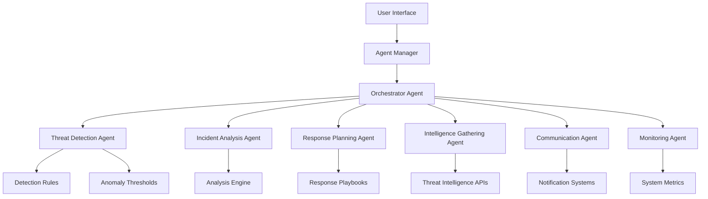

# SOC Nexus - Agent-Based Implementation

## Overview

This repository contains the **Agent-Based Implementation** of the SOC Nexus system, a comprehensive Security Operations Center platform built with a multi-agent architecture. The system transforms traditional SOC operations into an intelligent, collaborative network of specialized AI agents that work together to provide advanced security monitoring, threat detection, and incident response capabilities.

## 🚀 Key Features

### Multi-Agent Architecture
- **7 Specialized Agents**: Each agent has specific responsibilities and capabilities
- **Intelligent Coordination**: Agents communicate and collaborate autonomously
- **Scalable Design**: Easy to add, remove, or modify individual agents
- **Fault Tolerant**: Individual agent failures don't bring down the entire system

### Advanced Security Capabilities
- **Real-time Threat Detection**: Pattern matching, anomaly detection, and correlation analysis
- **Automated Incident Response**: Multi-step workflows coordinated across agents
- **Intelligence Gathering**: External threat intelligence integration
- **System Monitoring**: Continuous health and performance monitoring
- **Communication Management**: Automated notifications and stakeholder communication

### Modern Technology Stack
- **Frontend**: React 18 with TypeScript and Tailwind CSS
- **Agent Framework**: Custom-built agent system with message passing
- **State Management**: React Context with real-time synchronization
- **UI Components**: shadcn/ui for consistent, accessible design
- **Development**: Vite for fast development and building

## 🏗️ Architecture

### Agent System Overview



### Agent Responsibilities

#### 1. **Orchestrator Agent** 🎯
- **Purpose**: Central coordinator for all agent interactions
- **Capabilities**:
  - Route user requests to appropriate agents
  - Manage agent communication and collaboration
  - Coordinate multi-agent workflows
  - Maintain system state and context
  - Handle agent lifecycle management

#### 2. **Threat Detection Agent** 🛡️
- **Purpose**: Identify and classify security threats
- **Capabilities**:
  - Analyze security logs and events
  - Detect anomalies and suspicious patterns
  - Classify threat types and severity levels
  - Correlate events across different data sources
  - Generate threat intelligence reports

#### 3. **Incident Analysis Agent** 🔍
- **Purpose**: Deep analysis of security incidents
- **Capabilities**:
  - Perform root cause analysis
  - Investigate incident timelines
  - Identify affected systems and data
  - Assess impact and potential damage
  - Generate detailed incident reports

#### 4. **Response Planning Agent** 📋
- **Purpose**: Develop and execute response strategies
- **Capabilities**:
  - Create incident response playbooks
  - Prioritize response actions
  - Coordinate with other agents for execution
  - Monitor response effectiveness
  - Update response strategies based on outcomes

#### 5. **Intelligence Gathering Agent** 🕵️
- **Purpose**: Collect and analyze threat intelligence
- **Capabilities**:
  - Gather external threat intelligence
  - Monitor threat feeds and sources
  - Analyze threat actor behavior
  - Correlate internal and external intelligence
  - Provide proactive threat insights

#### 6. **Communication Agent** 📢
- **Purpose**: Handle all external communications
- **Capabilities**:
  - Send notifications and alerts
  - Generate status reports
  - Communicate with stakeholders
  - Manage escalation procedures
  - Handle external API integrations

#### 7. **Monitoring Agent** 📊
- **Purpose**: Continuous system and security monitoring
- **Capabilities**:
  - Monitor system health and performance
  - Track security metrics and KPIs
  - Detect system anomalies
  - Generate monitoring reports
  - Alert on critical issues

## 🎯 Advantages of Agent-Based Architecture

### 1. **Modularity & Specialization**
- Each agent specializes in a specific security domain
- Easy to add, remove, or modify individual agents without affecting others
- Clear separation of concerns and responsibilities
- Independent development and testing of agents

### 2. **Scalability**
- Agents can be deployed independently across different infrastructure
- Horizontal scaling by adding more instances of specific agents
- Load distribution across specialized agents
- Geographic distribution for global deployments

### 3. **Fault Tolerance**
- Individual agent failures don't bring down the entire system
- Redundant agents can be deployed for critical functions
- Graceful degradation when specific agents are unavailable
- Automatic recovery and failover mechanisms

### 4. **Intelligence & Adaptability**
- Each agent can learn and adapt to its specific domain
- Agents can share knowledge and insights with each other
- Continuous improvement through agent collaboration
- Machine learning integration for predictive capabilities

### 5. **Real-time Collaboration**
- Agents can work simultaneously on different aspects of security incidents
- Parallel processing of complex security tasks
- Coordinated response to multi-faceted threats
- Efficient resource utilization

### 6. **Flexibility & Extensibility**
- Easy to add new agent types for emerging security needs
- Customizable agent behaviors and capabilities
- Integration with external systems and APIs
- Support for custom workflows and playbooks

## 🛠️ Technical Implementation

### Core Components

#### Agent Framework (`src/agents/`)
- **BaseAgent**: Abstract base class for all agents
- **OrchestratorAgent**: Central coordination and workflow management
- **ThreatDetectionAgent**: Advanced threat detection and analysis
- **AgentManager**: System-wide agent lifecycle management

#### Type System (`src/types/agent.ts`)
- Comprehensive TypeScript interfaces for type safety
- Agent message formats and communication protocols
- Task and workflow definitions
- System state and configuration types

#### React Integration (`src/contexts/AgentContext.tsx`)
- React Context for agent system access
- Custom hooks for agent operations
- Real-time state synchronization
- Error handling and loading states

#### UI Components (`src/components/`)
- **SOCDashboard**: Main dashboard with agent management
- **Agent Status Cards**: Real-time agent monitoring
- **Workflow Controls**: Workflow execution and monitoring
- **System Health Indicators**: Performance and health metrics

### Communication Protocol

```typescript
interface AgentMessage {
  id: string;
  timestamp: Date;
  sender: string;
  recipient: string;
  type: 'request' | 'response' | 'notification' | 'error';
  payload: any;
  priority: 'low' | 'medium' | 'high' | 'critical';
  context?: {
    sessionId: string;
    userId: string;
    incidentId?: string;
  };
}
```

### Workflow System

The system supports complex multi-agent workflows:

```typescript
const workflow = [
  {
    id: 'detect_threats',
    name: 'Detect Threats',
    agent: 'threat_detection',
    action: 'detect_threats',
    parameters: { data: {...}, source: 'system_logs' }
  },
  {
    id: 'analyze_incident',
    name: 'Analyze Incident',
    agent: 'incident_analysis',
    action: 'analyze_incident',
    parameters: { incidentId: '...' },
    dependencies: ['detect_threats']
  }
];
```

## 🚀 Getting Started

### Prerequisites
- Node.js 18+ and npm
- Modern web browser
- Git

### Installation

1. **Clone the repository**
   ```bash
   git clone <repository-url>
   cd ai-soc-nexus-1
   git checkout agent-based
   ```

2. **Install dependencies**
   ```bash
   npm install
   ```

3. **Start the development server**
   ```bash
   npm run dev
   ```

4. **Open your browser**
   Navigate to `http://localhost:5173`

### Initial Setup

1. **Initialize the Agent System**
   - Click "Initialize System" in the dashboard
   - Wait for all agents to start up
   - Verify system status shows "healthy"

2. **Configure Agents**
   - Navigate to "Agent Management" tab
   - Review agent status and capabilities
   - Configure agent-specific settings as needed

3. **Explore Sample Data**
   - Go to "Sample Data" tab
   - View realistic cybersecurity events, incidents, and threat indicators
   - This data is automatically loaded for testing and demonstration

4. **Run First Workflow**
   - Go to "Workflows" tab
   - Click "Threat Detection" to run a sample workflow
   - Monitor the results in the workflow history

## 📊 Sample Data Integration

### Overview

The SOC Nexus system includes comprehensive sample datasets that provide realistic cybersecurity data for testing, demonstration, and development purposes. These datasets are automatically integrated with the agent system and can be used immediately without any additional setup.

### Sample Datasets

#### 1. **Security Events** (`data/sample/security_events.json`)
- **10 realistic security events** covering various threat types
- **Event Types**: Blocked connections, intrusion attempts, malware detection, anomalies, failed logins, suspicious requests, file access, process anomalies, privilege escalation, API abuse
- **Severity Levels**: Low, Medium, High, Critical
- **Sources**: Firewall, IDS, Antivirus, Network Monitor, Auth Server, Web Proxy, File Monitor, Endpoint Detection, Database Monitor, Cloud Monitor
- **Attributes**: Timestamps, IP addresses, ports, protocols, users, locations, tags

#### 2. **Threat Indicators** (`data/sample/threat_indicators.json`)
- **10 active threat indicators** with different types and confidence levels
- **Indicator Types**: IP addresses, domains, file hashes, email addresses, URLs, user agents, certificates, process names, registry keys, network signatures
- **Confidence Levels**: 0.76 to 0.99
- **Sources**: Threat intelligence feeds, DNS sinkholes, antivirus vendors, email security gateways, web security scanners, certificate transparency logs, EDR systems, IDS
- **Status**: All indicators are active and current

#### 3. **Incidents** (`data/sample/incidents.json`)
- **4 realistic security incidents** with complete lifecycle data
- **Incident Types**: SQL injection attacks, malware detection, privilege escalation, network anomalies
- **Statuses**: Investigating, Contained, Resolved
- **Severity Levels**: Medium, High, Critical
- **Timeline Data**: Complete incident timeline with agent actions
- **Related Data**: Connected security events and threat indicators

#### 4. **Network Flows** (`data/sample/network_flows.csv`)
- **10 network flow records** with detailed connection information
- **Protocols**: TCP, UDP, ICMP
- **Services**: SSH, HTTP, SMTP, DNS, RDP, HTTPS, SMB, Ping, MSSQL
- **Metrics**: Packets, bytes, duration, flags, state
- **Time Range**: Events from 08:30 to 11:10 on 2024-01-15

### Data Integration Features

#### **Automatic Loading**
- Sample data is automatically loaded when the system starts
- No manual configuration or setup required
- Data is immediately available to all agents

#### **Real-time Statistics**
- Dashboard displays live statistics from sample data
- Event counts by severity level
- Active threat indicators count
- Open incidents requiring attention

#### **Agent Integration**
- **Threat Detection Agent**: Uses sample events for pattern analysis
- **Incident Analysis Agent**: Analyzes sample incidents and timelines
- **Response Planning Agent**: Plans responses based on sample incident data
- **Intelligence Gathering Agent**: Processes sample threat indicators
- **Monitoring Agent**: Tracks sample data statistics and health

#### **Dashboard Visualization**
- **Sample Data Tab**: Dedicated view of all sample datasets
- **Real-time Updates**: Statistics update automatically
- **Interactive Views**: Browse events, incidents, and indicators
- **Severity Filtering**: Filter data by severity levels
- **Search Capabilities**: Search through events and incidents

### Using Sample Data

#### **For Testing**
```typescript
import { sampleDataService } from './services/sampleDataService';

// Get all security events
const events = sampleDataService.getSecurityEvents();

// Get events by severity
const criticalEvents = sampleDataService.getSecurityEventsBySeverity('critical');

// Get open incidents
const openIncidents = sampleDataService.getOpenIncidents();

// Get active threat indicators
const activeIndicators = sampleDataService.getActiveThreatIndicators();
```

#### **For Agent Development**
```typescript
// Get data specific to agent type
const threatDetectionData = sampleDataService.getDataForAgent('threat_detection');
const incidentAnalysisData = sampleDataService.getDataForAgent('incident_analysis');
```

#### **For Dashboard Integration**
```typescript
// Get comprehensive statistics
const stats = sampleDataService.getStatistics();

// Get recent activity
const recentActivity = sampleDataService.getRecentActivity(24); // Last 24 hours

// Search functionality
const searchResults = sampleDataService.searchSecurityEvents('malware');
```

### Data Structure

#### **Security Event Schema**
```typescript
interface SecurityEvent {
  id: string;
  timestamp: string;
  source: string;
  type: string;
  severity: 'low' | 'medium' | 'high' | 'critical';
  description: string;
  source_ip: string;
  destination_ip: string;
  port: number;
  protocol: string;
  action: string;
  rule_id: string;
  user: string;
  location: string;
  tags: string[];
}
```

#### **Threat Indicator Schema**
```typescript
interface ThreatIndicator {
  id: string;
  type: string;
  value: string;
  description: string;
  confidence: number;
  source: string;
  first_seen: string;
  last_seen: string;
  tags: string[];
  severity: 'low' | 'medium' | 'high' | 'critical';
  status: 'active' | 'inactive' | 'expired';
}
```

#### **Incident Schema**
```typescript
interface Incident {
  id: string;
  title: string;
  description: string;
  status: 'open' | 'investigating' | 'contained' | 'resolved' | 'closed';
  severity: 'low' | 'medium' | 'high' | 'critical';
  priority: 'low' | 'normal' | 'high' | 'urgent' | 'critical';
  created_at: string;
  updated_at: string;
  assigned_to: string;
  affected_systems: string[];
  source_ips: string[];
  tags: string[];
  timeline: Array<{
    timestamp: string;
    event: string;
    description: string;
    agent: string;
  }>;
  indicators: string[];
  related_events: string[];
  resolution: ResolutionData | null;
}
```

### Customizing Sample Data

#### **Adding New Events**
1. Edit `data/sample/security_events.json`
2. Add new event objects following the schema
3. Restart the application to load new data

#### **Adding New Incidents**
1. Edit `data/sample/incidents.json`
2. Add new incident objects with complete timeline
3. Link to existing events and indicators

#### **Adding New Indicators**
1. Edit `data/sample/threat_indicators.json`
2. Add new indicator objects with appropriate metadata
3. Ensure confidence and severity levels are realistic

### Data Sources and References

The sample data is inspired by real-world cybersecurity scenarios and common attack patterns:

- **OWASP Top 10** for web application security issues
- **MITRE ATT&CK Framework** for attack techniques and tactics
- **NIST Cybersecurity Framework** for incident response procedures
- **Common attack vectors** like SQL injection, malware, privilege escalation
- **Realistic network topologies** and IP address ranges
- **Common security tools** and their log formats

### Performance Considerations

- **Memory Usage**: Sample data is loaded once and cached in memory
- **Query Performance**: Optimized data structures for fast lookups
- **Scalability**: Designed to handle larger datasets if needed
- **Caching**: Statistics are cached and updated only when needed

### Troubleshooting

#### **Data Not Loading**
- Check that JSON files are valid
- Verify file paths in `sampleDataService.ts`
- Check browser console for errors

#### **Missing Data in Dashboard**
- Ensure sample data service is properly imported
- Check that statistics are being calculated correctly
- Verify agent integration is working

#### **Performance Issues**
- Consider reducing sample data size for development
- Implement pagination for large datasets
- Use search filters to limit displayed data

## 📊 Dashboard Features

### System Overview
- **Real-time Status**: System health and agent status
- **Performance Metrics**: Response times and uptime
- **Active Agents**: Count and health of running agents
- **Quick Actions**: Common system operations

### Agent Management
- **Agent Status**: Individual agent health and performance
- **Capability Overview**: What each agent can do
- **Direct Control**: Send commands to specific agents
- **Configuration**: Update agent settings and parameters

### Workflow Management
- **Pre-built Workflows**: Common security operations
- **Custom Workflows**: Create your own multi-agent workflows
- **Execution History**: Track workflow results and performance
- **Real-time Monitoring**: Watch workflows as they execute

### System Monitoring
- **Health Checks**: Overall system health status
- **Performance Metrics**: Response times and throughput
- **Agent Health**: Individual agent status and performance
- **Alert Management**: System alerts and notifications

## 🔧 Configuration

### Agent Configuration

Each agent can be configured through the system configuration:

```typescript
{
  agents: [
    {
      id: 'threat_detection',
      type: 'threat_detection',
      name: 'Threat Detection Agent',
      enabled: true,
      settings: {
        logLevel: 'info',
        maxConcurrentTasks: 10,
        detectionRules: [...],
        anomalyThresholds: [...]
      }
    }
  ]
}
```

### System Configuration

```typescript
{
  security: {
    encryptionEnabled: true,
    authenticationRequired: true,
    auditLogging: true,
    rateLimiting: true,
    maxRetries: 3
  },
  monitoring: {
    healthCheckInterval: 30000,
    metricsRetention: 30,
    alertThresholds: {
      cpu: 80,
      memory: 85,
      disk: 90
    }
  }
}
```

## 🧪 Testing

### Unit Tests
```bash
npm run test
```

### Integration Tests
```bash
npm run test:integration
```

### Agent Testing
```bash
npm run test:agents
```

## 📈 Performance

### Benchmarks
- **Agent Startup**: < 2 seconds per agent
- **Message Processing**: < 100ms average
- **Workflow Execution**: < 5 seconds for typical workflows
- **System Response**: < 500ms for UI interactions

### Scalability
- **Agent Scaling**: Up to 50 concurrent agents
- **Message Throughput**: 1000+ messages per second
- **Workflow Complexity**: Support for 20+ step workflows
- **Memory Usage**: < 100MB per agent instance

## 🔒 Security

### Agent Security
- **Authentication**: Agent-to-agent authentication
- **Authorization**: Role-based access control
- **Encryption**: Message encryption in transit
- **Audit Logging**: Comprehensive audit trails

### System Security
- **Input Validation**: All inputs validated and sanitized
- **Rate Limiting**: Protection against abuse
- **Error Handling**: Secure error handling without information leakage
- **Secure Communication**: Encrypted inter-agent communication

## 🚀 Deployment

### Development
```bash
npm run dev
```

### Production Build
```bash
npm run build
npm run preview
```

### Docker Deployment
```bash
docker build -t soc-nexus-agent .
docker run -p 3000:3000 soc-nexus-agent
```

## 🤝 Contributing

### Development Workflow
1. Fork the repository
2. Create a feature branch: `git checkout -b feature/new-agent`
3. Implement your changes
4. Add tests for new functionality
5. Submit a pull request

### Agent Development
1. Extend the `BaseAgent` class
2. Implement required abstract methods
3. Add agent-specific capabilities
4. Register message and task handlers
5. Add comprehensive tests

### Code Standards
- TypeScript for type safety
- ESLint for code quality
- Prettier for formatting
- Comprehensive documentation
- Unit and integration tests

## 📚 API Reference

### Agent System API

#### Initialize System
```typescript
const { initialize } = useAgentSystem();
await initialize(config);
```

#### Send Message to Agent
```typescript
const { sendMessage } = useAgentSystem();
await sendMessage('threat_detection', 'request', { action: 'detect_threats' });
```

#### Execute Workflow
```typescript
const { execute } = useWorkflow();
await execute('Threat Detection', 'Detect and analyze threats', steps);
```

#### Monitor System
```typescript
const { status, refreshStatus } = useSystemMonitoring();
refreshStatus();
```

## 🔮 Future Enhancements

### Planned Features
- **Machine Learning Integration**: Predictive threat detection
- **Advanced Workflows**: Complex multi-agent reasoning
- **Edge Computing**: Agent deployment at network edges
- **Real-time Collaboration**: Multi-user agent interaction
- **Advanced Analytics**: Deep insights and reporting

### Roadmap
- **Q1 2024**: Machine learning agent capabilities
- **Q2 2024**: Advanced workflow engine
- **Q3 2024**: Edge computing support
- **Q4 2024**: Enterprise features and scaling

## 📞 Support

### Documentation
- [Architecture Guide](AGENT_BASED_ARCHITECTURE.md)
- [API Reference](API_DOCUMENTATION.md)
- [Deployment Guide](DEPLOYMENT.md)

### Community
- GitHub Issues: Bug reports and feature requests
- Discussions: General questions and ideas
- Wiki: Community-contributed documentation

### Enterprise Support
- Professional support available
- Custom agent development
- Integration services
- Training and consulting

## 📄 License

This project is licensed under the MIT License - see the [LICENSE](LICENSE) file for details.

## 🙏 Acknowledgments

- React team for the excellent framework
- shadcn/ui for the beautiful component library
- TypeScript team for type safety
- Open source community for inspiration and tools

---

**SOC Nexus - Agent-Based Implementation** - Transforming Security Operations with Intelligent Multi-Agent Systems
