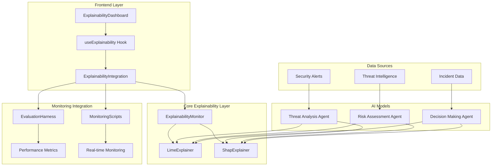

# AI Explainability Integration

## 🧠 **Overview**

This document details the integration of explainability (LIME/SHAP) into the AI SOC Portal's monitoring pipelines, providing comprehensive AI model interpretability and transparency.

## 📋 **Summary of Implementation**

### **Files Created:**
- `src/lib/explainability/lime-explainer.ts` - LIME (Local Interpretable Model-agnostic Explanations) implementation
- `src/lib/explainability/shap-explainer.ts` - SHAP (SHapley Additive exPlanations) implementation
- `src/lib/explainability/explainability-monitor.ts` - Core explainability monitoring service
- `src/lib/explainability/explainability-integration.ts` - Integration with existing monitoring pipelines
- `src/hooks/useExplainability.ts` - React hook for explainability functionality
- `src/components/ExplainabilityDashboard.tsx` - Dashboard component for visualization

### **Dependencies Added:**
- **Frontend**: `lime-js`, `shap-js`
- **Backend**: `lime`, `shap`, `scikit-learn`, `numpy`, `pandas`, `matplotlib`, `seaborn`

## 🎯 **Why Explainability Integration?**

### **1. Regulatory Compliance**
- **GDPR Article 22**: Right to explanation for automated decisions
- **AI Act (EU)**: Transparency requirements for high-risk AI systems
- **SOC 2**: Audit trails and decision transparency
- **Financial Regulations**: Explainable AI for risk assessment

### **2. Trust and Adoption**
- **Stakeholder Confidence**: Clear understanding of AI decisions
- **User Acceptance**: Transparent decision-making processes
- **Audit Readiness**: Comprehensive explanation trails
- **Risk Management**: Understanding model behavior and limitations

### **3. Model Improvement**
- **Bias Detection**: Identify unfair or biased predictions
- **Feature Importance**: Understand which factors drive decisions
- **Model Debugging**: Diagnose prediction errors and inconsistencies
- **Performance Optimization**: Focus on critical features

### **4. Operational Benefits**
- **Incident Response**: Understand why alerts were triggered
- **False Positive Reduction**: Explain why certain events are benign
- **Threat Analysis**: Understand attack patterns and indicators
- **Decision Support**: Provide analysts with reasoning context

## 🏗️ **Architecture Overview**

### **Multi-Layer Explainability Architecture**



## 🔧 **Implementation Details**

### **1. LIME Explainer Implementation**

#### **Core Features:**
- **Local Explanations**: Explain individual predictions
- **Feature Importance**: Identify key factors in decisions
- **Confidence Scoring**: Measure explanation reliability
- **Fidelity Measurement**: Assess explanation accuracy

#### **Pseudocode:**
```python
class LimeExplainer:
    def __init__(self, config):
        self.num_samples = config.num_samples  # Default: 5000
        self.num_features = config.num_features  # Default: 10
        self.kernel_width = config.kernel_width  # Default: 0.75
        
    def explain_prediction(self, input_data, model):
        # 1. Generate perturbed samples around input
        perturbed_samples = self.generate_perturbed_samples(input_data)
        
        # 2. Get predictions for perturbed samples
        predictions = [model.predict(sample) for sample in perturbed_samples]
        
        # 3. Calculate distances and weights
        weights = [self.calculate_weight(sample, input_data) for sample in perturbed_samples]
        
        # 4. Train local linear model
        local_model = self.train_local_model(perturbed_samples, predictions, weights)
        
        # 5. Extract feature importance
        feature_importance = self.extract_feature_importance(local_model, input_data)
        
        # 6. Calculate confidence and fidelity
        confidence = self.calculate_confidence(local_model)
        fidelity = self.calculate_fidelity(perturbed_samples, local_model)
        
        return {
            'explanation': feature_importance,
            'confidence': confidence,
            'fidelity': fidelity,
            'local_model': local_model
        }
    
    def generate_perturbed_samples(self, input_data):
        samples = []
        for i in range(self.num_samples):
            perturbed = self.perturb_input(input_data)
            samples.append(perturbed)
        return samples
    
    def perturb_input(self, input_data):
        perturbed = input_data.copy()
        for feature, value in input_data.items():
            if isinstance(value, (int, float)):
                # Add Gaussian noise to numerical features
                noise = np.random.normal(0, 0.1)
                perturbed[feature] = value + noise
            elif isinstance(value, str):
                # Randomly replace string values
                if np.random.random() < 0.1:
                    perturbed[feature] = self.generate_random_string(value)
        return perturbed
    
    def calculate_weight(self, sample, original):
        distance = self.calculate_distance(sample, original)
        return np.exp(-(distance / self.kernel_width) ** 2)
    
    def train_local_model(self, samples, predictions, weights):
        # Weighted linear regression
        X = self.extract_features(samples)
        y = predictions
        w = weights
        
        # Solve weighted least squares
        W = np.diag(w)
        XtWX = X.T @ W @ X
        XtWy = X.T @ W @ y
        
        coefficients = np.linalg.solve(XtWX, XtWy)
        intercept = np.mean(y) - np.mean(X @ coefficients)
        
        return {
            'coefficients': coefficients,
            'intercept': intercept,
            'r2_score': self.calculate_r2_score(X, y, coefficients, intercept),
            'mse': self.calculate_mse(X, y, coefficients, intercept)
        }
```

### **2. SHAP Explainer Implementation**

#### **Core Features:**
- **Global Explanations**: Understand overall model behavior
- **Local Explanations**: Explain individual predictions
- **Feature Interactions**: Identify feature relationships
- **Consistency**: Provide stable explanations across predictions

#### **Pseudocode:**
```python
class ShapExplainer:
    def __init__(self, config):
        self.num_samples = config.num_samples  # Default: 100
        self.max_features = config.max_features  # Default: 20
        self.background_samples = config.background_samples  # Default: 50
        
    def explain_prediction(self, input_data, model):
        # 1. Calculate base value (expected prediction)
        base_value = self.calculate_base_value(model)
        
        # 2. Calculate SHAP values for each feature
        shap_values = self.calculate_shap_values(input_data, model, base_value)
        
        # 3. Calculate confidence
        confidence = self.calculate_confidence(shap_values, model(input_data), base_value)
        
        return {
            'shap_values': shap_values,
            'base_value': base_value,
            'prediction': model(input_data),
            'expected_value': base_value,
            'confidence': confidence
        }
    
    def calculate_shap_values(self, input_data, model, base_value):
        features = list(input_data.keys())
        shap_values = {}
        
        for feature in features:
            # Calculate marginal contribution
            shap_value = self.calculate_feature_shap_value(feature, input_data, model)
            shap_values[feature] = {
                'value': input_data[feature],
                'shap_value': shap_value,
                'importance': abs(shap_value)
            }
        
        return shap_values
    
    def calculate_feature_shap_value(self, feature, input_data, model):
        features = list(input_data.keys())
        feature_index = features.index(feature)
        
        total_contribution = 0
        count = 0
        
        # Sample different subsets of features
        for i in range(self.num_samples):
            subset = self.generate_random_subset(features, feature_index)
            
            # Calculate marginal contribution
            contribution = self.calculate_marginal_contribution(
                feature, input_data, subset, model
            )
            
            total_contribution += contribution
            count += 1
        
        return total_contribution / count if count > 0 else 0
    
    def calculate_marginal_contribution(self, feature, input_data, subset, model):
        # Create input with subset features
        subset_input = {f: input_data[f] for f in subset}
        subset_with_feature = {f: input_data[f] for f in subset + [feature]}
        
        prediction_without = model(subset_input)
        prediction_with = model(subset_with_feature)
        
        return prediction_with - prediction_without
    
    def calculate_base_value(self, model):
        if not hasattr(self, 'background_data'):
            self.background_data = self.generate_background_data()
        
        predictions = [model(sample) for sample in self.background_data[:self.background_samples]]
        return np.mean(predictions)
```

### **3. Explainability Monitor Implementation**

#### **Core Features:**
- **Real-time Monitoring**: Continuous explanation quality tracking
- **Alert System**: Notify on explanation degradation
- **Metrics Collection**: Comprehensive explainability metrics
- **Integration**: Seamless integration with existing monitoring

#### **Pseudocode:**
```python
class ExplainabilityMonitor:
    def __init__(self, config):
        self.lime_explainer = LimeExplainer(config.lime_config)
        self.shap_explainer = ShapExplainer(config.shap_config)
        self.metrics = []
        self.alerts = []
        
    def explain_model_prediction(self, model_id, input_data, model):
        # 1. Generate LIME explanation
        lime_explanation = None
        if self.config.enable_lime:
            lime_explanation = self.lime_explainer.explain_prediction(input_data, model)
        
        # 2. Generate SHAP explanation
        shap_explanation = None
        if self.config.enable_shap:
            shap_explanation = self.shap_explainer.explain_prediction(input_data, model)
        
        # 3. Calculate combined confidence
        combined_confidence = self.calculate_combined_confidence(
            lime_explanation, shap_explanation
        )
        
        # 4. Calculate explanation consistency
        explanation_consistency = self.calculate_explanation_consistency(
            lime_explanation, shap_explanation
        )
        
        model_explanation = {
            'model_id': model_id,
            'prediction': model(input_data),
            'lime_explanation': lime_explanation,
            'shap_explanation': shap_explanation,
            'combined_confidence': combined_confidence,
            'explanation_consistency': explanation_consistency,
            'timestamp': datetime.now()
        }
        
        # 5. Check for alerts
        self.check_explainability_alerts(model_explanation)
        
        return model_explanation
    
    def collect_explainability_metrics(self):
        explanations = self.get_all_explanations()
        
        metrics = {
            'timestamp': datetime.now(),
            'total_explanations': len(explanations),
            'lime_explanations': len([e for e in explanations if e.lime_explanation]),
            'shap_explanations': len([e for e in explanations if e.shap_explanation]),
            'avg_confidence': self.calculate_average_confidence(explanations),
            'avg_fidelity': self.calculate_average_fidelity(explanations),
            'avg_explanation_time': self.calculate_average_explanation_time(explanations),
            'consistency_score': self.calculate_average_consistency(explanations),
            'explanation_quality': self.assess_explanation_quality(explanations)
        }
        
        self.metrics.append(metrics)
        return metrics
    
    def check_explainability_alerts(self, model_explanation):
        alerts = []
        
        # Check confidence threshold
        if model_explanation.combined_confidence < self.config.alert_thresholds.min_confidence:
            alerts.append({
                'type': 'low_confidence',
                'severity': 'medium',
                'message': f'Low explanation confidence: {model_explanation.combined_confidence:.3f}',
                'recommendations': [
                    'Review model input features',
                    'Check explanation method parameters',
                    'Consider increasing sample size for explanations'
                ]
            })
        
        # Check fidelity threshold
        avg_fidelity = self.calculate_average_fidelity([model_explanation])
        if avg_fidelity < self.config.alert_thresholds.max_fidelity:
            alerts.append({
                'type': 'high_fidelity_loss',
                'severity': 'high',
                'message': f'High fidelity loss: {avg_fidelity:.3f}',
                'recommendations': [
                    'Investigate model complexity',
                    'Check for overfitting',
                    'Review explanation method selection'
                ]
            })
        
        # Check explanation time
        explanation_time = model_explanation.metadata.get('processing_time_ms', 0)
        if explanation_time > self.config.alert_thresholds.max_explanation_time_ms:
            alerts.append({
                'type': 'slow_explanation',
                'severity': 'medium',
                'message': f'Slow explanation generation: {explanation_time}ms',
                'recommendations': [
                    'Optimize explanation parameters',
                    'Reduce sample size',
                    'Consider caching explanations'
                ]
            })
        
        self.alerts.extend(alerts)
```

### **4. Integration with Monitoring Pipelines**

#### **Core Features:**
- **Seamless Integration**: Works with existing evaluation and monitoring systems
- **Cross-Validation**: Validate explanations against performance metrics
- **Trend Analysis**: Track explanation quality over time
- **Unified Dashboard**: Single view of performance and explainability

#### **Pseudocode:**
```python
class ExplainabilityIntegration:
    def __init__(self, evaluation_harness, monitoring_scripts, config):
        self.explainability_monitor = ExplainabilityMonitor(config.explainability_config)
        self.evaluation_harness = evaluation_harness
        self.monitoring_scripts = monitoring_scripts
        self.integrated_metrics = []
        self.baseline_metrics = None
        
    def generate_integrated_metrics(self):
        # 1. Get performance metrics
        performance_snapshots = self.monitoring_scripts.get_performance_snapshots()
        latest_performance = performance_snapshots[-1]
        
        # 2. Get explainability metrics
        explainability_metrics = self.explainability_monitor.get_metrics()
        latest_explainability = explainability_metrics[-1]
        
        # 3. Calculate integrated score
        integrated_score = self.calculate_integrated_score(
            latest_performance, latest_explainability
        )
        
        # 4. Calculate model stability
        model_stability = self.calculate_model_stability()
        
        # 5. Calculate explanation drift
        explanation_drift = self.calculate_explanation_drift()
        
        # 6. Determine overall health
        overall_health = self.assess_overall_health(
            integrated_score, model_stability, explanation_drift
        )
        
        integrated_metric = {
            'timestamp': datetime.now(),
            'performance_metrics': latest_performance,
            'explainability_metrics': latest_explainability,
            'integrated_score': integrated_score,
            'model_stability': model_stability,
            'explanation_drift': explanation_drift,
            'overall_health': overall_health
        }
        
        self.integrated_metrics.append(integrated_metric)
        return integrated_metric
    
    def calculate_integrated_score(self, performance, explainability):
        # Normalize performance metrics (0-1 scale)
        performance_score = self.normalize_performance_score(performance)
        
        # Normalize explainability metrics (0-1 scale)
        explainability_score = self.normalize_explainability_score(explainability)
        
        # Weighted combination (60% performance, 40% explainability)
        return (0.6 * performance_score) + (0.4 * explainability_score)
    
    def calculate_model_stability(self):
        if len(self.integrated_metrics) < 2:
            return 1.0
        
        recent_metrics = self.integrated_metrics[-10:]  # Last 10 measurements
        scores = [m.integrated_score for m in recent_metrics]
        
        # Calculate coefficient of variation (lower is more stable)
        mean = np.mean(scores)
        std_dev = np.std(scores)
        coefficient_of_variation = std_dev / mean if mean > 0 else 1
        
        # Convert to stability score (0-1, higher is more stable)
        return max(0, min(1, 1 - coefficient_of_variation))
    
    def calculate_explanation_drift(self):
        if not self.baseline_metrics or len(self.integrated_metrics) < 2:
            return 0
        
        current_metrics = self.integrated_metrics[-1]
        
        # Compare feature importance distributions
        baseline_distribution = self.baseline_metrics.explainability_metrics
        current_distribution = current_metrics.explainability_metrics
        
        # Calculate drift as difference in confidence and fidelity
        confidence_drift = abs(
            current_distribution.avg_confidence - baseline_distribution.avg_confidence
        )
        fidelity_drift = abs(
            current_distribution.avg_fidelity - baseline_distribution.avg_fidelity
        )
        
        return (confidence_drift + fidelity_drift) / 2
```

## 📊 **Key Features and Benefits**

### **1. Comprehensive Explainability**
- **LIME Explanations**: Local, interpretable model-agnostic explanations
- **SHAP Explanations**: Global and local explanations with game theory foundation
- **Combined Analysis**: Cross-validation between explanation methods
- **Confidence Scoring**: Quantitative measures of explanation reliability

### **2. Real-time Monitoring**
- **Continuous Tracking**: Monitor explanation quality in real-time
- **Alert System**: Notify on explanation degradation or inconsistencies
- **Metrics Collection**: Comprehensive explainability metrics
- **Trend Analysis**: Track explanation quality over time

### **3. Integration Benefits**
- **Seamless Integration**: Works with existing evaluation and monitoring systems
- **Unified Dashboard**: Single view of performance and explainability
- **Cross-Validation**: Validate explanations against performance metrics
- **Operational Insights**: Understand model behavior in production

### **4. Compliance and Trust**
- **Regulatory Compliance**: Meet GDPR, AI Act, and SOC 2 requirements
- **Audit Trails**: Comprehensive explanation trails for compliance
- **Transparency**: Clear understanding of AI decision-making
- **Stakeholder Confidence**: Build trust through explainable AI

## 🚀 **Usage Examples**

### **1. Basic Model Explanation**
```typescript
// Initialize explainability integration
const explainabilityIntegration = new ExplainabilityIntegration(
  evaluationHarness,
  monitoringScripts,
  config
);

// Explain a model prediction
const explanation = await explainabilityIntegration.explainModelPredictionWithMonitoring(
  'threat-analysis-model',
  {
    threat_score: 85,
    risk_level: 0.8,
    confidence: 0.9,
    severity: 8,
    source_ip: '192.168.1.100',
    destination_ip: '10.0.0.50',
    port: 443,
    protocol: 'HTTPS'
  },
  threatAnalysisModel
);

console.log('Model Explanation:', {
  prediction: explanation.prediction,
  combinedConfidence: explanation.combinedConfidence,
  explanationConsistency: explanation.explanationConsistency,
  limeExplanation: explanation.limeExplanation,
  shapExplanation: explanation.shapExplanation
});
```

### **2. React Component Integration**
```typescript
// Use explainability hook in React component
const ExplainabilityComponent = () => {
  const { state, actions } = useExplainability({
    enableRealTimeMonitoring: true,
    enableIntegratedAlerts: true,
    monitoringIntervalMs: 300000,
    explanationRetentionDays: 7,
  });

  const handleExplainPrediction = async () => {
    try {
      const explanation = await actions.explainModelPrediction(
        'risk-assessment-model',
        inputData,
        riskAssessmentModel
      );
      
      console.log('Explanation generated:', explanation);
    } catch (error) {
      console.error('Explanation failed:', error);
    }
  };

  return (
    <div>
      <ExplainabilityDashboard />
      <button onClick={handleExplainPrediction}>
        Explain Prediction
      </button>
    </div>
  );
};
```

### **3. Monitoring Integration**
```typescript
// Start integrated monitoring
await explainabilityIntegration.startIntegratedMonitoring();

// Generate integrated metrics
const metrics = await explainabilityIntegration.generateIntegratedMetrics();

console.log('Integrated Metrics:', {
  integratedScore: metrics.integratedScore,
  modelStability: metrics.modelStability,
  explanationDrift: metrics.explanationDrift,
  overallHealth: metrics.overallHealth
});

// Get alerts
const alerts = explainabilityIntegration.getIntegratedAlerts();
console.log('Active Alerts:', alerts);
```

## ⚙️ **Configuration**

### **Explainability Configuration**
```typescript
const explainabilityConfig = {
  enableLime: true,
  enableShap: true,
  monitoringIntervalMs: 300000, // 5 minutes
  explanationRetentionDays: 7,
  alertThresholds: {
    minConfidence: 0.7,
    maxFidelity: 0.8,
    minFeatureImportance: 0.1,
    maxExplanationTimeMs: 10000,
    minConsistencyScore: 0.6,
  },
  limeConfig: {
    numSamples: 5000,
    numFeatures: 10,
    kernelWidth: 0.75,
    randomState: 42,
    featureSelection: 'auto',
    discretizeContinuous: true,
    discretizer: 'quartile',
  },
  shapConfig: {
    numSamples: 100,
    maxFeatures: 20,
    featureIndependence: true,
    backgroundSamples: 50,
    randomState: 42,
    algorithm: 'sampling',
    linkFunction: 'identity',
  },
};
```

### **Integration Configuration**
```typescript
const integrationConfig = {
  explainabilityConfig,
  enableIntegratedAlerts: true,
  enableCrossValidation: true,
  enableTrendAnalysis: true,
  alertIntegrationThresholds: {
    minOverallScore: 0.8,
    maxExplanationDrift: 0.2,
    minModelStability: 0.7,
    maxPerformanceDegradation: 0.15,
  },
};
```

## 📈 **Monitoring and Alerting**

### **Key Metrics Tracked**
1. **Explanation Quality**: Confidence, fidelity, consistency scores
2. **Performance Impact**: Explanation generation time and resource usage
3. **Model Stability**: Consistency of explanations over time
4. **Explanation Drift**: Changes in explanation patterns
5. **Feature Importance**: Distribution of important features
6. **Alert Frequency**: Number and severity of explainability alerts

### **Alert Types**
1. **Low Confidence**: Explanation confidence below threshold
2. **High Fidelity Loss**: Explanation accuracy degradation
3. **Slow Explanation**: Explanation generation time exceeds limit
4. **Inconsistent Explanations**: LIME and SHAP disagree significantly
5. **Feature Bias**: Unfair feature importance distribution
6. **Model Instability**: High variance in explanation quality

## 🔍 **Implementation Files**

### **Core Explainability Files**
- `src/lib/explainability/lime-explainer.ts` - LIME implementation
- `src/lib/explainability/shap-explainer.ts` - SHAP implementation
- `src/lib/explainability/explainability-monitor.ts` - Core monitoring service
- `src/lib/explainability/explainability-integration.ts` - Integration layer

### **Frontend Integration Files**
- `src/hooks/useExplainability.ts` - React hook
- `src/components/ExplainabilityDashboard.tsx` - Dashboard component

### **Configuration Files**
- `package.json` - Frontend dependencies
- `backend/requirements.txt` - Backend dependencies

## 🎯 **Benefits Summary**

1. **🔍 Transparency**: Clear understanding of AI decision-making processes
2. **📊 Compliance**: Meet regulatory requirements for explainable AI
3. **🛡️ Trust**: Build stakeholder confidence through transparent AI
4. **🔧 Debugging**: Identify and fix model issues through explanations
5. **📈 Performance**: Monitor and improve model performance
6. **⚡ Real-time**: Continuous monitoring and alerting
7. **🎛️ Configurable**: Flexible configuration for different use cases
8. **🔗 Integrated**: Seamless integration with existing monitoring systems

This comprehensive explainability integration provides the AI SOC Portal with state-of-the-art model interpretability capabilities, ensuring transparency, compliance, and trust in AI-driven security operations.
