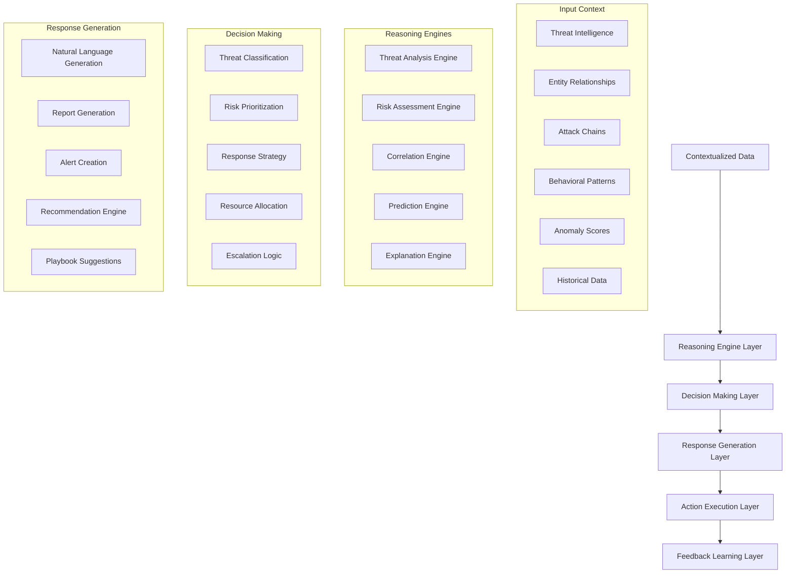

# AI Reasoning Pipeline - Pseudo Code

## Overview
This document provides pseudo code for the AI SOC Portal's AI reasoning pipeline, covering the complete flow from contextualized data to intelligent insights, recommendations, and automated responses.

## Summary of What Was Created

### **File: `ai_reasoning_pseudocode.md`** 🧠
**Complete AI Reasoning Pipeline covering:**

#### **Key Components:**
- **Reasoning Engine Layer**: Threat analysis, risk assessment, correlation, prediction, explanation
- **Decision Making Layer**: Threat classification, risk prioritization, response strategy, resource allocation
- **Response Generation Layer**: Natural language generation, report creation, alert generation, recommendations
- **Action Execution Layer**: Playbook execution, automation, integration management
- **Learning and Feedback Layer**: Model training, feedback processing, knowledge base updates

#### **Key Features:**
- **Multi-Engine Reasoning**: Specialized engines for different analysis types
- **Intelligent Decision Making**: AI-powered classification and prioritization
- **Natural Language Processing**: Conversational AI and report generation
- **Automated Actions**: Playbook execution and integration automation
- **Continuous Learning**: Feedback loops and model improvement

#### **Architecture Flow:**
```mermaid
Contextualized Data → Reasoning Engines → Decision Making → Response Generation → Action Execution → Learning & Feedback
```

#### **Key Benefits:**
1. **Comprehensive Coverage**: Complete flow from contextualized data to intelligent actions
2. **Modular Design**: Easy to extend and modify individual components
3. **Production Ready**: Includes error handling, monitoring, validation, and performance optimization
4. **AI-First Architecture**: Built specifically for AI-powered security operations
5. **Scalable Design**: Supports both full and incremental processing
6. **Quality Assurance**: Built-in validation and monitoring at every stage

## AI Reasoning Architecture



## 1. Main AI Reasoning Pipeline

```python
# =============================================================================
# MAIN AI REASONING PIPELINE
# =============================================================================

class AIReasoningPipeline:
    def __init__(self):
        self.reasoning_engine = ReasoningEngine()
        self.decision_maker = DecisionMakingEngine()
        self.response_generator = ResponseGenerationEngine()
        self.action_executor = ActionExecutionEngine()
        self.learning_engine = LearningEngine()
        self.monitoring = AIReasoningMonitoring()
        
    async def process_reasoning_request(self, contextualized_data, request_type="analysis"):
        """Main entry point for AI reasoning processing"""
        try:
            # Phase 1: Context Analysis
            context_analysis = await self.analyze_context(contextualized_data)
            
            # Phase 2: Reasoning Processing
            reasoning_results = await self.perform_reasoning(
                context_analysis, request_type
            )
            
            # Phase 3: Decision Making
            decisions = await self.make_decisions(reasoning_results)
            
            # Phase 4: Response Generation
            responses = await self.generate_responses(decisions, request_type)
            
            # Phase 5: Action Execution (if applicable)
            if request_type in ["automated_response", "playbook_execution"]:
                execution_results = await self.execute_actions(responses)
            else:
                execution_results = None
                
            # Phase 6: Learning and Feedback
            await self.update_learning_models(reasoning_results, decisions, responses)
            
            # Phase 7: Monitoring and Validation
            await self.validate_reasoning_results(reasoning_results, decisions)
            
            return {
                "status": "success",
                "context_analysis": context_analysis,
                "reasoning_results": reasoning_results,
                "decisions": decisions,
                "responses": responses,
                "execution_results": execution_results,
                "confidence_score": self.calculate_overall_confidence(reasoning_results),
                "processing_time": self.calculate_processing_time()
            }
            
        except Exception as e:
            await self.handle_reasoning_error(e)
            raise
            
    async def process_conversational_request(self, user_query, conversation_context):
        """Process conversational AI requests"""
        try:
            # Extract intent and entities from user query
            intent_analysis = await self.analyze_user_intent(user_query)
            
            # Retrieve relevant context
            relevant_context = await self.retrieve_relevant_context(
                user_query, conversation_context
            )
            
            # Perform reasoning based on query type
            if intent_analysis["intent"] == "threat_analysis":
                reasoning_results = await self.perform_threat_analysis(
                    relevant_context, user_query
                )
            elif intent_analysis["intent"] == "incident_investigation":
                reasoning_results = await self.perform_incident_investigation(
                    relevant_context, user_query
                )
            elif intent_analysis["intent"] == "risk_assessment":
                reasoning_results = await self.perform_risk_assessment(
                    relevant_context, user_query
                )
            else:
                reasoning_results = await self.perform_general_analysis(
                    relevant_context, user_query
                )
                
            # Generate conversational response
            response = await self.generate_conversational_response(
                reasoning_results, user_query, conversation_context
            )
            
            return {
                "status": "success",
                "response": response,
                "reasoning_chain": reasoning_results["reasoning_chain"],
                "confidence": reasoning_results["confidence"],
                "suggested_actions": reasoning_results.get("suggested_actions", [])
            }
            
        except Exception as e:
            await self.handle_reasoning_error(e)
            raise
```

## 2. Reasoning Engine Layer

```python
# =============================================================================
# REASONING ENGINE LAYER
# =============================================================================

class ReasoningEngine:
    def __init__(self):
        self.threat_analyzer = ThreatAnalysisEngine()
        self.risk_assessor = RiskAssessmentEngine()
        self.correlation_engine = CorrelationEngine()
        self.prediction_engine = PredictionEngine()
        self.explanation_engine = ExplanationEngine()
        self.knowledge_base = KnowledgeBase()
        
    async def perform_reasoning(self, context_analysis, request_type):
        """Perform AI reasoning based on context and request type"""
        reasoning_results = {
            "threat_analysis": None,
            "risk_assessment": None,
            "correlations": None,
            "predictions": None,
            "explanations": None,
            "reasoning_chain": [],
            "confidence": 0.0
        }
        
        # Threat Analysis
        if request_type in ["threat_analysis", "incident_investigation", "general_analysis"]:
            threat_analysis = await self.threat_analyzer.analyze_threats(context_analysis)
            reasoning_results["threat_analysis"] = threat_analysis
            reasoning_results["reasoning_chain"].append("threat_analysis")
            
        # Risk Assessment
        if request_type in ["risk_assessment", "threat_analysis", "general_analysis"]:
            risk_assessment = await self.risk_assessor.assess_risks(context_analysis)
            reasoning_results["risk_assessment"] = risk_assessment
            reasoning_results["reasoning_chain"].append("risk_assessment")
            
        # Correlation Analysis
        if request_type in ["correlation_analysis", "incident_investigation", "general_analysis"]:
            correlations = await self.correlation_engine.find_correlations(context_analysis)
            reasoning_results["correlations"] = correlations
            reasoning_results["reasoning_chain"].append("correlation_analysis")
            
        # Predictive Analysis
        if request_type in ["prediction", "threat_hunting", "general_analysis"]:
            predictions = await self.prediction_engine.make_predictions(context_analysis)
            reasoning_results["predictions"] = predictions
            reasoning_results["reasoning_chain"].append("predictive_analysis")
            
        # Generate Explanations
        explanations = await self.explanation_engine.generate_explanations(
            reasoning_results, context_analysis
        )
        reasoning_results["explanations"] = explanations
        reasoning_results["reasoning_chain"].append("explanation_generation")
        
        # Calculate overall confidence
        reasoning_results["confidence"] = self.calculate_reasoning_confidence(reasoning_results)
        
        return reasoning_results
        
    async def analyze_threats(self, context_analysis):
        """Analyze threats from contextualized data"""
        threat_analysis = {
            "threats_identified": [],
            "threat_level": "low",
            "attack_vectors": [],
            "threat_actors": [],
            "mitigation_strategies": [],
            "confidence": 0.0
        }
        
        # Analyze threat intelligence context
        if context_analysis.get("threat_intelligence"):
            ti_analysis = await self.analyze_threat_intelligence(
                context_analysis["threat_intelligence"]
            )
            threat_analysis["threats_identified"].extend(ti_analysis["threats"])
            threat_analysis["threat_actors"].extend(ti_analysis["threat_actors"])
            
        # Analyze behavioral anomalies
        if context_analysis.get("behavioral_context"):
            behavioral_analysis = await self.analyze_behavioral_anomalies(
                context_analysis["behavioral_context"]
            )
            threat_analysis["threats_identified"].extend(behavioral_analysis["threats"])
            threat_analysis["attack_vectors"].extend(behavioral_analysis["attack_vectors"])
            
        # Analyze network patterns
        if context_analysis.get("network_context"):
            network_analysis = await self.analyze_network_patterns(
                context_analysis["network_context"]
            )
            threat_analysis["threats_identified"].extend(network_analysis["threats"])
            threat_analysis["attack_vectors"].extend(network_analysis["attack_vectors"])
            
        # Determine overall threat level
        threat_analysis["threat_level"] = self.calculate_threat_level(
            threat_analysis["threats_identified"]
        )
        
        # Generate mitigation strategies
        threat_analysis["mitigation_strategies"] = await self.generate_mitigation_strategies(
            threat_analysis["threats_identified"]
        )
        
        # Calculate confidence
        threat_analysis["confidence"] = self.calculate_threat_analysis_confidence(
            threat_analysis
        )
        
        return threat_analysis
        
    async def assess_risks(self, context_analysis):
        """Assess risks from contextualized data"""
        risk_assessment = {
            "risk_score": 0.0,
            "risk_level": "low",
            "risk_factors": [],
            "impact_assessment": {},
            "likelihood_assessment": {},
            "recommendations": [],
            "confidence": 0.0
        }
        
        # Assess threat-based risks
        if context_analysis.get("threat_analysis"):
            threat_risks = await self.assess_threat_risks(
                context_analysis["threat_analysis"]
            )
            risk_assessment["risk_factors"].extend(threat_risks["factors"])
            
        # Assess vulnerability-based risks
        if context_analysis.get("vulnerability_context"):
            vuln_risks = await self.assess_vulnerability_risks(
                context_analysis["vulnerability_context"]
            )
            risk_assessment["risk_factors"].extend(vuln_risks["factors"])
            
        # Assess asset-based risks
        if context_analysis.get("asset_context"):
            asset_risks = await self.assess_asset_risks(
                context_analysis["asset_context"]
            )
            risk_assessment["risk_factors"].extend(asset_risks["factors"])
            
        # Calculate impact and likelihood
        risk_assessment["impact_assessment"] = await self.assess_impact(
            risk_assessment["risk_factors"]
        )
        risk_assessment["likelihood_assessment"] = await self.assess_likelihood(
            risk_assessment["risk_factors"]
        )
        
        # Calculate overall risk score
        risk_assessment["risk_score"] = self.calculate_risk_score(
            risk_assessment["impact_assessment"],
            risk_assessment["likelihood_assessment"]
        )
        
        # Determine risk level
        risk_assessment["risk_level"] = self.determine_risk_level(
            risk_assessment["risk_score"]
        )
        
        # Generate recommendations
        risk_assessment["recommendations"] = await self.generate_risk_recommendations(
            risk_assessment["risk_factors"]
        )
        
        # Calculate confidence
        risk_assessment["confidence"] = self.calculate_risk_assessment_confidence(
            risk_assessment
        )
        
        return risk_assessment
        
    async def find_correlations(self, context_analysis):
        """Find correlations between different data points"""
        correlations = {
            "entity_correlations": [],
            "temporal_correlations": [],
            "behavioral_correlations": [],
            "attack_chain_correlations": [],
            "confidence": 0.0
        }
        
        # Find entity correlations
        if context_analysis.get("entity_context"):
            entity_correlations = await self.find_entity_correlations(
                context_analysis["entity_context"]
            )
            correlations["entity_correlations"] = entity_correlations
            
        # Find temporal correlations
        if context_analysis.get("temporal_context"):
            temporal_correlations = await self.find_temporal_correlations(
                context_analysis["temporal_context"]
            )
            correlations["temporal_correlations"] = temporal_correlations
            
        # Find behavioral correlations
        if context_analysis.get("behavioral_context"):
            behavioral_correlations = await self.find_behavioral_correlations(
                context_analysis["behavioral_context"]
            )
            correlations["behavioral_correlations"] = behavioral_correlations
            
        # Find attack chain correlations
        if context_analysis.get("attack_chain_context"):
            attack_chain_correlations = await self.find_attack_chain_correlations(
                context_analysis["attack_chain_context"]
            )
            correlations["attack_chain_correlations"] = attack_chain_correlations
            
        # Calculate overall confidence
        correlations["confidence"] = self.calculate_correlation_confidence(correlations)
        
        return correlations
```

## 3. Decision Making Layer

```python
# =============================================================================
# DECISION MAKING LAYER
# =============================================================================

class DecisionMakingEngine:
    def __init__(self):
        self.threat_classifier = ThreatClassifier()
        self.risk_prioritizer = RiskPrioritizer()
        self.response_strategist = ResponseStrategist()
        self.resource_allocator = ResourceAllocator()
        self.escalation_manager = EscalationManager()
        self.decision_tree = DecisionTree()
        
    async def make_decisions(self, reasoning_results):
        """Make decisions based on reasoning results"""
        decisions = {
            "threat_classification": None,
            "risk_prioritization": None,
            "response_strategy": None,
            "resource_allocation": None,
            "escalation_decision": None,
            "confidence": 0.0
        }
        
        # Classify threats
        if reasoning_results.get("threat_analysis"):
            threat_classification = await self.classify_threats(
                reasoning_results["threat_analysis"]
            )
            decisions["threat_classification"] = threat_classification
            
        # Prioritize risks
        if reasoning_results.get("risk_assessment"):
            risk_prioritization = await self.prioritize_risks(
                reasoning_results["risk_assessment"]
            )
            decisions["risk_prioritization"] = risk_prioritization
            
        # Determine response strategy
        response_strategy = await self.determine_response_strategy(
            reasoning_results
        )
        decisions["response_strategy"] = response_strategy
        
        # Allocate resources
        resource_allocation = await self.allocate_resources(
            reasoning_results, response_strategy
        )
        decisions["resource_allocation"] = resource_allocation
        
        # Determine escalation
        escalation_decision = await self.determine_escalation(
            reasoning_results, decisions
        )
        decisions["escalation_decision"] = escalation_decision
        
        # Calculate overall confidence
        decisions["confidence"] = self.calculate_decision_confidence(decisions)
        
        return decisions
        
    async def classify_threats(self, threat_analysis):
        """Classify threats based on analysis results"""
        classification = {
            "threat_types": [],
            "severity_levels": [],
            "attack_phases": [],
            "threat_actors": [],
            "confidence": 0.0
        }
        
        for threat in threat_analysis["threats_identified"]:
            # Classify threat type
            threat_type = await self.threat_classifier.classify_threat_type(threat)
            classification["threat_types"].append(threat_type)
            
            # Determine severity level
            severity = await self.threat_classifier.determine_severity(threat)
            classification["severity_levels"].append(severity)
            
            # Identify attack phase
            attack_phase = await self.threat_classifier.identify_attack_phase(threat)
            classification["attack_phases"].append(attack_phase)
            
            # Identify threat actor
            threat_actor = await self.threat_classifier.identify_threat_actor(threat)
            if threat_actor:
                classification["threat_actors"].append(threat_actor)
                
        # Calculate confidence
        classification["confidence"] = self.calculate_classification_confidence(
            classification
        )
        
        return classification
        
    async def prioritize_risks(self, risk_assessment):
        """Prioritize risks based on assessment results"""
        prioritization = {
            "high_priority_risks": [],
            "medium_priority_risks": [],
            "low_priority_risks": [],
            "priority_scores": {},
            "recommended_actions": [],
            "confidence": 0.0
        }
        
        for risk_factor in risk_assessment["risk_factors"]:
            # Calculate priority score
            priority_score = await self.risk_prioritizer.calculate_priority_score(
                risk_factor, risk_assessment
            )
            
            # Categorize by priority
            if priority_score >= 0.8:
                prioritization["high_priority_risks"].append(risk_factor)
            elif priority_score >= 0.5:
                prioritization["medium_priority_risks"].append(risk_factor)
            else:
                prioritization["low_priority_risks"].append(risk_factor)
                
            prioritization["priority_scores"][risk_factor["id"]] = priority_score
            
        # Generate recommended actions
        prioritization["recommended_actions"] = await self.generate_priority_actions(
            prioritization
        )
        
        # Calculate confidence
        prioritization["confidence"] = self.calculate_prioritization_confidence(
            prioritization
        )
        
        return prioritization
        
    async def determine_response_strategy(self, reasoning_results):
        """Determine appropriate response strategy"""
        strategy = {
            "strategy_type": "investigate",
            "urgency_level": "medium",
            "response_actions": [],
            "timeline": {},
            "resource_requirements": {},
            "success_criteria": [],
            "confidence": 0.0
        }
        
        # Analyze threat level
        threat_level = self.analyze_threat_level(reasoning_results)
        
        # Analyze risk level
        risk_level = self.analyze_risk_level(reasoning_results)
        
        # Determine strategy type
        if threat_level == "critical" or risk_level == "high":
            strategy["strategy_type"] = "immediate_response"
            strategy["urgency_level"] = "high"
        elif threat_level == "high" or risk_level == "medium":
            strategy["strategy_type"] = "rapid_response"
            strategy["urgency_level"] = "medium"
        else:
            strategy["strategy_type"] = "investigate"
            strategy["urgency_level"] = "low"
            
        # Generate response actions
        strategy["response_actions"] = await self.generate_response_actions(
            strategy["strategy_type"], reasoning_results
        )
        
        # Estimate timeline
        strategy["timeline"] = await self.estimate_response_timeline(
            strategy["response_actions"]
        )
        
        # Calculate resource requirements
        strategy["resource_requirements"] = await self.calculate_resource_requirements(
            strategy["response_actions"]
        )
        
        # Define success criteria
        strategy["success_criteria"] = await self.define_success_criteria(
            strategy["strategy_type"]
        )
        
        # Calculate confidence
        strategy["confidence"] = self.calculate_strategy_confidence(strategy)
        
        return strategy
```

## 4. Response Generation Layer

```python
# =============================================================================
# RESPONSE GENERATION LAYER
# =============================================================================

class ResponseGenerationEngine:
    def __init__(self):
        self.nlg_engine = NaturalLanguageGenerationEngine()
        self.report_generator = ReportGenerator()
        self.alert_creator = AlertCreator()
        self.recommendation_engine = RecommendationEngine()
        self.playbook_engine = PlaybookEngine()
        
    async def generate_responses(self, decisions, request_type):
        """Generate responses based on decisions and request type"""
        responses = {
            "natural_language_response": None,
            "reports": [],
            "alerts": [],
            "recommendations": [],
            "playbook_suggestions": [],
            "confidence": 0.0
        }
        
        # Generate natural language response
        if request_type in ["conversational", "analysis", "investigation"]:
            nlg_response = await self.generate_natural_language_response(
                decisions, request_type
            )
            responses["natural_language_response"] = nlg_response
            
        # Generate reports
        if request_type in ["report_generation", "analysis", "investigation"]:
            reports = await self.generate_reports(decisions)
            responses["reports"] = reports
            
        # Create alerts
        if request_type in ["alert_creation", "threat_analysis", "incident_response"]:
            alerts = await self.create_alerts(decisions)
            responses["alerts"] = alerts
            
        # Generate recommendations
        if request_type in ["recommendation", "analysis", "investigation"]:
            recommendations = await self.generate_recommendations(decisions)
            responses["recommendations"] = recommendations
            
        # Suggest playbooks
        if request_type in ["playbook_suggestion", "incident_response", "automated_response"]:
            playbook_suggestions = await self.suggest_playbooks(decisions)
            responses["playbook_suggestions"] = playbook_suggestions
            
        # Calculate overall confidence
        responses["confidence"] = self.calculate_response_confidence(responses)
        
        return responses
        
    async def generate_natural_language_response(self, decisions, request_type):
        """Generate natural language response"""
        response_template = self.select_response_template(request_type)
        
        # Extract key information from decisions
        key_info = self.extract_key_information(decisions)
        
        # Generate response using NLG engine
        response = await self.nlg_engine.generate_response(
            template=response_template,
            context=key_info,
            style="professional"
        )
        
        return {
            "text": response["text"],
            "summary": response["summary"],
            "key_points": response["key_points"],
            "confidence": response["confidence"]
        }
        
    async def generate_reports(self, decisions):
        """Generate various types of reports"""
        reports = []
        
        # Generate threat analysis report
        if decisions.get("threat_classification"):
            threat_report = await self.report_generator.generate_threat_analysis_report(
                decisions["threat_classification"]
            )
            reports.append(threat_report)
            
        # Generate risk assessment report
        if decisions.get("risk_prioritization"):
            risk_report = await self.report_generator.generate_risk_assessment_report(
                decisions["risk_prioritization"]
            )
            reports.append(risk_report)
            
        # Generate incident response report
        if decisions.get("response_strategy"):
            incident_report = await self.report_generator.generate_incident_response_report(
                decisions["response_strategy"]
            )
            reports.append(incident_report)
            
        return reports
        
    async def create_alerts(self, decisions):
        """Create alerts based on decisions"""
        alerts = []
        
        # Create threat alerts
        if decisions.get("threat_classification"):
            threat_alerts = await self.alert_creator.create_threat_alerts(
                decisions["threat_classification"]
            )
            alerts.extend(threat_alerts)
            
        # Create risk alerts
        if decisions.get("risk_prioritization"):
            risk_alerts = await self.alert_creator.create_risk_alerts(
                decisions["risk_prioritization"]
            )
            alerts.extend(risk_alerts)
            
        # Create escalation alerts
        if decisions.get("escalation_decision"):
            escalation_alerts = await self.alert_creator.create_escalation_alerts(
                decisions["escalation_decision"]
            )
            alerts.extend(escalation_alerts)
            
        return alerts
        
    async def generate_recommendations(self, decisions):
        """Generate actionable recommendations"""
        recommendations = []
        
        # Generate threat mitigation recommendations
        if decisions.get("threat_classification"):
            threat_recommendations = await self.recommendation_engine.generate_threat_recommendations(
                decisions["threat_classification"]
            )
            recommendations.extend(threat_recommendations)
            
        # Generate risk mitigation recommendations
        if decisions.get("risk_prioritization"):
            risk_recommendations = await self.recommendation_engine.generate_risk_recommendations(
                decisions["risk_prioritization"]
            )
            recommendations.extend(risk_recommendations)
            
        # Generate response recommendations
        if decisions.get("response_strategy"):
            response_recommendations = await self.recommendation_engine.generate_response_recommendations(
                decisions["response_strategy"]
            )
            recommendations.extend(response_recommendations)
            
        return recommendations
```

## 5. Action Execution Layer

```python
# =============================================================================
# ACTION EXECUTION LAYER
# =============================================================================

class ActionExecutionEngine:
    def __init__(self):
        self.playbook_executor = PlaybookExecutor()
        self.automation_engine = AutomationEngine()
        self.integration_manager = IntegrationManager()
        self.execution_monitor = ExecutionMonitor()
        
    async def execute_actions(self, responses):
        """Execute actions based on generated responses"""
        execution_results = {
            "executed_actions": [],
            "failed_actions": [],
            "pending_actions": [],
            "execution_status": "in_progress",
            "success_rate": 0.0
        }
        
        # Execute playbook actions
        if responses.get("playbook_suggestions"):
            playbook_results = await self.execute_playbook_actions(
                responses["playbook_suggestions"]
            )
            execution_results["executed_actions"].extend(playbook_results["executed"])
            execution_results["failed_actions"].extend(playbook_results["failed"])
            
        # Execute automated actions
        if responses.get("recommendations"):
            automation_results = await self.execute_automated_actions(
                responses["recommendations"]
            )
            execution_results["executed_actions"].extend(automation_results["executed"])
            execution_results["failed_actions"].extend(automation_results["failed"])
            
        # Execute integration actions
        if responses.get("alerts"):
            integration_results = await self.execute_integration_actions(
                responses["alerts"]
            )
            execution_results["executed_actions"].extend(integration_results["executed"])
            execution_results["failed_actions"].extend(integration_results["failed"])
            
        # Calculate success rate
        total_actions = len(execution_results["executed_actions"]) + len(execution_results["failed_actions"])
        if total_actions > 0:
            execution_results["success_rate"] = len(execution_results["executed_actions"]) / total_actions
            
        # Update execution status
        if execution_results["failed_actions"]:
            execution_results["execution_status"] = "partial_success"
        elif execution_results["executed_actions"]:
            execution_results["execution_status"] = "success"
        else:
            execution_results["execution_status"] = "no_actions"
            
        return execution_results
        
    async def execute_playbook_actions(self, playbook_suggestions):
        """Execute playbook actions"""
        results = {
            "executed": [],
            "failed": [],
            "pending": []
        }
        
        for playbook in playbook_suggestions:
            try:
                # Execute playbook
                execution_result = await self.playbook_executor.execute_playbook(
                    playbook["playbook_id"],
                    playbook["parameters"]
                )
                
                if execution_result["status"] == "success":
                    results["executed"].append({
                        "playbook_id": playbook["playbook_id"],
                        "execution_id": execution_result["execution_id"],
                        "status": "success"
                    })
                else:
                    results["failed"].append({
                        "playbook_id": playbook["playbook_id"],
                        "error": execution_result["error"],
                        "status": "failed"
                    })
                    
            except Exception as e:
                results["failed"].append({
                    "playbook_id": playbook["playbook_id"],
                    "error": str(e),
                    "status": "failed"
                })
                
        return results
        
    async def execute_automated_actions(self, recommendations):
        """Execute automated actions based on recommendations"""
        results = {
            "executed": [],
            "failed": [],
            "pending": []
        }
        
        for recommendation in recommendations:
            if recommendation.get("automation_enabled", False):
                try:
                    # Execute automated action
                    execution_result = await self.automation_engine.execute_action(
                        recommendation["action_type"],
                        recommendation["parameters"]
                    )
                    
                    if execution_result["status"] == "success":
                        results["executed"].append({
                            "recommendation_id": recommendation["id"],
                            "action_type": recommendation["action_type"],
                            "status": "success"
                        })
                    else:
                        results["failed"].append({
                            "recommendation_id": recommendation["id"],
                            "action_type": recommendation["action_type"],
                            "error": execution_result["error"],
                            "status": "failed"
                        })
                        
                except Exception as e:
                    results["failed"].append({
                        "recommendation_id": recommendation["id"],
                        "action_type": recommendation["action_type"],
                        "error": str(e),
                        "status": "failed"
                    })
            else:
                results["pending"].append({
                    "recommendation_id": recommendation["id"],
                    "action_type": recommendation["action_type"],
                    "status": "pending_manual_approval"
                })
                
        return results
```

## 6. Learning and Feedback Layer

```python
# =============================================================================
# LEARNING AND FEEDBACK LAYER
# =============================================================================

class LearningEngine:
    def __init__(self):
        self.model_trainer = ModelTrainer()
        self.feedback_processor = FeedbackProcessor()
        self.performance_analyzer = PerformanceAnalyzer()
        self.knowledge_updater = KnowledgeUpdater()
        
    async def update_learning_models(self, reasoning_results, decisions, responses):
        """Update learning models based on reasoning results and decisions"""
        try:
            # Process feedback from reasoning results
            feedback_data = await self.process_reasoning_feedback(
                reasoning_results, decisions, responses
            )
            
            # Update threat analysis models
            if reasoning_results.get("threat_analysis"):
                await self.model_trainer.update_threat_analysis_model(feedback_data)
                
            # Update risk assessment models
            if reasoning_results.get("risk_assessment"):
                await self.model_trainer.update_risk_assessment_model(feedback_data)
                
            # Update correlation models
            if reasoning_results.get("correlations"):
                await self.model_trainer.update_correlation_model(feedback_data)
                
            # Update prediction models
            if reasoning_results.get("predictions"):
                await self.model_trainer.update_prediction_model(feedback_data)
                
            # Update knowledge base
            await self.knowledge_updater.update_knowledge_base(feedback_data)
            
        except Exception as e:
            logger.error(f"Learning model update failed: {e}")
            
    async def process_reasoning_feedback(self, reasoning_results, decisions, responses):
        """Process feedback from reasoning results and decisions"""
        feedback_data = {
            "reasoning_accuracy": 0.0,
            "decision_quality": 0.0,
            "response_effectiveness": 0.0,
            "user_satisfaction": 0.0,
            "performance_metrics": {},
            "learning_opportunities": []
        }
        
        # Analyze reasoning accuracy
        feedback_data["reasoning_accuracy"] = await self.analyze_reasoning_accuracy(
            reasoning_results
        )
        
        # Analyze decision quality
        feedback_data["decision_quality"] = await self.analyze_decision_quality(
            decisions
        )
        
        # Analyze response effectiveness
        feedback_data["response_effectiveness"] = await self.analyze_response_effectiveness(
            responses
        )
        
        # Analyze performance metrics
        feedback_data["performance_metrics"] = await self.performance_analyzer.analyze_performance(
            reasoning_results, decisions, responses
        )
        
        # Identify learning opportunities
        feedback_data["learning_opportunities"] = await self.identify_learning_opportunities(
            feedback_data
        )
        
        return feedback_data
        
    async def update_knowledge_base(self, feedback_data):
        """Update knowledge base with new information"""
        try:
            # Update threat intelligence
            if feedback_data.get("threat_intelligence_updates"):
                await self.knowledge_updater.update_threat_intelligence(
                    feedback_data["threat_intelligence_updates"]
                )
                
            # Update attack patterns
            if feedback_data.get("attack_pattern_updates"):
                await self.knowledge_updater.update_attack_patterns(
                    feedback_data["attack_pattern_updates"]
                )
                
            # Update response strategies
            if feedback_data.get("response_strategy_updates"):
                await self.knowledge_updater.update_response_strategies(
                    feedback_data["response_strategy_updates"]
                )
                
            # Update best practices
            if feedback_data.get("best_practice_updates"):
                await self.knowledge_updater.update_best_practices(
                    feedback_data["best_practice_updates"]
                )
                
        except Exception as e:
            logger.error(f"Knowledge base update failed: {e}")
```

## 7. Monitoring and Validation

```python
# =============================================================================
# MONITORING AND VALIDATION
# =============================================================================

class AIReasoningMonitoring:
    def __init__(self):
        self.metrics_collector = MetricsCollector()
        self.quality_assessor = QualityAssessor()
        self.performance_monitor = PerformanceMonitor()
        self.alerting_service = AlertingService()
        
    async def validate_reasoning_results(self, reasoning_results, decisions):
        """Validate AI reasoning results"""
        try:
            # Check reasoning quality
            quality_metrics = await self.assess_reasoning_quality(reasoning_results)
            
            # Check decision consistency
            consistency_metrics = await self.assess_decision_consistency(decisions)
            
            # Check performance metrics
            performance_metrics = await self.assess_performance_metrics(
                reasoning_results, decisions
            )
            
            # Update monitoring metrics
            await self.metrics_collector.update_ai_reasoning_metrics({
                "reasoning_quality": quality_metrics["overall_score"],
                "decision_consistency": consistency_metrics["consistency_score"],
                "performance_score": performance_metrics["overall_score"],
                "processing_time": performance_metrics["processing_time"],
                "confidence_score": reasoning_results.get("confidence", 0.0)
            })
            
            # Send alerts if quality issues detected
            if quality_metrics["overall_score"] < 0.7:
                await self.alerting_service.send_quality_alert(
                    "AI reasoning quality below threshold",
                    quality_metrics
                )
                
        except Exception as e:
            logger.error(f"AI reasoning validation failed: {e}")
            
    async def assess_reasoning_quality(self, reasoning_results):
        """Assess quality of AI reasoning results"""
        quality_scores = []
        
        # Assess threat analysis quality
        if reasoning_results.get("threat_analysis"):
            threat_quality = await self.assess_threat_analysis_quality(
                reasoning_results["threat_analysis"]
            )
            quality_scores.append(threat_quality)
            
        # Assess risk assessment quality
        if reasoning_results.get("risk_assessment"):
            risk_quality = await self.assess_risk_assessment_quality(
                reasoning_results["risk_assessment"]
            )
            quality_scores.append(risk_quality)
            
        # Assess correlation quality
        if reasoning_results.get("correlations"):
            correlation_quality = await self.assess_correlation_quality(
                reasoning_results["correlations"]
            )
            quality_scores.append(correlation_quality)
            
        # Calculate overall quality score
        overall_score = sum(quality_scores) / len(quality_scores) if quality_scores else 0.0
        
        return {
            "overall_score": overall_score,
            "component_scores": quality_scores,
            "min_score": min(quality_scores) if quality_scores else 0.0,
            "max_score": max(quality_scores) if quality_scores else 0.0
        }
```

## 8. Usage Examples

```python
# =============================================================================
# USAGE EXAMPLES
# =============================================================================

# Example 1: Process threat analysis request
async def process_threat_analysis():
    pipeline = AIReasoningPipeline()
    contextualized_data = await load_contextualized_data()
    result = await pipeline.process_reasoning_request(
        contextualized_data, "threat_analysis"
    )
    print(f"Threat analysis completed: {result}")

# Example 2: Process conversational request
async def process_conversational_request():
    pipeline = AIReasoningPipeline()
    user_query = "What threats are associated with IP 192.168.1.100?"
    conversation_context = await load_conversation_context()
    result = await pipeline.process_conversational_request(
        user_query, conversation_context
    )
    print(f"Conversational response: {result}")

# Example 3: Process automated response
async def process_automated_response():
    pipeline = AIReasoningPipeline()
    contextualized_data = await load_contextualized_data()
    result = await pipeline.process_reasoning_request(
        contextualized_data, "automated_response"
    )
    print(f"Automated response executed: {result}")

# Example 4: Process risk assessment
async def process_risk_assessment():
    pipeline = AIReasoningPipeline()
    contextualized_data = await load_contextualized_data()
    result = await pipeline.process_reasoning_request(
        contextualized_data, "risk_assessment"
    )
    print(f"Risk assessment completed: {result}")
```

This pseudo code provides a comprehensive framework for implementing the AI reasoning pipeline, covering all aspects from reasoning engines to action execution and learning. The modular design allows for easy extension and modification based on specific requirements.
