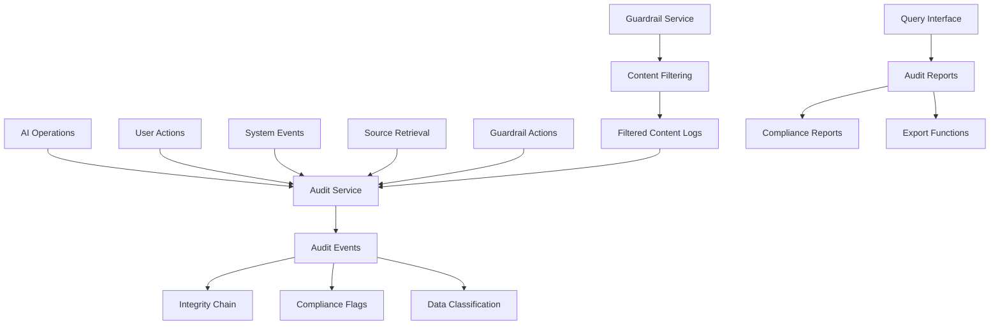

# Auditability Implementation for AI-First SOC Portal

## 🎯 Overview

This document provides comprehensive details about the auditability implementation in the AI-First SOC Portal. The auditability framework ensures complete transparency, compliance, and accountability for all AI operations, user actions, and system events.

## 📋 Table of Contents

1. [Why Auditability?](#why-auditability)
2. [Current State Analysis](#current-state-analysis)
3. [Auditability Framework](#auditability-framework)
4. [Implementation Details](#implementation-details)
5. [Source Tracking](#source-tracking)
6. [Guardrail Logging](#guardrail-logging)
7. [Compliance Features](#compliance-features)
8. [Code Examples](#code-examples)
9. [Configuration](#configuration)
10. [Benefits and Impact](#benefits-and-impact)

## 🔍 Why Auditability?

### Business Requirements

1. **Regulatory Compliance**: Meet GDPR, SOX, HIPAA, ISO 27001, and AI Act requirements
2. **Security Operations**: Maintain complete audit trails for security investigations
3. **Risk Management**: Track and monitor all AI operations for risk assessment
4. **Accountability**: Ensure transparency and accountability in AI decision-making
5. **Forensic Analysis**: Enable detailed investigation of security incidents
6. **Performance Monitoring**: Track AI system performance and optimization opportunities

### Technical Requirements

1. **Immutable Logs**: Cryptographic integrity verification for audit records
2. **Source Attribution**: Track which sources were used for AI responses
3. **Content Filtering**: Log all guardrail actions and filtered content
4. **Real-time Monitoring**: Continuous monitoring of audit events
5. **Data Classification**: Automatic classification of sensitive data
6. **Compliance Reporting**: Generate reports for regulatory requirements

## 📊 Current State Analysis

### Existing Logging Infrastructure

**Found:**
- Basic console-based logging with levels (DEBUG, INFO, WARN, ERROR)
- Structured JSON-formatted logs with metadata
- Context-aware logging with service-specific loggers
- Limited AI operation logging in agents
- Some workflow execution tracking

**Gaps Identified:**
- No comprehensive audit trail system
- Missing source tracking for RAG operations
- No guardrail filtering audit logs
- Lack of compliance-specific logging
- No immutable audit records
- Missing data classification
- No real-time audit monitoring

### Implementation Need

The auditability implementation was necessary to provide:

1. **Complete Audit Trails**: Every AI operation, user action, and system event logged
2. **Source Tracking**: Detailed logging of which sources were retrieved for AI responses
3. **Guardrail Logging**: Comprehensive logging of all content filtering actions
4. **Compliance Support**: Built-in support for regulatory requirements
5. **Integrity Verification**: Cryptographic verification of audit record integrity
6. **Real-time Monitoring**: Continuous monitoring and alerting for audit events

## 🏗️ Auditability Framework

### Architecture Overview

The auditability framework consists of three main components:



### Core Components

#### 1. Audit Service (`src/lib/auditability/audit-service.ts`)

The central service for comprehensive audit logging:

```typescript
/**
 * Audit Service
 * Comprehensive auditability framework for AI-First SOC Portal
 * 
 * This service provides:
 * - Complete audit trails for all AI operations
 * - Source tracking for RAG responses
 * - Guardrail filtering audit logs
 * - Compliance and regulatory audit support
 * - Immutable audit records with cryptographic integrity
 * - Real-time audit monitoring and alerting
 */
export class AuditService {
  private logger: Logger;
  private config: AuditConfig;
  private auditEvents: AuditEvent[];
  private integrityChain: string[];
  private monitoringInterval?: NodeJS.Timeout;
  private batchBuffer: AuditEvent[];
  private lastFlushTime: Date;

  constructor(config?: Partial<AuditConfig>) {
    // Initialize service with comprehensive configuration
    this.config = {
      enableAuditLogging: true,
      enableIntegrityVerification: true,
      enableRealTimeMonitoring: true,
      enableComplianceReporting: true,
      retentionPeriodDays: 2555, // 7 years
      encryptionEnabled: true,
      compressionEnabled: true,
      batchSize: 100,
      flushIntervalMs: 5000,
      alertThresholds: {
        criticalEventsPerMinute: 10,
        failedOperationsPercentage: 5,
        suspiciousActivityScore: 0.8,
      },
      complianceRequirements: ['gdpr', 'sox', 'iso27001'],
      dataClassificationRules: {
        'user_data': 'confidential',
        'security_data': 'restricted',
        'public_data': 'public',
        'internal_data': 'internal',
      },
    };
  }
}
```

**Key Features:**
- **Immutable Audit Records**: Cryptographic integrity verification
- **Comprehensive Event Types**: AI operations, user actions, system events
- **Data Classification**: Automatic classification of sensitive data
- **Compliance Flags**: Built-in support for regulatory requirements
- **Real-time Monitoring**: Continuous monitoring and alerting
- **Batch Processing**: Efficient processing of audit events

#### 2. Guardrail Service (`src/lib/auditability/guardrail-service.ts`)

Comprehensive content filtering with audit logging:

```typescript
/**
 * Guardrail Service
 * Comprehensive content filtering and audit logging service
 * 
 * This service provides:
 * - Content filtering for toxicity, bias, PII, and sensitive information
 * - Comprehensive audit logging of all filtered content
 * - Real-time content analysis and blocking
 * - Integration with audit service for compliance
 * - Customizable filtering rules and thresholds
 */
export class GuardrailService {
  private logger: Logger;
  private config: GuardrailConfig;
  private auditService?: AuditService;
  private stats: GuardrailStats;
  private customRules: Map<string, CustomRule>;

  constructor(config?: Partial<GuardrailConfig>, auditService?: AuditService) {
    this.config = {
      enableToxicityFilter: true,
      enableBiasFilter: true,
      enablePIIFilter: true,
      enableSensitiveFilter: true,
      enableMaliciousFilter: true,
      enableInappropriateFilter: true,
      toxicityThreshold: 0.7,
      biasThreshold: 0.6,
      piiThreshold: 0.8,
      sensitiveThreshold: 0.7,
      maliciousThreshold: 0.9,
      inappropriateThreshold: 0.6,
      actionOnViolation: 'filter',
      enableAuditLogging: true,
      enableRealTimeAnalysis: true,
      customRules: [],
    };
  }
}
```

**Key Features:**
- **Multi-layered Filtering**: Toxicity, bias, PII, sensitive, malicious, inappropriate content
- **Custom Rules**: SOC-specific filtering rules
- **Audit Integration**: Complete logging of all filtering actions
- **Real-time Analysis**: Continuous content analysis
- **Configurable Thresholds**: Adjustable sensitivity levels

#### 3. React Hook (`src/hooks/useAuditability.ts`)

Easy integration with React components:

```typescript
/**
 * React Hook for Auditability
 * Provides easy access to audit logging and monitoring capabilities
 */
export const useAuditability = (initialConfig?: Partial<AuditConfig>): UseAuditabilityReturn => {
  const [isEnabled, setIsEnabled] = useState(false);
  const [isLoading, setIsLoading] = useState(false);
  const [error, setError] = useState<string | null>(null);
  const [auditEvents, setAuditEvents] = useState<AuditEvent[]>([]);
  const [recentEvents, setRecentEvents] = useState<AuditEvent[]>([]);
  
  // Service initialization and management
  // ...
};
```

## 🔧 Implementation Details

### Audit Event Structure

Each audit event contains comprehensive information:

```typescript
export interface AuditEvent {
  eventId: string;                    // Unique event identifier
  timestamp: Date;                    // Event timestamp
  eventType: AuditEventType;          // Type of event (ai_operation, user_action, etc.)
  userId?: string;                    // User who triggered the event
  sessionId?: string;                 // Session identifier
  requestId?: string;                 // Request identifier
  workflowId?: string;                // Workflow identifier
  operation: string;                  // Operation performed
  category: AuditCategory;            // Category (threat_analysis, incident_response, etc.)
  severity: AuditSeverity;            // Severity level (low, medium, high, critical)
  source: string;                     // Source of the event
  target?: string;                    // Target of the operation
  action: string;                     // Action performed
  result: AuditResult;                // Result (success, failure, partial, blocked, error)
  metadata: AuditMetadata;            // Detailed metadata
  dataClassification: DataClassification; // Data classification
  complianceFlags: ComplianceFlag[]; // Compliance requirements
  integrityHash: string;             // Cryptographic integrity hash
  previousHash?: string;              // Previous event hash for chain verification
}
```

### Source Tracking Implementation

Comprehensive tracking of RAG source retrieval:

```typescript
/**
 * Log source retrieval for RAG operations
 * Tracks which sources were retrieved and used for generating responses
 */
async logSourceRetrieval(params: {
  query: string;
  retrievedSources: RetrievedSource[];
  userId?: string;
  sessionId?: string;
  requestId?: string;
  workflowId?: string;
  retrievalMethod: string;
  totalSources: number;
  retrievalLatencyMs: number;
  result: AuditResult;
}): Promise<string> {
  const eventId = this.generateEventId();
  const timestamp = new Date();

  const auditMetadata: AuditMetadata = {
    retrievedSources: params.retrievedSources,
    sourceCount: params.retrievedSources.length,
    relevanceScores: params.retrievedSources.map(s => s.relevanceScore),
    contextLength: params.retrievedSources.reduce((sum, s) => sum + s.contentSnippet.length, 0),
    latencyMs: params.retrievalLatencyMs,
    customAttributes: {
      query: params.query,
      retrievalMethod: params.retrievalMethod,
      totalSources: params.totalSources,
    },
  };

  // Create audit event with source tracking
  const auditEvent: AuditEvent = {
    eventId,
    timestamp,
    eventType: 'source_retrieval',
    userId: params.userId,
    sessionId: params.sessionId,
    requestId: params.requestId,
    workflowId: params.workflowId,
    operation: 'source_retrieval',
    category: 'rag_operations',
    severity: this.determineSeverity('source_retrieval', params.result),
    source: 'rag_system',
    action: 'retrieve_sources',
    result: params.result,
    metadata: auditMetadata,
    dataClassification: this.classifyData('source_retrieval', { query: params.query }),
    complianceFlags: this.determineComplianceFlags(dataClassification, { query: params.query }),
    integrityHash: this.calculateIntegrityHash(eventId, timestamp, params),
    previousHash: this.integrityChain[this.integrityChain.length - 1],
  };

  // Store and chain the event
  this.integrityChain.push(integrityHash);
  await this.storeAuditEvent(auditEvent);

  return eventId;
}
```

### Guardrail Logging Implementation

Comprehensive logging of all content filtering actions:

```typescript
/**
 * Log guardrail filtering actions
 * Tracks when content is filtered or removed by guardrails
 */
async logGuardrailAction(params: {
  originalContent: string;
  filteredContent: FilteredContent[];
  userId?: string;
  sessionId?: string;
  requestId?: string;
  workflowId?: string;
  guardrailType: string;
  action: 'block' | 'filter' | 'sanitize' | 'allow';
  result: AuditResult;
  metadata?: Record<string, any>;
}): Promise<string> {
  const eventId = this.generateEventId();
  const timestamp = new Date();

  const auditMetadata: AuditMetadata = {
    filteredContent: params.filteredContent,
    filterReason: params.filteredContent.map(f => f.filterReason).join('; '),
    filterType: params.filteredContent.map(f => f.filterType).join('; '),
    originalContent: params.originalContent,
    sanitizedContent: params.filteredContent.map(f => f.filteredText).join(' '),
    customAttributes: {
      guardrailType: params.guardrailType,
      action: params.action,
      ...params.metadata,
    },
  };

  // Create audit event for guardrail action
  const auditEvent: AuditEvent = {
    eventId,
    timestamp,
    eventType: 'guardrail_action',
    userId: params.userId,
    sessionId: params.sessionId,
    requestId: params.requestId,
    workflowId: params.workflowId,
    operation: 'guardrail_enforcement',
    category: 'guardrail_enforcement',
    severity: this.determineSeverity('guardrail_action', params.result, params.filteredContent),
    source: 'guardrail_system',
    target: 'content',
    action: params.action,
    result: params.result,
    metadata: auditMetadata,
    dataClassification: this.classifyData('guardrail_action', { content: params.originalContent }),
    complianceFlags: this.determineComplianceFlags(dataClassification, { content: params.originalContent }),
    integrityHash: this.calculateIntegrityHash(eventId, timestamp, params),
    previousHash: this.integrityChain[this.integrityChain.length - 1],
  };

  // Store and chain the event
  this.integrityChain.push(integrityHash);
  await this.storeAuditEvent(auditEvent);

  return eventId;
}
```

## 📚 Source Tracking

### Retrieved Source Structure

Detailed tracking of each source used in RAG operations:

```typescript
export interface RetrievedSource {
  sourceId: string;                   // Unique source identifier
  sourceType: 'document' | 'database' | 'api' | 'knowledge_base' | 'external';
  sourceName: string;                 // Human-readable source name
  sourceUrl?: string;                 // Source URL if applicable
  relevanceScore: number;             // Relevance score (0-1)
  confidenceScore: number;            // Confidence score (0-1)
  retrievalTimestamp: Date;           // When the source was retrieved
  contentSnippet: string;             // Snippet of retrieved content
  metadata: Record<string, any>;      // Additional source metadata
}
```

### Source Tracking Benefits

1. **Transparency**: Complete visibility into which sources influenced AI responses
2. **Accountability**: Ability to trace back to original sources for verification
3. **Quality Assurance**: Monitor source quality and relevance
4. **Compliance**: Meet regulatory requirements for AI decision transparency
5. **Debugging**: Easily identify problematic sources or retrieval issues

## 🛡️ Guardrail Logging

### Filtered Content Structure

Comprehensive logging of all content filtering actions:

```typescript
export interface FilteredContent {
  filterId: string;                  // Unique filter identifier
  filterType: 'toxicity' | 'bias' | 'pii' | 'sensitive' | 'malicious' | 'inappropriate';
  originalText: string;               // Original text that was filtered
  filteredText: string;              // Filtered/sanitized text
  filterReason: string;               // Reason for filtering
  confidenceScore: number;           // Confidence in the filtering decision
  severity: AuditSeverity;           // Severity of the violation
  timestamp: Date;                   // When the filtering occurred
}
```

### Guardrail Types

1. **Toxicity Filter**: Detects hate speech, violence, threats, abuse
2. **Bias Filter**: Identifies biased language and generalizations
3. **PII Filter**: Detects personally identifiable information
4. **Sensitive Filter**: Identifies sensitive information (passwords, API keys)
5. **Malicious Filter**: Detects malicious code and injection attempts
6. **Inappropriate Filter**: Identifies inappropriate content
7. **Custom Rules**: SOC-specific filtering rules

### Guardrail Benefits

1. **Content Safety**: Ensures AI responses meet safety standards
2. **Compliance**: Meet content policy and regulatory requirements
3. **Audit Trail**: Complete record of all content filtering actions
4. **Transparency**: Clear visibility into what content was filtered and why
5. **Continuous Improvement**: Data for improving filtering algorithms

## 📋 Compliance Features

### Data Classification

Automatic classification of data based on content and context:

```typescript
export type DataClassification = 'public' | 'internal' | 'confidential' | 'restricted' | 'top_secret';

private classifyData(operation: string, metadata?: Record<string, any>): DataClassification {
  // Simple classification logic - in production, this would be more sophisticated
  if (metadata?.query?.includes('confidential') || metadata?.content?.includes('confidential')) {
    return 'confidential';
  }
  if (metadata?.query?.includes('internal') || metadata?.content?.includes('internal')) {
    return 'internal';
  }
  if (operation.includes('security') || operation.includes('threat')) {
    return 'restricted';
  }
  return 'internal';
}
```

### Compliance Flags

Built-in support for regulatory requirements:

```typescript
export type ComplianceFlag = 
  | 'gdpr'      // General Data Protection Regulation
  | 'ccpa'      // California Consumer Privacy Act
  | 'hipaa'     // Health Insurance Portability and Accountability Act
  | 'sox'       // Sarbanes-Oxley Act
  | 'pci_dss'   // Payment Card Industry Data Security Standard
  | 'iso27001'  // ISO 27001 Information Security Management
  | 'nist'      // NIST Cybersecurity Framework
  | 'ai_act'    // EU AI Act
  | 'custom';   // Custom compliance requirements
```

### Integrity Verification

Cryptographic integrity verification for audit records:

```typescript
private calculateIntegrityHash(eventId: string, timestamp: Date, data: any): string {
  const dataString = JSON.stringify({ eventId, timestamp, data });
  return crypto.createHash('sha256').update(dataString).digest('hex');
}

verifyIntegrityChain(): boolean {
  if (this.integrityChain.length === 0) return true;

  for (let i = 1; i < this.integrityChain.length; i++) {
    const currentHash = this.integrityChain[i];
    const previousHash = this.integrityChain[i - 1];
    
    // In a real implementation, we would verify that the current hash
    // was calculated using the previous hash
    if (!currentHash || !previousHash) {
      return false;
    }
  }

  return true;
}
```

## 💻 Code Examples

### Basic Audit Logging

```typescript
import { useAuditability } from '../hooks/useAuditability';

const MyComponent = () => {
  const {
    isEnabled,
    logAIOperation,
    logSourceRetrieval,
    logGuardrailAction,
    logUserAction,
    queryAuditEvents,
    generateAuditReport
  } = useAuditability();

  const handleThreatAnalysis = async () => {
    try {
      // Log AI operation
      const operationId = await logAIOperation({
        operation: 'threat_analysis',
        category: 'threat_analysis',
        userId: 'analyst_001',
        sessionId: 'session_123',
        requestId: 'req_456',
        workflowId: 'workflow_789',
        modelName: 'gpt-4',
        promptTokens: 500,
        completionTokens: 200,
        totalTokens: 700,
        costEstimate: 0.05,
        latencyMs: 1500,
        confidenceScore: 0.85,
        result: 'success',
        metadata: {
          threatType: 'malware',
          severity: 'high',
          affectedSystems: 3
        }
      });

      // Log source retrieval
      const sourceId = await logSourceRetrieval({
        query: 'malware detection patterns',
        retrievedSources: [
          {
            sourceId: 'src_001',
            sourceType: 'knowledge_base',
            sourceName: 'Malware Detection Guide',
            relevanceScore: 0.9,
            confidenceScore: 0.85,
            retrievalTimestamp: new Date(),
            contentSnippet: 'Common malware patterns include...',
            metadata: { category: 'malware', version: '2024.1' }
          }
        ],
        userId: 'analyst_001',
        sessionId: 'session_123',
        requestId: 'req_456',
        workflowId: 'workflow_789',
        retrievalMethod: 'semantic_search',
        totalSources: 5,
        retrievalLatencyMs: 300,
        result: 'success'
      });

      // Log user action
      await logUserAction({
        userId: 'analyst_001',
        sessionId: 'session_123',
        requestId: 'req_456',
        action: 'view_threat_analysis',
        target: 'threat_report_001',
        category: 'threat_analysis',
        result: 'success',
        metadata: {
          reportId: 'threat_report_001',
          viewDuration: 120000
        }
      });

    } catch (error) {
      console.error('Operation failed:', error);
    }
  };

  const handleAuditQuery = async () => {
    try {
      // Query audit events
      const events = await queryAuditEvents({
        eventTypes: ['ai_operation', 'source_retrieval'],
        categories: ['threat_analysis'],
        severity: ['high', 'critical'],
        startDate: new Date(Date.now() - 24 * 60 * 60 * 1000), // Last 24 hours
        limit: 100
      });

      console.log('Audit events:', events);

      // Generate audit report
      const report = await generateAuditReport({
        eventTypes: ['ai_operation'],
        categories: ['threat_analysis'],
        startDate: new Date(Date.now() - 7 * 24 * 60 * 60 * 1000), // Last 7 days
      }, 'analyst_001');

      console.log('Audit report:', report);

    } catch (error) {
      console.error('Audit query failed:', error);
    }
  };

  return (
    <div>
      <button onClick={handleThreatAnalysis} disabled={!isEnabled}>
        Perform Threat Analysis
      </button>
      <button onClick={handleAuditQuery} disabled={!isEnabled}>
        Query Audit Events
      </button>
    </div>
  );
};
```

### Guardrail Integration

```typescript
import { GuardrailService } from '../lib/auditability/guardrail-service';
import { AuditService } from '../lib/auditability/audit-service';

const ContentFilteringComponent = () => {
  const auditService = new AuditService();
  const guardrailService = new GuardrailService({}, auditService);

  const handleContentAnalysis = async (content: string) => {
    try {
      // Analyze content with guardrails
      const result = await guardrailService.analyzeContent(content, {
        userId: 'user_001',
        sessionId: 'session_123',
        contentType: 'ai_response',
        source: 'threat_analysis'
      });

      console.log('Content analysis result:', {
        originalContent: result.originalContent,
        filteredContent: result.filteredContent,
        violations: result.violations.length,
        action: result.action,
        confidence: result.confidence
      });

      // Check if content was filtered
      if (result.violations.length > 0) {
        console.log('Content violations detected:', result.violations);
        
        // Log each violation
        result.violations.forEach(violation => {
          console.log(`Violation: ${violation.type} - ${violation.reason}`);
        });
      }

      return result.filteredContent;

    } catch (error) {
      console.error('Content analysis failed:', error);
      throw error;
    }
  };

  return (
    <div>
      <textarea 
        placeholder="Enter content to analyze..."
        onChange={(e) => handleContentAnalysis(e.target.value)}
      />
    </div>
  );
};
```

### Advanced Audit Reporting

```typescript
import { useAuditability } from '../hooks/useAuditability';

const AuditReportingComponent = () => {
  const {
    queryAuditEvents,
    generateAuditReport,
    exportAuditData
  } = useAuditability();

  const generateComplianceReport = async () => {
    try {
      // Query events for compliance reporting
      const query = {
        eventTypes: ['ai_operation', 'user_action', 'guardrail_action'],
        categories: ['threat_analysis', 'incident_response', 'rag_operations'],
        startDate: new Date(Date.now() - 30 * 24 * 60 * 60 * 1000), // Last 30 days
        complianceFlags: ['gdpr', 'sox', 'iso27001'],
        limit: 1000
      };

      // Generate comprehensive report
      const report = await generateAuditReport(query, 'compliance_officer');

      console.log('Compliance Report Summary:', {
        totalEvents: report.summary.totalEvents,
        eventTypes: report.summary.eventTypes,
        severity: report.summary.severity,
        complianceSummary: report.complianceSummary,
        integrityVerified: report.integrityVerified
      });

      // Export data for external analysis
      const csvData = await exportAuditData(query, 'csv');
      console.log('CSV Export:', csvData);

      const jsonData = await exportAuditData(query, 'json');
      console.log('JSON Export:', jsonData);

      return report;

    } catch (error) {
      console.error('Compliance report generation failed:', error);
      throw error;
    }
  };

  const generateSourceTrackingReport = async () => {
    try {
      // Query source retrieval events
      const query = {
        eventTypes: ['source_retrieval'],
        categories: ['rag_operations'],
        startDate: new Date(Date.now() - 7 * 24 * 60 * 60 * 1000), // Last 7 days
        limit: 500
      };

      const events = await queryAuditEvents(query);

      // Analyze source usage patterns
      const sourceStats = events.reduce((stats, event) => {
        const sources = event.metadata.retrievedSources || [];
        sources.forEach(source => {
          stats[source.sourceType] = (stats[source.sourceType] || 0) + 1;
        });
        return stats;
      }, {} as Record<string, number>);

      console.log('Source Usage Statistics:', sourceStats);

      return sourceStats;

    } catch (error) {
      console.error('Source tracking report failed:', error);
      throw error;
    }
  };

  return (
    <div>
      <button onClick={generateComplianceReport}>
        Generate Compliance Report
      </button>
      <button onClick={generateSourceTrackingReport}>
        Generate Source Tracking Report
      </button>
    </div>
  );
};
```

## ⚙️ Configuration

### Environment Variables

```bash
# Audit Service Configuration
REACT_APP_AUDIT_ENABLED=true
REACT_APP_AUDIT_RETENTION_DAYS=2555
REACT_APP_AUDIT_ENCRYPTION_ENABLED=true
REACT_APP_AUDIT_COMPRESSION_ENABLED=true

# Guardrail Configuration
REACT_APP_GUARDRAIL_ENABLED=true
REACT_APP_GUARDRAIL_TOXICITY_THRESHOLD=0.7
REACT_APP_GUARDRAIL_BIAS_THRESHOLD=0.6
REACT_APP_GUARDRAIL_PII_THRESHOLD=0.8
REACT_APP_GUARDRAIL_SENSITIVE_THRESHOLD=0.7
REACT_APP_GUARDRAIL_MALICIOUS_THRESHOLD=0.9
REACT_APP_GUARDRAIL_INAPPROPRIATE_THRESHOLD=0.6

# Compliance Configuration
REACT_APP_COMPLIANCE_GDPR=true
REACT_APP_COMPLIANCE_SOX=true
REACT_APP_COMPLIANCE_ISO27001=true
REACT_APP_COMPLIANCE_AI_ACT=true
```

### Service Configuration

#### Audit Service Configuration

```typescript
const auditConfig: AuditConfig = {
  enableAuditLogging: true,
  enableIntegrityVerification: true,
  enableRealTimeMonitoring: true,
  enableComplianceReporting: true,
  retentionPeriodDays: 2555, // 7 years
  encryptionEnabled: true,
  compressionEnabled: true,
  batchSize: 100,
  flushIntervalMs: 5000,
  alertThresholds: {
    criticalEventsPerMinute: 10,
    failedOperationsPercentage: 5,
    suspiciousActivityScore: 0.8,
  },
  complianceRequirements: ['gdpr', 'sox', 'iso27001'],
  dataClassificationRules: {
    'user_data': 'confidential',
    'security_data': 'restricted',
    'public_data': 'public',
    'internal_data': 'internal',
  },
};
```

#### Guardrail Service Configuration

```typescript
const guardrailConfig: GuardrailConfig = {
  enableToxicityFilter: true,
  enableBiasFilter: true,
  enablePIIFilter: true,
  enableSensitiveFilter: true,
  enableMaliciousFilter: true,
  enableInappropriateFilter: true,
  toxicityThreshold: 0.7,
  biasThreshold: 0.6,
  piiThreshold: 0.8,
  sensitiveThreshold: 0.7,
  maliciousThreshold: 0.9,
  inappropriateThreshold: 0.6,
  actionOnViolation: 'filter',
  enableAuditLogging: true,
  enableRealTimeAnalysis: true,
  customRules: [
    {
      id: 'soc_confidential',
      name: 'SOC Confidential Information',
      description: 'Blocks references to confidential SOC operations',
      pattern: /(confidential|classified|top.?secret|restricted)/gi,
      action: 'block',
      severity: 'high',
      enabled: true,
      category: 'soc_security',
    },
    {
      id: 'internal_ip',
      name: 'Internal IP Addresses',
      description: 'Filters internal IP addresses from responses',
      pattern: /\b(10\.|172\.(1[6-9]|2[0-9]|3[01])\.|192\.168\.)\d{1,3}\.\d{1,3}\b/g,
      action: 'sanitize',
      severity: 'medium',
      enabled: true,
      category: 'network_security',
    }
  ],
};
```

## 📖 Usage Guide

### Getting Started

1. **Initialize Services**
   ```typescript
   import { AuditService } from './lib/auditability/audit-service';
   import { GuardrailService } from './lib/auditability/guardrail-service';
   import { useAuditability } from './hooks/useAuditability';

   const auditService = new AuditService();
   const guardrailService = new GuardrailService({}, auditService);
   ```

2. **Integrate with Components**
   ```typescript
   const MyComponent = () => {
     const auditability = useAuditability();
     
     // Use auditability features
     const handleAction = async () => {
       await auditability.logUserAction({
         userId: 'user_001',
         action: 'view_dashboard',
         category: 'user_management',
         result: 'success'
       });
     };
   };
   ```

3. **Configure Guardrails**
   ```typescript
   const guardrailService = new GuardrailService({
     enableToxicityFilter: true,
     enablePIIFilter: true,
     toxicityThreshold: 0.7,
     piiThreshold: 0.8,
   }, auditService);
   ```

### Best Practices

#### Audit Logging Best Practices

1. **Complete Context**: Include all relevant context in audit events
2. **Consistent Categorization**: Use consistent categories and severity levels
3. **Data Classification**: Properly classify sensitive data
4. **Integrity Verification**: Regularly verify audit chain integrity
5. **Retention Management**: Implement proper data retention policies

#### Guardrail Best Practices

1. **Threshold Tuning**: Adjust thresholds based on false positive/negative rates
2. **Custom Rules**: Implement SOC-specific filtering rules
3. **Regular Updates**: Keep filtering patterns up to date
4. **Performance Monitoring**: Monitor filtering performance impact
5. **Audit Integration**: Ensure all filtering actions are audited

### Troubleshooting

#### Common Issues

1. **Audit Service Connection Issues**
   - Verify service initialization
   - Check configuration parameters
   - Ensure proper error handling

2. **Guardrail False Positives**
   - Adjust threshold values
   - Review custom rules
   - Analyze filtering patterns

3. **Performance Issues**
   - Optimize batch processing
   - Monitor memory usage
   - Adjust flush intervals

## 🎯 Benefits and Impact

### Business Benefits

1. **Regulatory Compliance**: Meet GDPR, SOX, HIPAA, ISO 27001, AI Act requirements
2. **Risk Management**: Complete visibility into AI operations and risks
3. **Accountability**: Transparent and accountable AI decision-making
4. **Forensic Capabilities**: Detailed investigation capabilities for security incidents
5. **Audit Readiness**: Always ready for internal and external audits

### Technical Benefits

1. **Complete Observability**: Full visibility into all system operations
2. **Source Attribution**: Complete traceability of AI response sources
3. **Content Safety**: Comprehensive content filtering and safety measures
4. **Integrity Verification**: Cryptographic verification of audit records
5. **Real-time Monitoring**: Continuous monitoring and alerting

### Security Benefits

1. **Threat Detection**: Early detection of suspicious activities
2. **Incident Response**: Detailed audit trails for incident investigation
3. **Compliance Monitoring**: Continuous compliance monitoring and reporting
4. **Data Protection**: Automatic classification and protection of sensitive data
5. **Access Control**: Comprehensive access control and authorization logging

## 🔮 Future Enhancements

### Planned Improvements

1. **Advanced Analytics**: Machine learning-based audit analysis
2. **Automated Compliance**: Automated compliance checking and reporting
3. **Real-time Alerts**: Advanced real-time alerting and notification
4. **Integration Expansion**: Integration with more external systems
5. **Performance Optimization**: Advanced performance optimization techniques

### Extension Opportunities

1. **Multi-tenant Support**: Support for multiple organizations
2. **Advanced Visualization**: Enhanced audit dashboards and visualizations
3. **API Integration**: RESTful API for external integrations
4. **Machine Learning**: ML-based anomaly detection and pattern recognition
5. **Blockchain Integration**: Blockchain-based immutable audit records

## 📚 Conclusion

The auditability implementation in the AI-First SOC Portal provides comprehensive transparency, compliance, and accountability capabilities. The framework ensures:

- **Complete Audit Trails**: Every AI operation, user action, and system event is logged
- **Source Tracking**: Detailed logging of which sources were retrieved for AI responses
- **Guardrail Logging**: Comprehensive logging of all content filtering actions
- **Compliance Support**: Built-in support for regulatory requirements
- **Integrity Verification**: Cryptographic verification of audit record integrity
- **Real-time Monitoring**: Continuous monitoring and alerting for audit events

The implementation follows industry best practices and provides a solid foundation for regulatory compliance, security operations, and continuous improvement of AI systems in security operations centers.

---

*This auditability implementation represents a significant advancement in AI transparency and accountability, providing the foundation for trustworthy, compliant, and auditable AI systems in security operations.*
