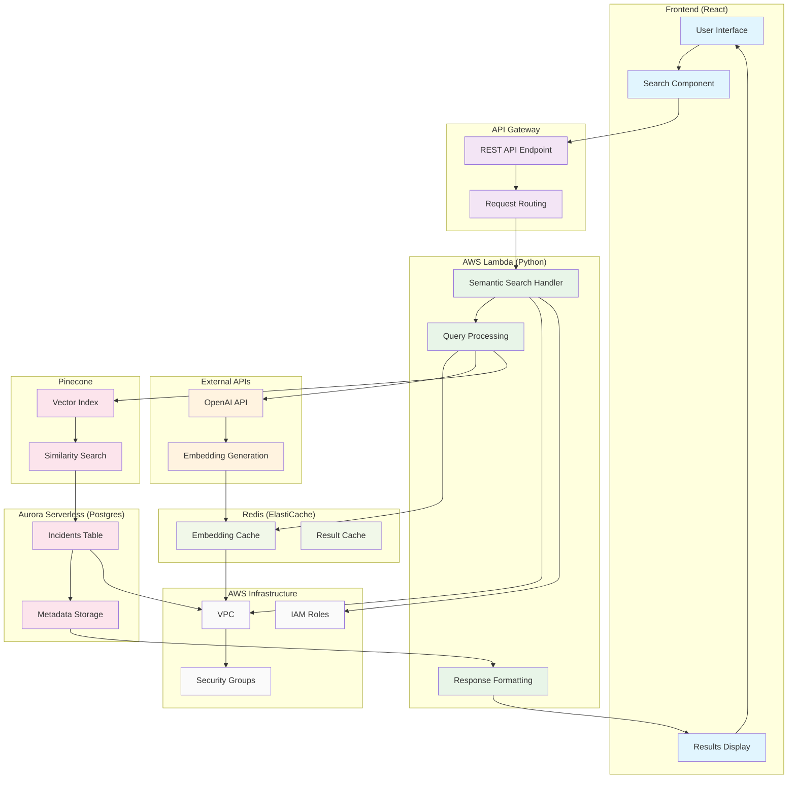
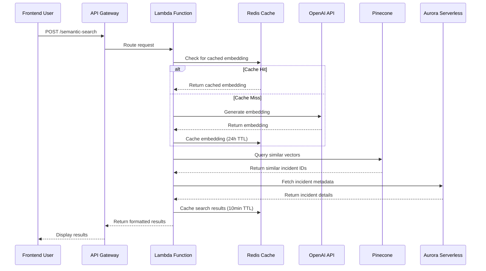
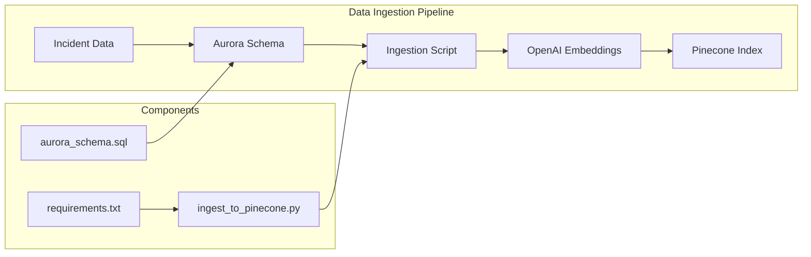
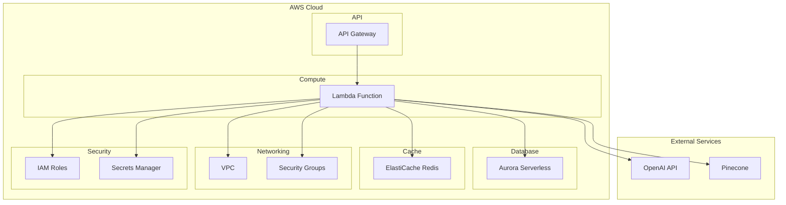
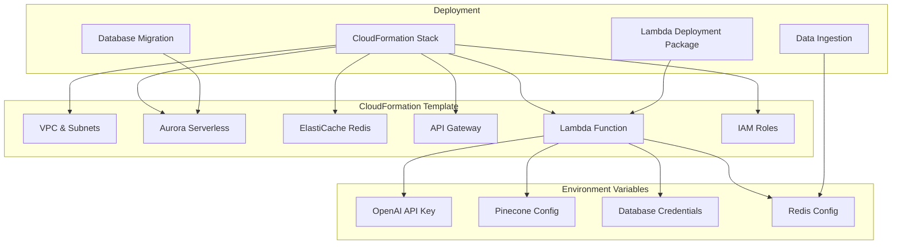

# SOC-AI Serverless Backend Architecture Diagram

## Complete System Architecture

```mermaid
graph TB
    %% Frontend Layer
    subgraph "Frontend (React)"
        A[User Interface]
        B[Search Component]
        C[Results Display]
    end

    %% API Gateway Layer
    subgraph "API Gateway"
        D[REST API Endpoint]
        E[Request Routing]
    end

    %% Lambda Layer
    subgraph "AWS Lambda (Python)"
        F[Semantic Search Handler]
        G[Query Processing]
        H[Response Formatting]
    end

    %% External Services
    subgraph "External APIs"
        I[OpenAI API]
        J[Embedding Generation]
    end

    %% Vector Database
    subgraph "Pinecone"
        K[Vector Index]
        L[Similarity Search]
    end

    %% Data Storage
    subgraph "Aurora Serverless (Postgres)"
        M[Incidents Table]
        N[Metadata Storage]
    end

    %% Caching Layer
    subgraph "Redis (ElastiCache)"
        O[Embedding Cache]
        P[Result Cache]
    end

    %% Infrastructure
    subgraph "AWS Infrastructure"
        Q[VPC]
        R[Security Groups]
        S[IAM Roles]
    end

    %% Data Flow
    A --> B
    B --> D
    D --> E
    E --> F
    F --> G
    G --> O
    G --> I
    I --> J
    J --> O
    G --> K
    K --> L
    L --> M
    M --> N
    N --> H
    H --> C
    C --> A

    %% Infrastructure Connections
    F --> Q
    M --> Q
    O --> Q
    Q --> R
    F --> S

    %% Styling
    classDef frontend fill:#e1f5fe
    classDef api fill:#f3e5f5
    classDef lambda fill:#e8f5e8
    classDef external fill:#fff3e0
    classDef database fill:#fce4ec
    classDef cache fill:#f1f8e9
    classDef infra fill:#fafafa

    class A,B,C frontend
    class D,E api
    class F,G,H lambda
    class I,J external
    class K,L,M,N database
    class O,P cache
    class Q,R,S infra
```

## Detailed Component Flow

```mermaid
sequenceDiagram
    participant User as Frontend User
    participant API as API Gateway
    participant Lambda as Lambda Function
    participant Redis as Redis Cache
    participant OpenAI as OpenAI API
    participant Pinecone as Pinecone
    participant Aurora as Aurora Serverless

    User->>API: POST /semantic-search
    API->>Lambda: Route request
    
    Lambda->>Redis: Check for cached embedding
    alt Cache Hit
        Redis-->>Lambda: Return cached embedding
    else Cache Miss
        Lambda->>OpenAI: Generate embedding
        OpenAI-->>Lambda: Return embedding
        Lambda->>Redis: Cache embedding (24h TTL)
    end
    
    Lambda->>Pinecone: Query similar vectors
    Pinecone-->>Lambda: Return similar incident IDs
    
    Lambda->>Aurora: Fetch incident metadata
    Aurora-->>Lambda: Return incident details
    
    Lambda->>Redis: Cache search results (10min TTL)
    Lambda-->>API: Return formatted results
    API-->>User: Display results
```

## Data Ingestion Flow

```mermaid
graph LR
    subgraph "Data Ingestion Pipeline"
        A[Incident Data] --> B[Aurora Schema]
        B --> C[Ingestion Script]
        C --> D[OpenAI Embeddings]
        D --> E[Pinecone Index]
    end

    subgraph "Components"
        F[aurora_schema.sql]
        G[ingest_to_pinecone.py]
        H[requirements.txt]
    end

    F --> B
    G --> C
    H --> G
```

## Infrastructure Stack

```mermaid
graph TB
    subgraph "AWS Cloud"
        subgraph "Compute"
            A[Lambda Function]
        end
        
        subgraph "API"
            B[API Gateway]
        end
        
        subgraph "Database"
            C[Aurora Serverless]
        end
        
        subgraph "Cache"
            D[ElastiCache Redis]
        end
        
        subgraph "Networking"
            E[VPC]
            F[Security Groups]
        end
        
        subgraph "Security"
            G[IAM Roles]
            H[Secrets Manager]
        end
    end
    
    subgraph "External Services"
        I[OpenAI API]
        J[Pinecone]
    end
    
    B --> A
    A --> C
    A --> D
    A --> I
    A --> J
    A --> E
    A --> F
    A --> G
    A --> H
```

## Deployment Architecture

```mermaid
graph TB
    subgraph "CloudFormation Template"
        A[VPC & Subnets]
        B[Aurora Serverless]
        C[ElastiCache Redis]
        D[API Gateway]
        E[Lambda Function]
        F[IAM Roles]
    end
    
    subgraph "Environment Variables"
        G[OpenAI API Key]
        H[Pinecone Config]
        I[Database Credentials]
        J[Redis Config]
    end
    
    subgraph "Deployment"
        K[CloudFormation Stack]
        L[Lambda Deployment Package]
        M[Database Migration]
        N[Data Ingestion]
    end
    
    K --> A
    K --> B
    K --> C
    K --> D
    K --> E
    K --> F
    
    E --> G
    E --> H
    E --> I
    E --> J
    
    L --> E
    M --> B
    N --> J
``` 