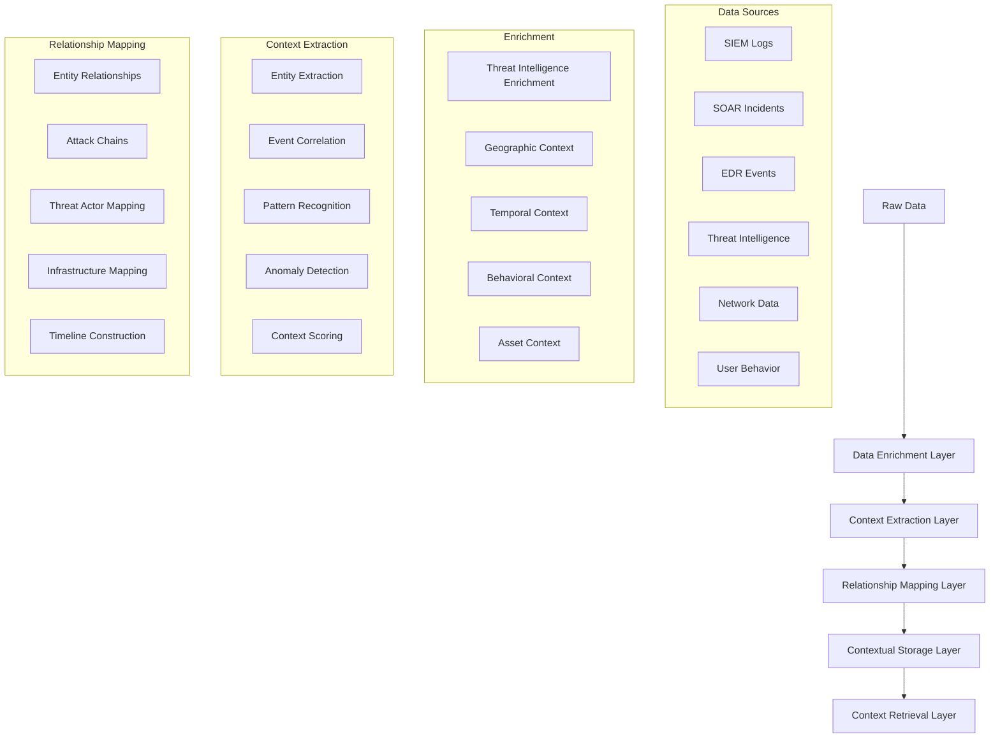

# Contextualization Pipeline - Pseudo Code

## Overview
This document provides pseudo code for the AI SOC Portal's contextualization pipeline, covering the complete flow from raw data to enriched, contextualized information ready for AI reasoning.

## Contextualization Architecture



## 1. Main Contextualization Pipeline

```python
# =============================================================================
# MAIN CONTEXTUALIZATION PIPELINE
# =============================================================================

class ContextualizationPipeline:
    def __init__(self):
        self.data_enricher = DataEnrichmentEngine()
        self.context_extractor = ContextExtractionEngine()
        self.relationship_mapper = RelationshipMappingEngine()
        self.context_storage = ContextualStorageManager()
        self.context_retriever = ContextRetrievalEngine()
        self.monitoring = ContextualizationMonitoring()
        
    async def contextualize_data(self, raw_data):
        """Main entry point for data contextualization"""
        try:
            # Phase 1: Data Enrichment
            enriched_data = await self.enrich_data_with_context(raw_data)
            
            # Phase 2: Context Extraction
            extracted_contexts = await self.extract_contextual_information(enriched_data)
            
            # Phase 3: Relationship Mapping
            relationship_graph = await self.map_relationships(extracted_contexts)
            
            # Phase 4: Contextual Storage
            await self.store_contextual_data(extracted_contexts, relationship_graph)
            
            # Phase 5: Context Indexing
            await self.index_contexts_for_retrieval(extracted_contexts)
            
            # Phase 6: Validation and Monitoring
            await self.validate_contextualization_results(extracted_contexts)
            
            return {
                "status": "success",
                "contexts_created": len(extracted_contexts),
                "relationships_mapped": len(relationship_graph),
                "enrichment_score": self.calculate_enrichment_score(enriched_data)
            }
            
        except Exception as e:
            await self.handle_contextualization_error(e)
            raise
            
    async def contextualize_incremental(self, new_data, existing_contexts):
        """Contextualize new data with existing context awareness"""
        try:
            # Get relevant existing contexts
            relevant_contexts = await self.context_retriever.find_relevant_contexts(
                new_data, existing_contexts
            )
            
            # Enrich new data with existing context
            context_aware_data = await self.data_enricher.enrich_with_existing_context(
                new_data, relevant_contexts
            )
            
            # Extract new contexts
            new_contexts = await self.extract_contextual_information(context_aware_data)
            
            # Update relationship mappings
            updated_relationships = await self.relationship_mapper.update_relationships(
                new_contexts, existing_contexts
            )
            
            return {
                "status": "success",
                "new_contexts": new_contexts,
                "updated_relationships": updated_relationships
            }
            
        except Exception as e:
            await self.handle_contextualization_error(e)
            raise
```

## 2. Data Enrichment Layer

```python
# =============================================================================
# DATA ENRICHMENT LAYER
# =============================================================================

class DataEnrichmentEngine:
    def __init__(self):
        self.threat_intel_enricher = ThreatIntelligenceEnricher()
        self.geo_enricher = GeographicEnricher()
        self.temporal_enricher = TemporalEnricher()
        self.behavioral_enricher = BehavioralEnricher()
        self.asset_enricher = AssetEnricher()
        self.network_enricher = NetworkEnricher()
        
    async def enrich_data_with_context(self, raw_data):
        """Enrich raw data with comprehensive contextual information"""
        enriched_batches = []
        
        for data_batch in raw_data:
            # Parallel enrichment across all context types
            enrichment_tasks = [
                self.enrich_threat_intelligence(data_batch),
                self.enrich_geographic_context(data_batch),
                self.enrich_temporal_context(data_batch),
                self.enrich_behavioral_context(data_batch),
                self.enrich_asset_context(data_batch),
                self.enrich_network_context(data_batch)
            ]
            
            enrichment_results = await asyncio.gather(*enrichment_tasks)
            
            # Combine all enrichment results
            enriched_batch = self.combine_enrichment_results(
                data_batch, enrichment_results
            )
            
            enriched_batches.append(enriched_batch)
            
        return enriched_batches
        
    async def enrich_threat_intelligence(self, data_batch):
        """Enrich data with threat intelligence context"""
        enriched_records = []
        
        for record in data_batch["data"]:
            # Extract indicators from record
            indicators = self.extract_indicators(record)
            
            # Look up threat intelligence for each indicator
            threat_context = {}
            for indicator in indicators:
                ti_data = await self.threat_intel_enricher.lookup_indicator(indicator)
                if ti_data:
                    threat_context[indicator] = {
                        "threat_type": ti_data.get("threat_type"),
                        "confidence": ti_data.get("confidence_score"),
                        "source": ti_data.get("source"),
                        "first_seen": ti_data.get("first_seen"),
                        "last_seen": ti_data.get("last_seen"),
                        "tags": ti_data.get("tags", []),
                        "country": ti_data.get("country_code"),
                        "latitude": ti_data.get("latitude"),
                        "longitude": ti_data.get("longitude")
                    }
                    
            # Calculate threat score
            threat_score = self.calculate_threat_score(threat_context)
            
            # Add threat context to record
            enriched_record = {
                **record,
                "threat_intelligence": threat_context,
                "threat_score": threat_score,
                "enriched_at": datetime.now()
            }
            
            enriched_records.append(enriched_record)
            
        return {
            "source": data_batch["source"],
            "data": enriched_records,
            "enrichment_type": "threat_intelligence"
        }
        
    async def enrich_geographic_context(self, data_batch):
        """Enrich data with geographic context"""
        enriched_records = []
        
        for record in data_batch["data"]:
            # Extract IP addresses and domains
            ips = self.extract_ip_addresses(record)
            domains = self.extract_domains(record)
            
            # Get geographic information
            geo_context = {}
            
            for ip in ips:
                geo_data = await self.geo_enricher.lookup_ip_geolocation(ip)
                if geo_data:
                    geo_context[ip] = {
                        "country": geo_data.get("country"),
                        "region": geo_data.get("region"),
                        "city": geo_data.get("city"),
                        "latitude": geo_data.get("latitude"),
                        "longitude": geo_data.get("longitude"),
                        "timezone": geo_data.get("timezone"),
                        "isp": geo_data.get("isp"),
                        "organization": geo_data.get("organization")
                    }
                    
            for domain in domains:
                geo_data = await self.geo_enricher.lookup_domain_geolocation(domain)
                if geo_data:
                    geo_context[domain] = {
                        "country": geo_data.get("country"),
                        "region": geo_data.get("region"),
                        "city": geo_data.get("city"),
                        "latitude": geo_data.get("latitude"),
                        "longitude": geo_data.get("longitude")
                    }
                    
            # Calculate geographic risk score
            geo_risk_score = self.calculate_geographic_risk(geo_context)
            
            enriched_record = {
                **record,
                "geographic_context": geo_context,
                "geo_risk_score": geo_risk_score
            }
            
            enriched_records.append(enriched_record)
            
        return {
            "source": data_batch["source"],
            "data": enriched_records,
            "enrichment_type": "geographic"
        }
        
    async def enrich_temporal_context(self, data_batch):
        """Enrich data with temporal context"""
        enriched_records = []
        
        for record in data_batch["data"]:
            timestamp = record.get("timestamp")
            if not timestamp:
                continue
                
            # Calculate temporal features
            temporal_context = {
                "hour_of_day": timestamp.hour,
                "day_of_week": timestamp.weekday(),
                "day_of_month": timestamp.day,
                "month": timestamp.month,
                "quarter": (timestamp.month - 1) // 3 + 1,
                "is_weekend": timestamp.weekday() >= 5,
                "is_business_hours": self.is_business_hours(timestamp),
                "is_holiday": await self.is_holiday(timestamp),
                "time_since_last_event": await self.calculate_time_since_last_event(
                    record, timestamp
                ),
                "frequency_in_timeframe": await self.calculate_frequency_in_timeframe(
                    record, timestamp
                )
            }
            
            # Calculate temporal anomaly score
            temporal_anomaly_score = self.calculate_temporal_anomaly(temporal_context)
            
            enriched_record = {
                **record,
                "temporal_context": temporal_context,
                "temporal_anomaly_score": temporal_anomaly_score
            }
            
            enriched_records.append(enriched_record)
            
        return {
            "source": data_batch["source"],
            "data": enriched_records,
            "enrichment_type": "temporal"
        }
        
    async def enrich_behavioral_context(self, data_batch):
        """Enrich data with behavioral context"""
        enriched_records = []
        
        for record in data_batch["data"]:
            # Extract user/entity information
            user_id = record.get("user_id")
            source_ip = record.get("source_ip")
            destination_ip = record.get("destination_ip")
            
            behavioral_context = {}
            
            if user_id:
                # Get user behavioral patterns
                user_behavior = await self.behavioral_enricher.get_user_behavior_patterns(
                    user_id, record.get("timestamp")
                )
                behavioral_context["user_behavior"] = user_behavior
                
            if source_ip:
                # Get IP behavioral patterns
                ip_behavior = await self.behavioral_enricher.get_ip_behavior_patterns(
                    source_ip, record.get("timestamp")
                )
                behavioral_context["source_ip_behavior"] = ip_behavior
                
            if destination_ip:
                # Get destination IP patterns
                dest_behavior = await self.behavioral_enricher.get_ip_behavior_patterns(
                    destination_ip, record.get("timestamp")
                )
                behavioral_context["destination_ip_behavior"] = dest_behavior
                
            # Calculate behavioral anomaly score
            behavioral_anomaly_score = self.calculate_behavioral_anomaly(
                behavioral_context
            )
            
            enriched_record = {
                **record,
                "behavioral_context": behavioral_context,
                "behavioral_anomaly_score": behavioral_anomaly_score
            }
            
            enriched_records.append(enriched_record)
            
        return {
            "source": data_batch["source"],
            "data": enriched_records,
            "enrichment_type": "behavioral"
        }
```

## 3. Context Extraction Layer

```python
# =============================================================================
# CONTEXT EXTRACTION LAYER
# =============================================================================

class ContextExtractionEngine:
    def __init__(self):
        self.entity_extractor = EntityExtractionEngine()
        self.event_correlator = EventCorrelationEngine()
        self.pattern_recognizer = PatternRecognitionEngine()
        self.anomaly_detector = AnomalyDetectionEngine()
        self.context_scorer = ContextScoringEngine()
        
    async def extract_contextual_information(self, enriched_data):
        """Extract contextual information from enriched data"""
        extracted_contexts = []
        
        for batch in enriched_data:
            # Extract entities from each record
            entity_contexts = await self.extract_entities(batch["data"])
            
            # Correlate events within the batch
            event_correlations = await self.correlate_events(batch["data"])
            
            # Recognize patterns across the batch
            patterns = await self.recognize_patterns(batch["data"])
            
            # Detect anomalies
            anomalies = await self.detect_anomalies(batch["data"])
            
            # Score contexts
            scored_contexts = await self.score_contexts(
                entity_contexts, event_correlations, patterns, anomalies
            )
            
            extracted_contexts.extend(scored_contexts)
            
        return extracted_contexts
        
    async def extract_entities(self, records):
        """Extract entities and their relationships from records"""
        entity_contexts = []
        
        for record in records:
            # Extract different types of entities
            entities = {
                "ip_addresses": await self.entity_extractor.extract_ip_addresses(record),
                "domains": await self.entity_extractor.extract_domains(record),
                "email_addresses": await self.entity_extractor.extract_emails(record),
                "file_hashes": await self.entity_extractor.extract_file_hashes(record),
                "user_accounts": await self.entity_extractor.extract_user_accounts(record),
                "processes": await self.entity_extractor.extract_processes(record),
                "network_connections": await self.entity_extractor.extract_network_connections(record),
                "threat_actors": await self.entity_extractor.extract_threat_actors(record)
            }
            
            # Create entity context
            entity_context = {
                "record_id": record["id"],
                "entities": entities,
                "entity_count": sum(len(ents) for ents in entities.values()),
                "extraction_confidence": self.calculate_extraction_confidence(entities),
                "extracted_at": datetime.now()
            }
            
            entity_contexts.append(entity_context)
            
        return entity_contexts
        
    async def correlate_events(self, records):
        """Correlate events to identify related activities"""
        correlations = []
        
        # Group records by time windows
        time_windows = self.create_time_windows(records, window_size_minutes=30)
        
        for window in time_windows:
            # Find correlations within the time window
            window_correlations = await self.event_correlator.find_correlations(
                window["records"]
            )
            
            if window_correlations:
                correlation_context = {
                    "time_window": window["time_range"],
                    "correlations": window_correlations,
                    "correlation_strength": self.calculate_correlation_strength(
                        window_correlations
                    ),
                    "correlated_entities": self.extract_correlated_entities(
                        window_correlations
                    )
                }
                
                correlations.append(correlation_context)
                
        return correlations
        
    async def recognize_patterns(self, records):
        """Recognize patterns in the data"""
        patterns = []
        
        # Extract different types of patterns
        attack_patterns = await self.pattern_recognizer.recognize_attack_patterns(records)
        behavioral_patterns = await self.pattern_recognizer.recognize_behavioral_patterns(records)
        temporal_patterns = await self.pattern_recognizer.recognize_temporal_patterns(records)
        network_patterns = await self.pattern_recognizer.recognize_network_patterns(records)
        
        # Combine patterns
        all_patterns = {
            "attack_patterns": attack_patterns,
            "behavioral_patterns": behavioral_patterns,
            "temporal_patterns": temporal_patterns,
            "network_patterns": network_patterns
        }
        
        # Create pattern context
        pattern_context = {
            "patterns": all_patterns,
            "pattern_count": sum(len(patterns) for patterns in all_patterns.values()),
            "pattern_confidence": self.calculate_pattern_confidence(all_patterns),
            "recognized_at": datetime.now()
        }
        
        patterns.append(pattern_context)
        
        return patterns
        
    async def detect_anomalies(self, records):
        """Detect anomalies in the data"""
        anomalies = []
        
        for record in records:
            # Detect different types of anomalies
            anomaly_scores = {
                "statistical_anomaly": await self.anomaly_detector.detect_statistical_anomaly(record),
                "behavioral_anomaly": await self.anomaly_detector.detect_behavioral_anomaly(record),
                "temporal_anomaly": await self.anomaly_detector.detect_temporal_anomaly(record),
                "network_anomaly": await self.anomaly_detector.detect_network_anomaly(record),
                "content_anomaly": await self.anomaly_detector.detect_content_anomaly(record)
            }
            
            # Calculate overall anomaly score
            overall_anomaly_score = self.calculate_overall_anomaly_score(anomaly_scores)
            
            if overall_anomaly_score > self.anomaly_detector.threshold:
                anomaly_context = {
                    "record_id": record["id"],
                    "anomaly_scores": anomaly_scores,
                    "overall_score": overall_anomaly_score,
                    "anomaly_type": self.classify_anomaly_type(anomaly_scores),
                    "detected_at": datetime.now()
                }
                
                anomalies.append(anomaly_context)
                
        return anomalies
```

## 4. Relationship Mapping Layer

```python
# =============================================================================
# RELATIONSHIP MAPPING LAYER
# =============================================================================

class RelationshipMappingEngine:
    def __init__(self):
        self.entity_relationship_mapper = EntityRelationshipMapper()
        self.attack_chain_builder = AttackChainBuilder()
        self.threat_actor_mapper = ThreatActorMapper()
        self.infrastructure_mapper = InfrastructureMapper()
        self.timeline_builder = TimelineBuilder()
        
    async def map_relationships(self, extracted_contexts):
        """Map relationships between entities and contexts"""
        relationship_graph = {
            "entity_relationships": [],
            "attack_chains": [],
            "threat_actor_mappings": [],
            "infrastructure_mappings": [],
            "timelines": []
        }
        
        # Map entity relationships
        entity_relationships = await self.map_entity_relationships(extracted_contexts)
        relationship_graph["entity_relationships"] = entity_relationships
        
        # Build attack chains
        attack_chains = await self.build_attack_chains(extracted_contexts)
        relationship_graph["attack_chains"] = attack_chains
        
        # Map threat actors
        threat_actor_mappings = await self.map_threat_actors(extracted_contexts)
        relationship_graph["threat_actor_mappings"] = threat_actor_mappings
        
        # Map infrastructure
        infrastructure_mappings = await self.map_infrastructure(extracted_contexts)
        relationship_graph["infrastructure_mappings"] = infrastructure_mappings
        
        # Build timelines
        timelines = await self.build_timelines(extracted_contexts)
        relationship_graph["timelines"] = timelines
        
        return relationship_graph
        
    async def map_entity_relationships(self, contexts):
        """Map relationships between entities"""
        relationships = []
        
        # Extract all entities from contexts
        all_entities = self.extract_all_entities(contexts)
        
        # Find relationships between entities
        for entity1 in all_entities:
            for entity2 in all_entities:
                if entity1["id"] != entity2["id"]:
                    relationship = await self.entity_relationship_mapper.find_relationship(
                        entity1, entity2
                    )
                    
                    if relationship:
                        relationships.append({
                            "entity1": entity1["id"],
                            "entity2": entity2["id"],
                            "relationship_type": relationship["type"],
                            "strength": relationship["strength"],
                            "confidence": relationship["confidence"],
                            "evidence": relationship["evidence"]
                        })
                        
        return relationships
        
    async def build_attack_chains(self, contexts):
        """Build attack chains from correlated events"""
        attack_chains = []
        
        # Group contexts by correlation
        correlated_groups = self.group_correlated_contexts(contexts)
        
        for group in correlated_groups:
            # Build attack chain from group
            attack_chain = await self.attack_chain_builder.build_chain(group)
            
            if attack_chain:
                attack_chains.append({
                    "chain_id": self.generate_chain_id(),
                    "stages": attack_chain["stages"],
                    "confidence": attack_chain["confidence"],
                    "threat_level": attack_chain["threat_level"],
                    "affected_entities": attack_chain["affected_entities"],
                    "timeline": attack_chain["timeline"]
                })
                
        return attack_chains
        
    async def map_threat_actors(self, contexts):
        """Map threat actors to activities"""
        threat_actor_mappings = []
        
        # Extract threat actor indicators
        threat_indicators = self.extract_threat_indicators(contexts)
        
        for indicator in threat_indicators:
            # Look up threat actor information
            threat_actor_info = await self.threat_actor_mapper.lookup_threat_actor(
                indicator
            )
            
            if threat_actor_info:
                mapping = {
                    "indicator": indicator,
                    "threat_actor": threat_actor_info["name"],
                    "attribution_confidence": threat_actor_info["confidence"],
                    "campaign": threat_actor_info.get("campaign"),
                    "motivation": threat_actor_info.get("motivation"),
                    "capabilities": threat_actor_info.get("capabilities"),
                    "tactics": threat_actor_info.get("tactics"),
                    "techniques": threat_actor_info.get("techniques")
                }
                
                threat_actor_mappings.append(mapping)
                
        return threat_actor_mappings
        
    async def map_infrastructure(self, contexts):
        """Map infrastructure components and their relationships"""
        infrastructure_mappings = []
        
        # Extract infrastructure components
        infrastructure_components = self.extract_infrastructure_components(contexts)
        
        for component in infrastructure_components:
            # Map component relationships
            relationships = await self.infrastructure_mapper.map_component_relationships(
                component
            )
            
            # Determine component role in attack
            role = await self.infrastructure_mapper.determine_component_role(
                component, relationships
            )
            
            mapping = {
                "component_id": component["id"],
                "component_type": component["type"],
                "role": role,
                "relationships": relationships,
                "vulnerabilities": component.get("vulnerabilities", []),
                "security_controls": component.get("security_controls", [])
            }
            
            infrastructure_mappings.append(mapping)
            
        return infrastructure_mappings
```

## 5. Contextual Storage Layer

```python
# =============================================================================
# CONTEXTUAL STORAGE LAYER
# =============================================================================

class ContextualStorageManager:
    def __init__(self):
        self.aurora_client = AuroraClient()
        self.pinecone_client = PineconeClient()
        self.redis_client = RedisClient()
        self.graph_db = GraphDatabaseClient()
        
    async def store_contextual_data(self, extracted_contexts, relationship_graph):
        """Store contextual data in appropriate storage systems"""
        try:
            # Store in Aurora PostgreSQL
            await self.store_contexts_in_aurora(extracted_contexts)
            
            # Store relationships in graph database
            await self.store_relationships_in_graph_db(relationship_graph)
            
            # Store context vectors in Pinecone
            await self.store_context_vectors(extracted_contexts)
            
            # Cache frequently accessed contexts in Redis
            await self.cache_contexts(extracted_contexts)
            
        except Exception as e:
            logger.error(f"Contextual storage failed: {e}")
            raise
            
    async def store_contexts_in_aurora(self, contexts):
        """Store contexts in Aurora PostgreSQL"""
        connection = await self.aurora_client.get_connection()
        
        try:
            async with connection.transaction():
                # Store entity contexts
                await self.aurora_client.upsert_entity_contexts(
                    [ctx for ctx in contexts if ctx["type"] == "entity"]
                )
                
                # Store event correlations
                await self.aurora_client.upsert_event_correlations(
                    [ctx for ctx in contexts if ctx["type"] == "correlation"]
                )
                
                # Store patterns
                await self.aurora_client.upsert_patterns(
                    [ctx for ctx in contexts if ctx["type"] == "pattern"]
                )
                
                # Store anomalies
                await self.aurora_client.upsert_anomalies(
                    [ctx for ctx in contexts if ctx["type"] == "anomaly"]
                )
                
        finally:
            await connection.close()
            
    async def store_relationships_in_graph_db(self, relationship_graph):
        """Store relationships in graph database"""
        try:
            # Store entity relationships
            await self.graph_db.create_entity_relationships(
                relationship_graph["entity_relationships"]
            )
            
            # Store attack chains
            await self.graph_db.create_attack_chains(
                relationship_graph["attack_chains"]
            )
            
            # Store threat actor mappings
            await self.graph_db.create_threat_actor_mappings(
                relationship_graph["threat_actor_mappings"]
            )
            
            # Store infrastructure mappings
            await self.graph_db.create_infrastructure_mappings(
                relationship_graph["infrastructure_mappings"]
            )
            
        except Exception as e:
            logger.error(f"Graph database storage failed: {e}")
            raise
            
    async def store_context_vectors(self, contexts):
        """Store context vectors in Pinecone for semantic search"""
        try:
            vectors = []
            
            for context in contexts:
                # Generate vector for context
                vector = await self.generate_context_vector(context)
                
                vectors.append({
                    "id": context["id"],
                    "values": vector,
                    "metadata": {
                        "context_type": context["type"],
                        "confidence": context.get("confidence", 0.0),
                        "timestamp": context.get("created_at", datetime.now()).isoformat()
                    }
                })
                
            # Upsert vectors to Pinecone
            await self.pinecone_client.upsert(
                vectors=vectors,
                namespace="contexts"
            )
            
        except Exception as e:
            logger.error(f"Context vector storage failed: {e}")
            raise
```

## 6. Context Retrieval Layer

```python
# =============================================================================
# CONTEXT RETRIEVAL LAYER
# =============================================================================

class ContextRetrievalEngine:
    def __init__(self):
        self.semantic_search = SemanticSearchEngine()
        self.graph_traversal = GraphTraversalEngine()
        self.temporal_search = TemporalSearchEngine()
        self.entity_search = EntitySearchEngine()
        
    async def find_relevant_contexts(self, query_data, existing_contexts=None):
        """Find contexts relevant to the given query data"""
        relevant_contexts = []
        
        # Semantic search for similar contexts
        semantic_results = await self.semantic_search.search_contexts(
            query_data, limit=50
        )
        relevant_contexts.extend(semantic_results)
        
        # Graph traversal for related contexts
        if existing_contexts:
            graph_results = await self.graph_traversal.find_related_contexts(
                existing_contexts, depth=2
            )
            relevant_contexts.extend(graph_results)
            
        # Temporal search for time-based contexts
        temporal_results = await self.temporal_search.find_temporal_contexts(
            query_data, time_window_hours=24
        )
        relevant_contexts.extend(temporal_results)
        
        # Entity-based search
        entity_results = await self.entity_search.find_entity_contexts(
            query_data
        )
        relevant_contexts.extend(entity_results)
        
        # Deduplicate and rank contexts
        deduplicated_contexts = self.deduplicate_contexts(relevant_contexts)
        ranked_contexts = await self.rank_contexts(deduplicated_contexts, query_data)
        
        return ranked_contexts[:20]  # Return top 20 most relevant
        
    async def get_context_summary(self, context_ids):
        """Get summary of contexts for the given IDs"""
        summaries = []
        
        for context_id in context_ids:
            # Get context details
            context = await self.get_context_by_id(context_id)
            
            if context:
                # Generate summary
                summary = await self.generate_context_summary(context)
                summaries.append({
                    "context_id": context_id,
                    "summary": summary,
                    "relevance_score": context.get("relevance_score", 0.0),
                    "context_type": context.get("type"),
                    "timestamp": context.get("created_at")
                })
                
        return summaries
```

## 7. Monitoring and Validation

```python
# =============================================================================
# MONITORING AND VALIDATION
# =============================================================================

class ContextualizationMonitoring:
    def __init__(self):
        self.metrics_collector = MetricsCollector()
        self.quality_assessor = QualityAssessor()
        self.performance_monitor = PerformanceMonitor()
        
    async def validate_contextualization_results(self, contexts):
        """Validate contextualization results"""
        try:
            # Check context quality
            quality_metrics = await self.assess_context_quality(contexts)
            
            # Check enrichment completeness
            enrichment_metrics = await self.assess_enrichment_completeness(contexts)
            
            # Check relationship accuracy
            relationship_metrics = await self.assess_relationship_accuracy(contexts)
            
            # Update monitoring metrics
            await self.metrics_collector.update_contextualization_metrics({
                "context_count": len(contexts),
                "quality_score": quality_metrics["overall_score"],
                "enrichment_completeness": enrichment_metrics["completeness_score"],
                "relationship_accuracy": relationship_metrics["accuracy_score"],
                "processing_time": quality_metrics["processing_time"]
            })
            
            # Send alerts if quality issues detected
            if quality_metrics["overall_score"] < 0.7:
                await self.send_quality_alert(quality_metrics)
                
        except Exception as e:
            logger.error(f"Contextualization validation failed: {e}")
            
    async def assess_context_quality(self, contexts):
        """Assess quality of contextualized data"""
        quality_scores = []
        
        for context in contexts:
            # Check data completeness
            completeness_score = self.calculate_completeness_score(context)
            
            # Check data consistency
            consistency_score = self.calculate_consistency_score(context)
            
            # Check confidence scores
            confidence_score = context.get("confidence", 0.0)
            
            # Calculate overall quality score
            overall_score = (
                completeness_score * 0.4 +
                consistency_score * 0.4 +
                confidence_score * 0.2
            )
            
            quality_scores.append(overall_score)
            
        return {
            "overall_score": sum(quality_scores) / len(quality_scores),
            "min_score": min(quality_scores),
            "max_score": max(quality_scores),
            "scores": quality_scores
        }
```

## 8. Usage Examples

```python
# =============================================================================
# USAGE EXAMPLES
# =============================================================================

# Example 1: Contextualize new data
async def contextualize_new_data():
    pipeline = ContextualizationPipeline()
    raw_data = await load_raw_data()
    result = await pipeline.contextualize_data(raw_data)
    print(f"Contextualization completed: {result}")

# Example 2: Incremental contextualization
async def contextualize_incremental():
    pipeline = ContextualizationPipeline()
    new_data = await load_new_data()
    existing_contexts = await load_existing_contexts()
    result = await pipeline.contextualize_incremental(new_data, existing_contexts)
    print(f"Incremental contextualization: {result}")

# Example 3: Find relevant contexts
async def find_relevant_contexts():
    retriever = ContextRetrievalEngine()
    query_data = {"ip": "192.168.1.100", "timestamp": datetime.now()}
    contexts = await retriever.find_relevant_contexts(query_data)
    print(f"Found {len(contexts)} relevant contexts")

# Example 4: Get context summary
async def get_context_summary():
    retriever = ContextRetrievalEngine()
    context_ids = ["ctx_001", "ctx_002", "ctx_003"]
    summaries = await retriever.get_context_summary(context_ids)
    print(f"Context summaries: {summaries}")
```

This pseudo code provides a comprehensive framework for implementing the contextualization pipeline, covering all aspects from data enrichment to relationship mapping and contextual storage. The modular design allows for easy extension and modification based on specific requirements.
