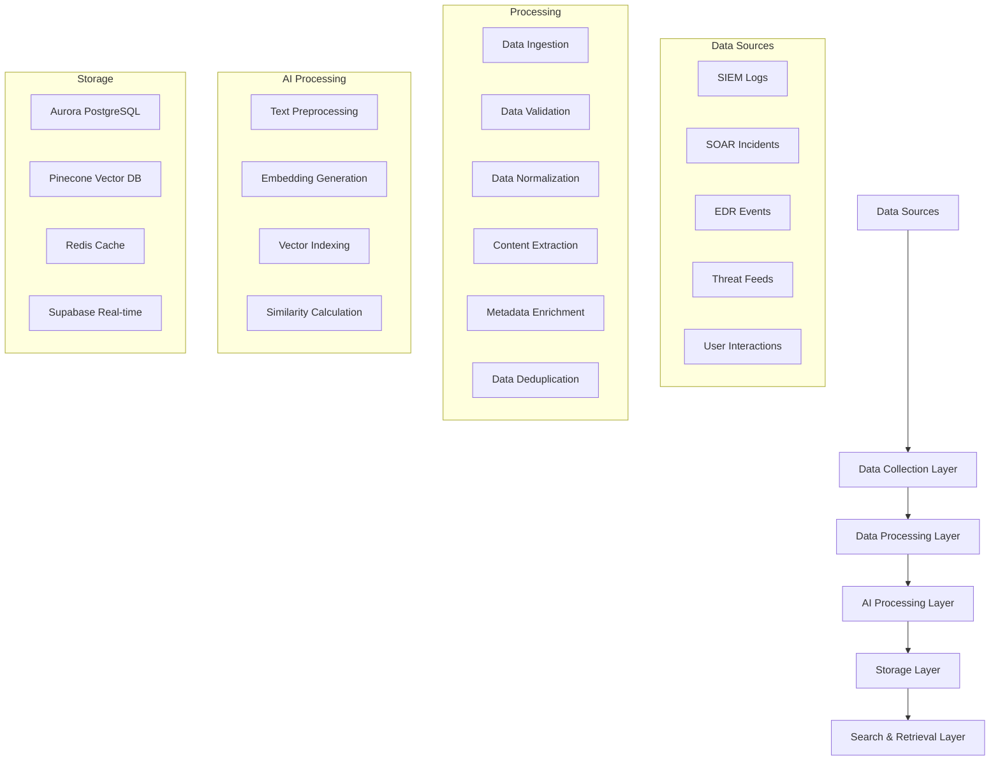

# Data Ingestion Pipeline - Pseudo Code

## Overview
This document provides pseudo code for the AI SOC Portal's data ingestion pipeline, covering the complete flow from data sources to vector embeddings and storage.

## Pipeline Architecture



## 1. Main Data Ingestion Pipeline

```python
# =============================================================================
# MAIN DATA INGESTION PIPELINE
# =============================================================================

class DataIngestionPipeline:
    def __init__(self):
        self.data_sources = DataSourceManager()
        self.processors = DataProcessorManager()
        self.ai_engine = AIProcessingEngine()
        self.storage = StorageManager()
        self.monitoring = MonitoringService()
        
    async def run_full_ingestion(self):
        """Main entry point for data ingestion pipeline"""
        try:
            # Phase 1: Data Collection
            raw_data = await self.collect_all_data_sources()
            
            # Phase 2: Data Processing
            processed_data = await self.process_and_normalize(raw_data)
            
            # Phase 3: AI Processing
            vector_data = await self.generate_embeddings(processed_data)
            
            # Phase 4: Storage
            await self.store_data(processed_data, vector_data)
            
            # Phase 5: Indexing & Caching
            await self.update_search_indexes(vector_data)
            
            # Phase 6: Monitoring & Validation
            await self.validate_ingestion_results()
            
        except Exception as e:
            await self.handle_ingestion_error(e)
            
    async def run_incremental_ingestion(self, last_run_timestamp):
        """Incremental ingestion for new/changed data only"""
        try:
            # Get only new/changed data since last run
            new_data = await self.data_sources.get_incremental_data(last_run_timestamp)
            
            if not new_data:
                return {"status": "no_new_data", "count": 0}
                
            # Process only new data
            processed_data = await self.process_and_normalize(new_data)
            vector_data = await self.generate_embeddings(processed_data)
            await self.store_data(processed_data, vector_data)
            
            return {"status": "success", "count": len(processed_data)}
            
        except Exception as e:
            await self.handle_ingestion_error(e)
```

## 2. Data Collection Layer

```python
# =============================================================================
# DATA COLLECTION LAYER
# =============================================================================

class DataSourceManager:
    def __init__(self):
        self.siem_connector = SIEMConnector()
        self.soar_connector = SOARConnector()
        self.edr_connector = EDRConnector()
        self.threat_feed_connector = ThreatFeedConnector()
        self.user_interaction_tracker = UserInteractionTracker()
        
    async def collect_all_data_sources(self):
        """Collect data from all configured sources"""
        collection_tasks = [
            self.collect_siem_data(),
            self.collect_soar_data(),
            self.collect_edr_data(),
            self.collect_threat_intelligence(),
            self.collect_user_interactions()
        ]
        
        # Run all collection tasks in parallel
        results = await asyncio.gather(*collection_tasks, return_exceptions=True)
        
        # Combine and validate results
        combined_data = self.combine_collection_results(results)
        return combined_data
        
    async def collect_siem_data(self):
        """Collect data from SIEM systems"""
        try:
            # Connect to SIEM (Splunk, QRadar, etc.)
            siem_data = await self.siem_connector.fetch_recent_events(
                time_range="last_24_hours",
                event_types=["alerts", "logs", "correlations"],
                limit=10000
            )
            
            # Transform SIEM data to standard format
            normalized_data = self.normalize_siem_data(siem_data)
            
            return {
                "source": "siem",
                "data": normalized_data,
                "count": len(normalized_data),
                "timestamp": datetime.now()
            }
            
        except Exception as e:
            logger.error(f"SIEM data collection failed: {e}")
            return {"source": "siem", "data": [], "error": str(e)}
            
    async def collect_soar_data(self):
        """Collect data from SOAR systems"""
        try:
            # Connect to SOAR (Phantom, XSOAR, etc.)
            soar_data = await self.soar_connector.fetch_incidents(
                status=["new", "in_progress", "resolved"],
                time_range="last_7_days"
            )
            
            # Extract playbook execution data
            playbook_data = await self.soar_connector.fetch_playbook_executions(
                time_range="last_24_hours"
            )
            
            normalized_data = self.normalize_soar_data(soar_data, playbook_data)
            
            return {
                "source": "soar",
                "data": normalized_data,
                "count": len(normalized_data),
                "timestamp": datetime.now()
            }
            
        except Exception as e:
            logger.error(f"SOAR data collection failed: {e}")
            return {"source": "soar", "data": [], "error": str(e)}
            
    async def collect_edr_data(self):
        """Collect data from EDR systems"""
        try:
            # Connect to EDR (CrowdStrike, SentinelOne, etc.)
            edr_data = await self.edr_connector.fetch_detections(
                time_range="last_24_hours",
                severity=["high", "critical"],
                status=["new", "investigating"]
            )
            
            # Get endpoint telemetry data
            telemetry_data = await self.edr_connector.fetch_telemetry(
                time_range="last_6_hours",
                event_types=["process", "network", "file"]
            )
            
            normalized_data = self.normalize_edr_data(edr_data, telemetry_data)
            
            return {
                "source": "edr",
                "data": normalized_data,
                "count": len(normalized_data),
                "timestamp": datetime.now()
            }
            
        except Exception as e:
            logger.error(f"EDR data collection failed: {e}")
            return {"source": "edr", "data": [], "error": str(e)}
```

## 3. Data Processing Layer

```python
# =============================================================================
# DATA PROCESSING LAYER
# =============================================================================

class DataProcessorManager:
    def __init__(self):
        self.validators = DataValidators()
        self.normalizers = DataNormalizers()
        self.enrichers = DataEnrichers()
        self.deduplicators = DeduplicationEngine()
        
    async def process_and_normalize(self, raw_data):
        """Process and normalize collected data"""
        processed_batches = []
        
        for source_data in raw_data:
            if source_data.get("error"):
                continue
                
            # Step 1: Validate data structure
            validated_data = await self.validators.validate_source_data(
                source_data["data"], 
                source_data["source"]
            )
            
            # Step 2: Normalize to common schema
            normalized_data = await self.normalizers.normalize_to_common_schema(
                validated_data,
                source_data["source"]
            )
            
            # Step 3: Enrich with additional context
            enriched_data = await self.enrichers.enrich_data(
                normalized_data,
                source_data["source"]
            )
            
            # Step 4: Deduplicate across sources
            deduplicated_data = await self.deduplicators.deduplicate(
                enriched_data,
                source_data["source"]
            )
            
            processed_batches.append({
                "source": source_data["source"],
                "data": deduplicated_data,
                "processed_at": datetime.now(),
                "count": len(deduplicated_data)
            })
            
        return processed_batches
        
    async def normalize_to_common_schema(self, data, source_type):
        """Normalize data to common schema regardless of source"""
        normalized_records = []
        
        for record in data:
            # Map source-specific fields to common schema
            common_record = {
                "id": self.generate_unique_id(record, source_type),
                "title": self.extract_title(record, source_type),
                "description": self.extract_description(record, source_type),
                "severity": self.map_severity(record.get("severity"), source_type),
                "status": self.map_status(record.get("status"), source_type),
                "source": source_type,
                "source_id": record.get("id"),
                "timestamp": self.parse_timestamp(record.get("timestamp")),
                "tags": self.extract_tags(record, source_type),
                "indicators": self.extract_indicators(record, source_type),
                "metadata": self.extract_metadata(record, source_type),
                "raw_data": record  # Keep original for reference
            }
            
            normalized_records.append(common_record)
            
        return normalized_records
        
    def extract_title(self, record, source_type):
        """Extract title based on source type"""
        if source_type == "siem":
            return record.get("alert_name") or record.get("rule_name")
        elif source_type == "soar":
            return record.get("incident_name") or record.get("playbook_name")
        elif source_type == "edr":
            return record.get("detection_name") or record.get("threat_name")
        else:
            return record.get("title") or "Unknown"
            
    def extract_description(self, record, source_type):
        """Extract description based on source type"""
        description_parts = []
        
        if source_type == "siem":
            description_parts.append(record.get("description", ""))
            description_parts.append(record.get("reason", ""))
            description_parts.append(record.get("details", ""))
        elif source_type == "soar":
            description_parts.append(record.get("description", ""))
            description_parts.append(record.get("summary", ""))
            description_parts.append(record.get("resolution_notes", ""))
        elif source_type == "edr":
            description_parts.append(record.get("description", ""))
            description_parts.append(record.get("threat_description", ""))
            description_parts.append(record.get("behavior", ""))
            
        return " | ".join(filter(None, description_parts))
```

## 4. AI Processing Layer

```python
# =============================================================================
# AI PROCESSING LAYER
# =============================================================================

class AIProcessingEngine:
    def __init__(self):
        self.openai_client = OpenAIClient()
        self.embedding_cache = EmbeddingCache()
        self.batch_processor = BatchProcessor()
        self.vector_indexer = VectorIndexer()
        
    async def generate_embeddings(self, processed_data):
        """Generate embeddings for all processed data"""
        vector_data = []
        
        for batch in processed_data:
            # Prepare text for embedding
            text_batches = self.prepare_text_for_embedding(batch["data"])
            
            # Generate embeddings in batches for efficiency
            embeddings = await self.batch_generate_embeddings(text_batches)
            
            # Create vector records
            for i, record in enumerate(batch["data"]):
                vector_record = {
                    "id": record["id"],
                    "vector": embeddings[i],
                    "metadata": {
                        "title": record["title"],
                        "source": record["source"],
                        "severity": record["severity"],
                        "timestamp": record["timestamp"].isoformat(),
                        "tags": record["tags"]
                    }
                }
                vector_data.append(vector_record)
                
        return vector_data
        
    async def batch_generate_embeddings(self, text_batches):
        """Generate embeddings in optimized batches"""
        embeddings = []
        
        # Process in batches to respect API limits
        batch_size = 100  # OpenAI batch limit
        for i in range(0, len(text_batches), batch_size):
            batch = text_batches[i:i + batch_size]
            
            # Check cache first
            cached_embeddings = await self.embedding_cache.get_batch(batch)
            new_texts = []
            new_indices = []
            
            for j, text in enumerate(batch):
                if cached_embeddings[j] is not None:
                    embeddings.append(cached_embeddings[j])
                else:
                    new_texts.append(text)
                    new_indices.append(i + j)
                    
            # Generate embeddings for uncached texts
            if new_texts:
                new_embeddings = await self.openai_client.create_embeddings(
                    texts=new_texts,
                    model="text-embedding-3-small"
                )
                
                # Cache new embeddings
                await self.embedding_cache.set_batch(new_texts, new_embeddings)
                
                # Insert new embeddings at correct positions
                for j, embedding in enumerate(new_embeddings):
                    embeddings.insert(new_indices[j], embedding)
                    
        return embeddings
        
    def prepare_text_for_embedding(self, records):
        """Prepare text content for embedding generation"""
        text_batches = []
        
        for record in records:
            # Combine title and description for better semantic understanding
            text_content = f"{record['title']}\n{record['description']}"
            
            # Add tags for additional context
            if record.get("tags"):
                text_content += f"\nTags: {', '.join(record['tags'])}"
                
            # Add indicators for threat context
            if record.get("indicators"):
                indicators_text = " ".join(record["indicators"])
                text_content += f"\nIndicators: {indicators_text}"
                
            text_batches.append(text_content)
            
        return text_batches
```

## 5. Storage Layer

```python
# =============================================================================
# STORAGE LAYER
# =============================================================================

class StorageManager:
    def __init__(self):
        self.aurora_client = AuroraClient()
        self.pinecone_client = PineconeClient()
        self.redis_client = RedisClient()
        self.supabase_client = SupabaseClient()
        
    async def store_data(self, processed_data, vector_data):
        """Store processed data and vectors in appropriate storage systems"""
        try:
            # Store in Aurora PostgreSQL
            await self.store_in_aurora(processed_data)
            
            # Store vectors in Pinecone
            await self.store_in_pinecone(vector_data)
            
            # Update Redis cache
            await self.update_redis_cache(processed_data)
            
            # Update Supabase for real-time features
            await self.update_supabase(processed_data)
            
        except Exception as e:
            logger.error(f"Storage operation failed: {e}")
            raise
            
    async def store_in_aurora(self, processed_data):
        """Store processed data in Aurora PostgreSQL"""
        connection = await self.aurora_client.get_connection()
        
        try:
            async with connection.transaction():
                for batch in processed_data:
                    # Insert/update incidents table
                    await self.aurora_client.upsert_incidents(
                        batch["data"],
                        batch["source"]
                    )
                    
                    # Insert/update alerts table
                    await self.aurora_client.upsert_alerts(
                        batch["data"],
                        batch["source"]
                    )
                    
                    # Insert/update threat intelligence
                    await self.aurora_client.upsert_threat_intelligence(
                        batch["data"],
                        batch["source"]
                    )
                    
        finally:
            await connection.close()
            
    async def store_in_pinecone(self, vector_data):
        """Store vectors in Pinecone for semantic search"""
        try:
            # Prepare vectors for Pinecone
            pinecone_vectors = []
            for record in vector_data:
                pinecone_vectors.append({
                    "id": record["id"],
                    "values": record["vector"],
                    "metadata": record["metadata"]
                })
                
            # Upsert vectors in batches
            batch_size = 100
            for i in range(0, len(pinecone_vectors), batch_size):
                batch = pinecone_vectors[i:i + batch_size]
                await self.pinecone_client.upsert(
                    vectors=batch,
                    namespace="incidents"
                )
                
        except Exception as e:
            logger.error(f"Pinecone storage failed: {e}")
            raise
            
    async def update_redis_cache(self, processed_data):
        """Update Redis cache with processed data"""
        try:
            for batch in processed_data:
                for record in batch["data"]:
                    # Cache individual records
                    cache_key = f"incident:{record['id']}"
                    await self.redis_client.set(
                        cache_key,
                        json.dumps(record),
                        ex=3600  # 1 hour TTL
                    )
                    
                    # Cache by source
                    source_key = f"source:{batch['source']}:{record['id']}"
                    await self.redis_client.set(
                        source_key,
                        json.dumps(record),
                        ex=1800  # 30 minutes TTL
                    )
                    
        except Exception as e:
            logger.error(f"Redis cache update failed: {e}")
            # Don't raise - cache failures shouldn't stop ingestion
```

## 6. Monitoring and Validation

```python
# =============================================================================
# MONITORING AND VALIDATION
# =============================================================================

class MonitoringService:
    def __init__(self):
        self.metrics_collector = MetricsCollector()
        self.alerting_service = AlertingService()
        self.health_checker = HealthChecker()
        
    async def validate_ingestion_results(self):
        """Validate ingestion results and update metrics"""
        try:
            # Check data quality
            quality_metrics = await self.check_data_quality()
            
            # Check storage health
            storage_health = await self.check_storage_health()
            
            # Check AI processing health
            ai_health = await self.check_ai_processing_health()
            
            # Update metrics
            await self.metrics_collector.update_ingestion_metrics({
                "quality_score": quality_metrics["score"],
                "records_processed": quality_metrics["count"],
                "storage_healthy": storage_health["status"],
                "ai_processing_healthy": ai_health["status"],
                "timestamp": datetime.now()
            })
            
            # Send alerts if issues detected
            if quality_metrics["score"] < 0.8:
                await self.alerting_service.send_alert(
                    "Data quality below threshold",
                    {"quality_score": quality_metrics["score"]}
                )
                
        except Exception as e:
            logger.error(f"Validation failed: {e}")
            await self.alerting_service.send_alert(
                "Ingestion validation failed",
                {"error": str(e)}
            )
            
    async def check_data_quality(self):
        """Check quality of ingested data"""
        # Check for missing required fields
        missing_fields = await self.check_missing_fields()
        
        # Check for data consistency
        consistency_score = await self.check_data_consistency()
        
        # Check for duplicates
        duplicate_rate = await self.check_duplicate_rate()
        
        # Calculate overall quality score
        quality_score = (
            (1 - missing_fields["rate"]) * 0.4 +
            consistency_score * 0.4 +
            (1 - duplicate_rate) * 0.2
        )
        
        return {
            "score": quality_score,
            "missing_fields": missing_fields,
            "consistency": consistency_score,
            "duplicates": duplicate_rate
        }
```

## 7. Error Handling and Recovery

```python
# =============================================================================
# ERROR HANDLING AND RECOVERY
# =============================================================================

class ErrorHandler:
    def __init__(self):
        self.retry_strategy = RetryStrategy()
        self.dead_letter_queue = DeadLetterQueue()
        self.recovery_service = RecoveryService()
        
    async def handle_ingestion_error(self, error):
        """Handle ingestion errors with appropriate recovery strategies"""
        error_context = {
            "error_type": type(error).__name__,
            "error_message": str(error),
            "timestamp": datetime.now(),
            "pipeline_stage": self.get_current_stage()
        }
        
        # Log error
        logger.error(f"Ingestion error: {error_context}")
        
        # Determine recovery strategy
        if isinstance(error, RetryableError):
            await self.handle_retryable_error(error, error_context)
        elif isinstance(error, DataValidationError):
            await self.handle_validation_error(error, error_context)
        elif isinstance(error, StorageError):
            await self.handle_storage_error(error, error_context)
        else:
            await self.handle_unknown_error(error, error_context)
            
    async def handle_retryable_error(self, error, context):
        """Handle retryable errors with exponential backoff"""
        retry_count = context.get("retry_count", 0)
        
        if retry_count < self.retry_strategy.max_retries:
            # Wait with exponential backoff
            wait_time = self.retry_strategy.get_wait_time(retry_count)
            await asyncio.sleep(wait_time)
            
            # Retry the operation
            await self.retry_operation(context)
        else:
            # Move to dead letter queue
            await self.dead_letter_queue.add(context)
            
    async def handle_validation_error(self, error, context):
        """Handle data validation errors"""
        # Log the specific validation issues
        logger.warning(f"Data validation failed: {error.details}")
        
        # Attempt to fix common validation issues
        fixed_data = await self.recovery_service.attempt_data_fix(
            error.data,
            error.validation_rules
        )
        
        if fixed_data:
            # Retry with fixed data
            await self.retry_with_fixed_data(fixed_data, context)
        else:
            # Skip invalid data and continue
            await self.skip_invalid_data(error.data, context)
```

## 8. Configuration and Scheduling

```python
# =============================================================================
# CONFIGURATION AND SCHEDULING
# =============================================================================

class IngestionScheduler:
    def __init__(self):
        self.config = IngestionConfig()
        self.scheduler = AsyncScheduler()
        self.pipeline = DataIngestionPipeline()
        
    async def setup_scheduled_ingestion(self):
        """Setup scheduled ingestion jobs"""
        # Full ingestion - daily at 2 AM
        await self.scheduler.add_job(
            self.pipeline.run_full_ingestion,
            "cron",
            hour=2,
            minute=0,
            id="full_ingestion_daily"
        )
        
        # Incremental ingestion - every 15 minutes
        await self.scheduler.add_job(
            self.run_incremental_ingestion,
            "interval",
            minutes=15,
            id="incremental_ingestion"
        )
        
        # Health check - every 5 minutes
        await self.scheduler.add_job(
            self.check_pipeline_health,
            "interval",
            minutes=5,
            id="health_check"
        )
        
    async def run_incremental_ingestion(self):
        """Run incremental ingestion"""
        last_run = await self.get_last_ingestion_timestamp()
        result = await self.pipeline.run_incremental_ingestion(last_run)
        
        if result["status"] == "success":
            await self.update_last_ingestion_timestamp()
            
        return result
```

## 9. Usage Examples

```python
# =============================================================================
# USAGE EXAMPLES
# =============================================================================

# Example 1: Run full ingestion manually
async def run_manual_ingestion():
    pipeline = DataIngestionPipeline()
    result = await pipeline.run_full_ingestion()
    print(f"Ingestion completed: {result}")

# Example 2: Run incremental ingestion
async def run_incremental():
    pipeline = DataIngestionPipeline()
    last_run = datetime.now() - timedelta(hours=1)
    result = await pipeline.run_incremental_ingestion(last_run)
    print(f"Incremental ingestion: {result}")

# Example 3: Process specific data source
async def process_siem_only():
    pipeline = DataIngestionPipeline()
    siem_data = await pipeline.data_sources.collect_siem_data()
    processed = await pipeline.processors.process_and_normalize([siem_data])
    vectors = await pipeline.ai_engine.generate_embeddings(processed)
    await pipeline.storage.store_data(processed, vectors)

# Example 4: Monitor ingestion health
async def check_health():
    monitoring = MonitoringService()
    health = await monitoring.check_pipeline_health()
    print(f"Pipeline health: {health}")
```

## 10. Performance Optimizations

```python
# =============================================================================
# PERFORMANCE OPTIMIZATIONS
# =============================================================================

class PerformanceOptimizer:
    def __init__(self):
        self.batch_processor = BatchProcessor()
        self.connection_pool = ConnectionPool()
        self.cache_manager = CacheManager()
        
    async def optimize_ingestion_performance(self):
        """Apply performance optimizations"""
        # Use connection pooling
        await self.connection_pool.initialize()
        
        # Enable batch processing
        await self.batch_processor.enable_batching()
        
        # Configure caching
        await self.cache_manager.configure_caching()
        
        # Set up parallel processing
        await self.setup_parallel_processing()
        
    async def setup_parallel_processing(self):
        """Setup parallel processing for better performance"""
        # Process different data sources in parallel
        # Use asyncio.gather for concurrent operations
        # Implement worker pools for CPU-intensive tasks
        pass
```

This pseudo code provides a comprehensive framework for implementing the data ingestion pipeline, covering all aspects from data collection to storage and monitoring. The modular design allows for easy extension and modification based on specific requirements.
