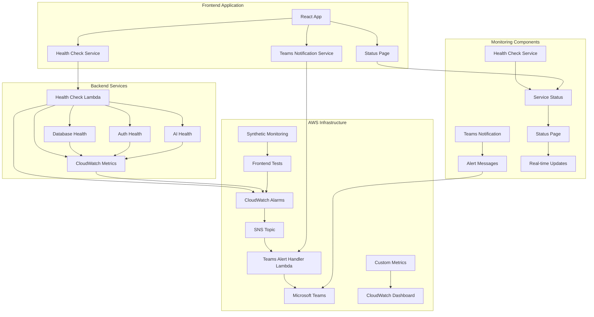

# SOC Nexus Monitoring Architecture

## Overview

The SOC Nexus monitoring system provides comprehensive monitoring for critical services with automated Microsoft Teams notifications for downtime events. The system ensures high availability and rapid incident response through real-time health checks, automated alerting, and escalation procedures.

## Architecture Diagram



## System Components

### 1. Frontend Monitoring Services

#### Health Check Service (`src/services/healthCheck.ts`)
- **Purpose**: Monitors critical services and provides health status
- **Key Features**:
  - Singleton pattern for consistent monitoring
  - Real-time health checks for frontend, database, auth, and AI services
  - Continuous monitoring with configurable intervals
  - Automatic Teams notification triggers
  - Service status aggregation

#### Teams Notification Service (`src/services/teamsNotification.ts`)
- **Purpose**: Sends rich notifications to Microsoft Teams
- **Key Features**:
  - Rich message cards with actionable buttons
  - Support for downtime, recovery, maintenance, and escalation alerts
  - Configurable webhook integration
  - Error handling and retry logic

#### Status Page (`src/pages/StatusPage.tsx`)
- **Purpose**: Real-time service status dashboard
- **Key Features**:
  - Live service status updates every 30 seconds
  - Visual status indicators with color coding
  - System metrics and performance data
  - Recent incidents tracking
  - Responsive design for all devices

### 2. Backend Monitoring Services

#### Health Check Lambda (`backend/lambda/health_check.py`)
- **Purpose**: Backend health monitoring and metrics collection
- **Key Features**:
  - RESTful health check endpoints
  - Database connection testing
  - Authentication service validation
  - AI service availability checks
  - CloudWatch metrics integration
  - CORS support for frontend integration

#### Teams Alert Handler Lambda (`backend/lambda/teams_alert_handler.py`)
- **Purpose**: Processes CloudWatch alarms and sends Teams notifications
- **Key Features**:
  - CloudWatch alarm event processing
  - Service name extraction from alarm names
  - Rich message formatting for Teams
  - Support for multiple alert types
  - Error handling and logging

### 3. AWS Infrastructure

#### CloudWatch Configuration (`monitoring/cloudwatch-config.yaml`)
- **Purpose**: Infrastructure monitoring and alerting setup
- **Key Features**:
  - Custom CloudWatch dashboard
  - Multiple alarm configurations
  - SNS topic for alert distribution
  - Synthetic monitoring canaries
  - IAM roles and permissions

#### Deployment Script (`scripts/deploy-monitoring.sh`)
- **Purpose**: Automated deployment of monitoring infrastructure
- **Key Features**:
  - CloudFormation stack deployment
  - Lambda function packaging and deployment
  - Environment configuration
  - Prerequisites validation
  - Deployment testing and verification

## Monitoring Metrics

### Application Metrics
- **Response Time**: < 200ms for 95% of requests
- **Error Rate**: < 1% for all endpoints
- **Availability**: 99.9% uptime target
- **Throughput**: Monitor requests per second

### Infrastructure Metrics
- **CPU Utilization**: < 80% average
- **Memory Usage**: < 85% average
- **Disk Space**: < 90% usage
- **Network Latency**: < 100ms average

### Business Metrics
- **Active Users**: Monitor concurrent users
- **Alert Processing**: Monitor alert processing time
- **AI Response Time**: Monitor AI assistant response
- **Authentication Success Rate**: > 99% success rate

## Alert Escalation Matrix

### Level 1: Immediate Response (0-5 minutes)
- **Trigger**: Any critical service down
- **Action**: Automated Teams notification
- **Response**: On-call engineer acknowledgment

### Level 2: Escalation (5-15 minutes)
- **Trigger**: No acknowledgment within 5 minutes
- **Action**: Escalate to senior engineer
- **Response**: Senior engineer takes ownership

### Level 3: Management Alert (15-30 minutes)
- **Trigger**: Service still down after 15 minutes
- **Action**: Alert SOC manager
- **Response**: Management oversight and coordination

### Level 4: Emergency Response (30+ minutes)
- **Trigger**: Extended downtime
- **Action**: Emergency response team activation
- **Response**: Full incident response procedures

## Code Standards and Best Practices

### TypeScript/JavaScript Standards
- **ESLint Configuration**: Strict linting rules
- **TypeScript**: Strong typing for all components
- **Error Handling**: Comprehensive try-catch blocks
- **Logging**: Structured logging with levels
- **Documentation**: JSDoc comments for all functions

### Python Standards
- **PEP 8**: Code formatting and style
- **Type Hints**: Full type annotation
- **Error Handling**: Specific exception handling
- **Logging**: Structured logging with context
- **Documentation**: Docstrings for all functions

### Security Considerations
- **Environment Variables**: Sensitive data in environment variables
- **Input Validation**: All inputs validated and sanitized
- **Rate Limiting**: API rate limiting to prevent abuse
- **CORS**: Proper CORS configuration for cross-origin requests
- **Authentication**: JWT validation for protected endpoints

## Deployment Process

### 1. Prerequisites
- AWS CLI configured with appropriate permissions
- Microsoft Teams webhook URL (optional)
- Node.js and Python environments

### 2. Deployment Steps
```bash
# Deploy monitoring infrastructure
./scripts/deploy-monitoring.sh production https://teams-webhook-url

# Verify deployment
aws cloudformation describe-stacks --stack-name soc-nexus-monitoring-production

# Test health checks
curl https://api.soc-nexus.com/health
```

### 3. Configuration
- Environment variables configured in AWS Lambda
- CloudWatch alarms tuned for specific thresholds
- Teams webhook URL configured for notifications
- Custom metrics namespace configured

## Monitoring Dashboard

### CloudWatch Dashboard Features
- **Load Balancer Health**: Real-time ALB metrics
- **Lambda Performance**: Function duration and error rates
- **Database Health**: Connection count and CPU utilization
- **Custom Health Metrics**: Application-specific health status

### Status Page Features
- **Service Status Cards**: Individual service health indicators
- **Overall System Status**: Aggregated health status
- **Performance Metrics**: Response times and uptime statistics
- **Recent Incidents**: Historical incident tracking

## Cost Estimation

### AWS CloudWatch
- **Basic Monitoring**: $0.30 per metric per month
- **Detailed Monitoring**: $0.30 per metric per month
- **Custom Metrics**: $0.30 per metric per month
- **Synthetic Monitoring**: $0.0012 per canary run

### Estimated Monthly Cost
- **50 Metrics**: $15/month
- **Synthetic Tests**: $5/month
- **Total**: ~$20/month

## Success Criteria

### Technical Metrics
- **Mean Time to Detection (MTTD)**: < 1 minute
- **Mean Time to Resolution (MTTR)**: < 15 minutes
- **False Positive Rate**: < 5%
- **Alert Fatigue**: Minimal through proper threshold tuning

### Business Metrics
- **Service Availability**: 99.9% uptime
- **Customer Satisfaction**: Maintain high satisfaction during incidents
- **Incident Response Time**: < 5 minutes acknowledgment
- **Recovery Time**: < 15 minutes for most incidents

## Maintenance and Updates

### Monthly Tasks
- [ ] Review and update alert thresholds
- [ ] Analyze false positives
- [ ] Update monitoring dashboards
- [ ] Test incident response procedures

### Quarterly Tasks
- [ ] Review monitoring strategy
- [ ] Update escalation procedures
- [ ] Conduct monitoring drills
- [ ] Update documentation

## Troubleshooting Guide

### Common Issues
1. **Teams notifications not sending**
   - Check webhook URL configuration
   - Verify network connectivity
   - Check Lambda function logs

2. **Health checks failing**
   - Verify service endpoints
   - Check authentication credentials
   - Review CloudWatch logs

3. **High false positive rate**
   - Adjust alarm thresholds
   - Review monitoring intervals
   - Analyze historical data

### Debug Commands
```bash
# Check Lambda function logs
aws logs tail /aws/lambda/soc-nexus-health-check-production

# Test Teams webhook
curl -X POST -H "Content-Type: application/json" -d '{"text":"test"}' YOUR_WEBHOOK_URL

# Check CloudWatch alarms
aws cloudwatch describe-alarms --alarm-names "SOC-Nexus-*"
```

This monitoring architecture ensures comprehensive coverage of critical services with rapid incident response through Microsoft Teams integration. 