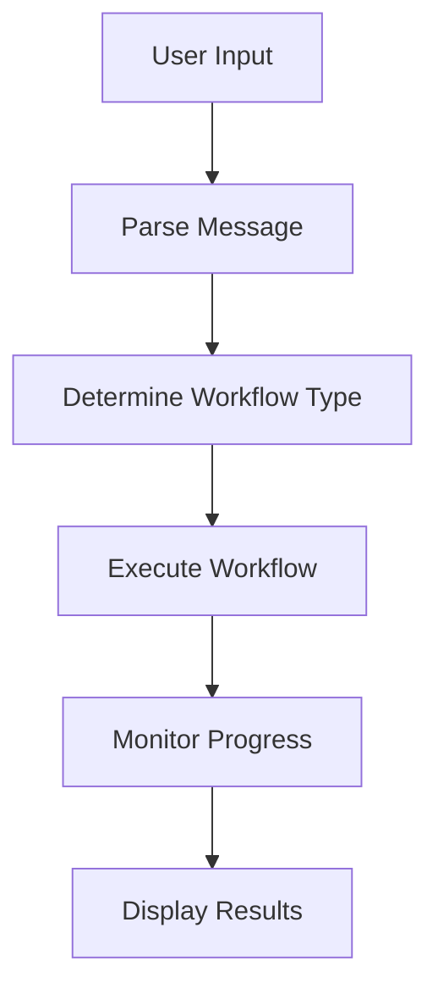
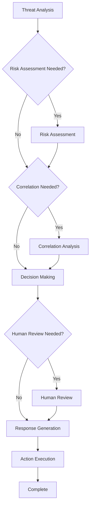
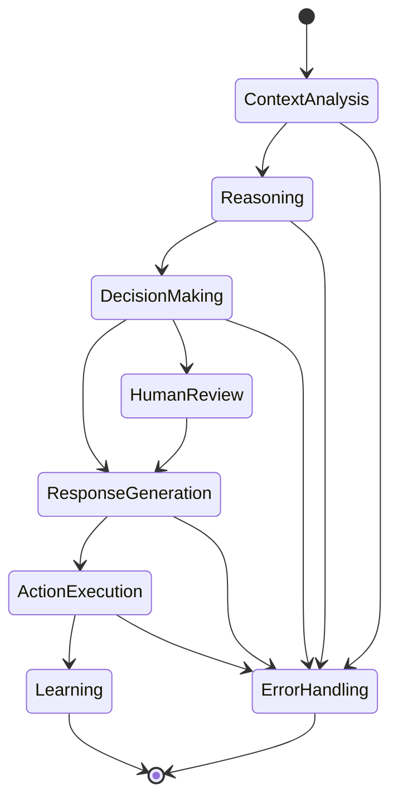

# LangGraph Implementation for AI-First SOC Portal

## 🎯 Overview

This document provides comprehensive details about the LangGraph implementation in the AI-First SOC Portal. LangGraph is used to orchestrate multiple AI agents for intelligent security analysis, threat detection, incident response, and automated decision-making.

## 🏗️ Architecture

### Core Components

1. **State Management**: TypedDict-based state management for workflow coordination
2. **AI Agents**: Specialized agents for different security analysis tasks
3. **Workflow Orchestration**: LangGraph StateGraph for agent coordination
4. **Service Layer**: High-level service for workflow execution
5. **React Integration**: Custom hooks for frontend integration

### File Structure

```
src/lib/langgraph/
├── types.ts                          # Type definitions and state models
├── soc-workflow.ts                   # Main workflow orchestration
├── langgraph-service.ts              # Service layer
├── agents/
│   ├── threat-analysis-agent.ts      # Threat analysis AI agent
│   ├── risk-assessment-agent.ts      # Risk assessment AI agent
│   ├── correlation-agent.ts          # Event correlation AI agent
│   ├── decision-making-agent.ts      # Decision making AI agent
│   ├── response-generation-agent.ts  # Response generation AI agent
│   └── action-execution-agent.ts     # Action execution AI agent
src/hooks/
└── useLangGraphWorkflow.ts           # React hook for workflow integration
src/components/
└── LangGraphAIAssistant.tsx          # Enhanced AI Assistant component
```

## 🔧 Implementation Details

### 1. State Management (`types.ts`)

The state management system uses LangGraph's TypedDict for type-safe state management across the workflow.

#### Key State Types:

- **SOCState**: Main workflow state containing all data and control information
- **Alert**: Security alert data structure
- **ThreatIntelligence**: Threat intelligence data
- **Incident**: Security incident information
- **Entity**: Security entities (users, hosts, IPs, etc.)

#### State Channels:

```typescript
channels: {
  // Input data channels
  alerts: { reducer: (x, y) => y ?? x },
  threat_intelligence: { reducer: (x, y) => y ?? x },
  incidents: { reducer: (x, y) => y ?? x },
  entities: { reducer: (x, y) => y ?? x },
  
  // Analysis results channels
  threat_analysis: { reducer: (x, y) => y ?? x },
  risk_assessment: { reducer: (x, y) => y ?? x },
  correlations: { reducer: (x, y) => y ?? x },
  
  // Workflow control channels
  current_phase: { reducer: (x, y) => y ?? x },
  errors: { reducer: (x, y) => [...(x || []), ...(y || [])] },
  confidence_scores: { reducer: (x, y) => ({ ...x, ...y }) },
}
```

### 2. AI Agents

Each AI agent is implemented as a LangGraph node with specialized capabilities:

#### Threat Analysis Agent
- **Purpose**: Analyzes security threats and attack vectors
- **Input**: Alerts, threat intelligence, entities, incidents
- **Output**: Threat analysis with identified threats, severity levels, mitigation strategies
- **AI Model**: GPT-4o-mini with specialized prompts

#### Risk Assessment Agent
- **Purpose**: Evaluates risk levels and potential impact
- **Input**: Threat analysis, alerts, incidents, entities
- **Output**: Risk assessment with scores, factors, and recommendations
- **AI Model**: GPT-4o-mini with risk assessment prompts

#### Correlation Agent
- **Purpose**: Finds relationships between security events
- **Input**: Alerts, incidents, entities, threat intelligence
- **Output**: Correlation results with patterns and relationships
- **AI Model**: GPT-4o-mini with correlation analysis prompts

#### Decision Making Agent
- **Purpose**: Makes intelligent decisions based on analysis results
- **Input**: Threat analysis, risk assessment, correlations
- **Output**: Decisions for classification, prioritization, response strategy
- **AI Model**: GPT-4o-mini with decision-making prompts

#### Response Generation Agent
- **Purpose**: Generates natural language responses and reports
- **Input**: Analysis results, decisions, recommendations
- **Output**: Natural language responses, reports, notifications
- **AI Model**: GPT-4o-mini with response generation prompts

#### Action Execution Agent
- **Purpose**: Executes automated actions and playbooks
- **Input**: Recommendations, playbook suggestions, notifications
- **Output**: Execution results with metrics and status
- **Implementation**: Simulated action execution with real-world integration points

### 3. Workflow Orchestration (`soc-workflow.ts`)

The main workflow uses LangGraph's StateGraph for agent coordination:

#### Workflow Nodes:
```typescript
this.workflow.addNode('threat_analysis', this.threatAnalysisAgent.analyze);
this.workflow.addNode('risk_assessment', this.riskAssessmentAgent.assess);
this.workflow.addNode('correlation_analysis', this.correlationAgent.correlate);
this.workflow.addNode('decision_making', this.decisionMakingAgent.makeDecisions);
this.workflow.addNode('response_generation', this.responseGenerationAgent.generateResponses);
this.workflow.addNode('action_execution', this.actionExecutionAgent.executeActions);
this.workflow.addNode('human_review', this.humanReviewNode);
this.workflow.addNode('error_handling', this.errorHandlingNode);
```

#### Conditional Edges:
The workflow uses conditional edges for intelligent routing:

```typescript
this.workflow.addConditionalEdges(
  'threat_analysis',
  this.shouldContinueToRiskAssessment,
  {
    'risk_assessment': 'risk_assessment',
    'correlation_analysis': 'correlation_analysis',
    'decision_making': 'decision_making',
    'error_handling': 'error_handling',
    'end': END,
  }
);
```

#### Workflow Phases:
1. **Context Analysis**: Initial data processing and context building
2. **Reasoning**: AI agent analysis and processing
3. **Decision Making**: Intelligent decision generation
4. **Response Generation**: Natural language and report generation
5. **Action Execution**: Automated action execution
6. **Learning**: Feedback processing and model updates

### 4. Service Layer (`langgraph-service.ts`)

High-level service providing easy integration:

#### Available Workflows:
- `analyzeThreats()`: Threat analysis workflow
- `investigateIncident()`: Incident investigation workflow
- `assessRisk()`: Risk assessment workflow
- `analyzeCorrelations()`: Correlation analysis workflow
- `executeAutomatedResponse()`: Automated response workflow
- `executePlaybook()`: Playbook execution workflow

#### Example Usage:
```typescript
const service = new LangGraphService();
const result = await service.analyzeThreats({
  alerts: mockAlerts,
  threatIntelligence: mockTI,
  entities: mockEntities,
  incidents: mockIncidents,
  userId: 'user_123',
  sessionId: 'session_456',
});
```

### 5. React Integration (`useLangGraphWorkflow.ts`)

Custom React hook for frontend integration:

#### Features:
- Workflow execution methods
- Real-time state management
- Progress tracking
- Error handling
- Human-in-the-loop support

#### Example Usage:
```typescript
const {
  executeThreatAnalysis,
  currentState,
  isExecuting,
  progress,
  errors,
} = useLangGraphWorkflow({
  onWorkflowComplete: (result) => console.log('Completed:', result),
  onWorkflowError: (error) => console.error('Error:', error),
});
```

### 6. Enhanced AI Assistant (`LangGraphAIAssistant.tsx`)

React component with LangGraph integration:

#### Features:
- Workflow status display
- Progress tracking
- Human input handling
- Results visualization
- Error and warning display

## 🔄 Workflow Execution Flow

### 1. Workflow Initiation


### 2. Agent Orchestration


### 3. State Transitions


## 🎛️ Configuration

### Dependencies

#### Frontend (`package.json`):
```json
{
  "dependencies": {
    "@langchain/community": "^0.3.15",
    "@langchain/core": "^0.3.21",
    "@langchain/openai": "^0.3.15",
    "@langchain/pinecone": "^0.1.0",
    "langgraph": "^0.2.50",
    "langchain": "^0.3.7"
  }
}
```

#### Backend (`requirements.txt`):
```
langgraph
langchain
langchain-openai
langchain-community
langchain-pinecone
```

### Environment Variables

```bash
# OpenAI Configuration
OPENAI_API_KEY=your_openai_api_key

# Pinecone Configuration
PINECONE_API_KEY=your_pinecone_api_key
PINECONE_ENVIRONMENT=your_pinecone_environment

# Database Configuration
DATABASE_URL=your_database_url
REDIS_URL=your_redis_url
```

## 🚀 Usage Examples

### 1. Basic Threat Analysis

```typescript
import { LangGraphService } from './lib/langgraph/langgraph-service';

const service = new LangGraphService();
const result = await service.analyzeThreats({
  alerts: [
    {
      id: 'alert_1',
      timestamp: new Date(),
      severity: 'high',
      source: 'SIEM',
      type: 'malware',
      description: 'Suspicious PowerShell activity detected',
      status: 'new',
      tags: ['malware', 'powershell'],
      metadata: {}
    }
  ],
  threatIntelligence: [],
  entities: [],
  incidents: [],
  userId: 'analyst_1',
  sessionId: 'session_123'
});
```

### 2. React Component Integration

```typescript
import { useLangGraphWorkflow } from './hooks/useLangGraphWorkflow';

function MyComponent() {
  const {
    executeThreatAnalysis,
    currentState,
    isExecuting,
    progress
  } = useLangGraphWorkflow();

  const handleAnalyze = async () => {
    await executeThreatAnalysis({
      alerts: mockAlerts,
      threatIntelligence: mockTI,
      entities: mockEntities,
      incidents: mockIncidents,
      userId: 'user_123',
      sessionId: 'session_456'
    });
  };

  return (
    <div>
      <button onClick={handleAnalyze} disabled={isExecuting}>
        Analyze Threats
      </button>
      {isExecuting && <div>Progress: {progress}%</div>}
      {currentState && <div>Status: {currentState.current_phase}</div>}
    </div>
  );
}
```

### 3. Custom Agent Implementation

```typescript
import { SOCState } from './types';
import { ChatOpenAI } from '@langchain/openai';

export class CustomAgent {
  private llm: ChatOpenAI;

  constructor() {
    this.llm = new ChatOpenAI({
      modelName: 'gpt-4o-mini',
      temperature: 0.1,
    });
  }

  async process(state: SOCState): Promise<Partial<SOCState>> {
    // Custom agent logic
    const result = await this.llm.invoke('Your custom prompt');
    
    return {
      // Update state with results
      custom_analysis: result.content,
      current_phase: 'next_phase',
    };
  }
}
```

## 🔍 Monitoring and Debugging

### 1. Workflow Metrics

The system provides comprehensive metrics:

```typescript
const metrics = service.getWorkflowMetrics(state);
console.log({
  total_duration: metrics.total_duration,
  phase_durations: metrics.phase_durations,
  confidence_scores: metrics.confidence_scores,
  error_count: metrics.error_count,
  warning_count: metrics.warning_count,
});
```

### 2. State Validation

```typescript
const validation = service.validateState(state);
if (!validation.valid) {
  console.error('State validation failed:', validation.errors);
}
```

### 3. Debug Logging

Enable debug logging for workflow execution:

```typescript
// In workflow execution
console.log('🔍 Threat Analysis Agent: Starting analysis...');
console.log('📊 Risk Assessment Agent: Starting assessment...');
console.log('🔗 Correlation Agent: Starting correlation analysis...');
```

## 🛠️ Customization

### 1. Adding New Agents

1. Create agent class in `src/lib/langgraph/agents/`
2. Implement the agent interface
3. Add to workflow in `soc-workflow.ts`
4. Add conditional edges for routing

### 2. Modifying Workflow Logic

1. Update conditional edge functions
2. Modify state transitions
3. Add new workflow phases
4. Update state management

### 3. Custom Prompts

1. Modify prompt templates in agent classes
2. Add new prompt types
3. Implement prompt chaining
4. Add context-aware prompting

## 🧪 Testing

### 1. Unit Tests

```typescript
import { ThreatAnalysisAgent } from './agents/threat-analysis-agent';

describe('ThreatAnalysisAgent', () => {
  it('should analyze threats correctly', async () => {
    const agent = new ThreatAnalysisAgent();
    const mockState = createMockState();
    
    const result = await agent.analyze(mockState);
    
    expect(result.threat_analysis).toBeDefined();
    expect(result.threat_analysis.threats_identified).toBeInstanceOf(Array);
  });
});
```

### 2. Integration Tests

```typescript
import { SOCWorkflow } from './soc-workflow';

describe('SOCWorkflow', () => {
  it('should execute complete workflow', async () => {
    const workflow = new SOCWorkflow();
    const initialState = createMockInitialState();
    
    const result = await workflow.executeWorkflow(initialState);
    
    expect(result.current_phase).toBe('completed');
    expect(result.errors).toHaveLength(0);
  });
});
```

## 📊 Performance Considerations

### 1. Agent Optimization

- Use appropriate model sizes for different tasks
- Implement caching for repeated operations
- Optimize prompt templates for efficiency
- Use parallel execution where possible

### 2. State Management

- Minimize state size for better performance
- Use efficient reducers for state updates
- Implement state pruning for long-running workflows
- Cache frequently accessed state data

### 3. Error Handling

- Implement retry logic for transient failures
- Use circuit breakers for external service calls
- Provide graceful degradation
- Log errors for debugging

## 🔒 Security Considerations

### 1. Data Protection

- Encrypt sensitive data in state
- Implement data masking for logs
- Use secure communication channels
- Validate all inputs

### 2. Access Control

- Implement role-based access control
- Validate user permissions
- Audit workflow executions
- Secure API endpoints

### 3. AI Safety

- Validate AI model outputs
- Implement content filtering
- Monitor for bias and hallucinations
- Provide human oversight

## 🚀 Deployment

### 1. Frontend Deployment

```bash
# Install dependencies
npm install

# Build for production
npm run build

# Deploy to hosting platform
npm run deploy
```

### 2. Backend Deployment

```bash
# Install Python dependencies
pip install -r requirements.txt

# Deploy to cloud platform
# (AWS Lambda, Google Cloud Functions, etc.)
```

### 3. Environment Setup

```bash
# Set environment variables
export OPENAI_API_KEY=your_key
export PINECONE_API_KEY=your_key

# Start services
npm run dev
```

## 📈 Future Enhancements

### 1. Advanced Features

- Multi-modal AI agents (text, images, logs)
- Real-time streaming responses
- Advanced human-in-the-loop workflows
- Custom agent marketplace

### 2. Performance Improvements

- Agent parallelization
- Caching strategies
- Model optimization
- Workflow optimization

### 3. Integration Enhancements

- More data source integrations
- Advanced notification systems
- Custom dashboard components
- API rate limiting

## 📚 Resources

### Documentation

- [LangGraph Documentation](https://langchain-ai.github.io/langgraph/)
- [LangChain Documentation](https://python.langchain.com/)
- [OpenAI API Documentation](https://platform.openai.com/docs)

### Examples

- See `src/components/LangGraphAIAssistant.tsx` for React integration
- See `src/hooks/useLangGraphWorkflow.ts` for hook usage
- See `src/lib/langgraph/agents/` for agent implementations

### Support

- GitHub Issues for bug reports
- Documentation for usage questions
- Community forums for discussions

---

This implementation provides a robust, scalable, and maintainable foundation for AI-powered security operations using LangGraph. The modular design allows for easy extension and customization while maintaining high performance and reliability.
