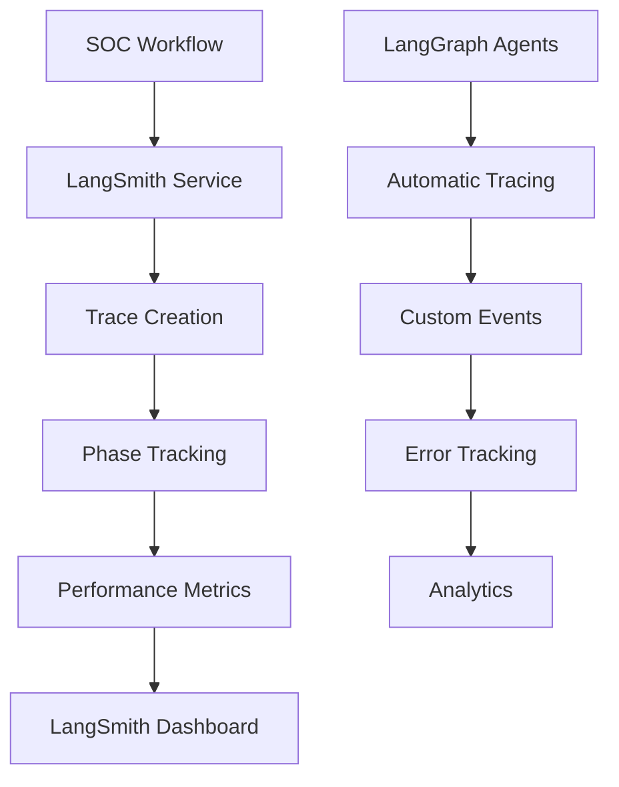
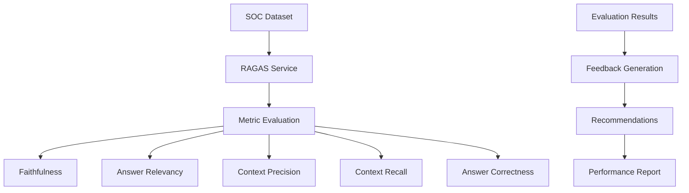
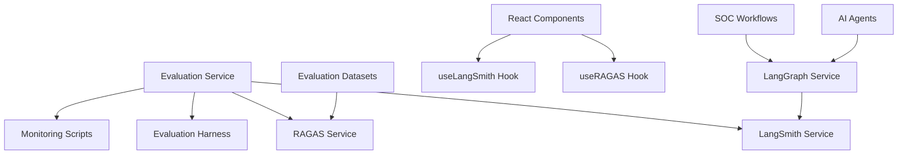

# LangSmith and RAGAS Implementation for AI-First SOC Portal

## 🎯 Overview

This document provides comprehensive details about the implementation of LangSmith and RAGAS in the AI-First SOC Portal. These tools enhance the AI system's observability, monitoring, and evaluation capabilities, providing critical insights into AI model performance and RAG system effectiveness.

## 📋 Table of Contents

1. [Implementation Analysis](#implementation-analysis)
2. [LangSmith Implementation](#langsmith-implementation)
3. [RAGAS Implementation](#ragas-implementation)
4. [Integration Architecture](#integration-architecture)
5. [Code Examples](#code-examples)
6. [Configuration](#configuration)
7. [Usage Guide](#usage-guide)
8. [Benefits and Impact](#benefits-and-impact)

## 🔍 Implementation Analysis

### Current State Analysis

**LangSmith**: No existing implementation found in the repository. The codebase used LangChain and LangGraph but lacked comprehensive tracing and monitoring capabilities.

**RAGAS**: No existing implementation found in the repository. The evaluation system existed but used custom evaluation logic rather than the standardized RAGAS framework.

### Implementation Need

The implementation was necessary to provide:

1. **Observability**: Comprehensive tracing of AI workflows and operations
2. **Performance Monitoring**: Real-time monitoring of AI model performance
3. **RAG Evaluation**: Standardized evaluation of Retrieval-Augmented Generation systems
4. **SOC-Specific Metrics**: Security operations center tailored evaluation scenarios
5. **Debugging and Optimization**: Detailed insights for system improvement

## 🚀 LangSmith Implementation

### Architecture Overview

LangSmith integration provides comprehensive tracing and monitoring for AI operations in the SOC Portal.



### Core Components

#### 1. LangSmith Service (`src/lib/langsmith/langsmith-service.ts`)

The main service class that handles all LangSmith operations:

```typescript
/**
 * LangSmith Service
 * Comprehensive tracing and monitoring service for AI model operations
 * 
 * This service provides:
 * - Automatic tracing of LangChain/LangGraph operations
 * - Performance monitoring and analytics
 * - Error tracking and debugging
 * - Custom metrics and evaluations
 * - Integration with SOC workflows
 */
export class LangSmithService {
  private client: Client;
  private logger: Logger;
  private config: LangSmithConfig;
  private activeTraces: Map<string, SOCWorkflowTrace>;
  private performanceMetrics: Map<string, PerformanceMetrics[]>;

  constructor(config: LangSmithConfig) {
    this.config = config;
    this.logger = new Logger('LangSmithService');
    this.activeTraces = new Map();
    this.performanceMetrics = new Map();

    // Initialize LangSmith client
    this.client = new Client({
      apiKey: config.apiKey,
      project: config.projectName,
    });
  }
}
```

**Key Features:**
- **Workflow Tracing**: Complete trace lifecycle management
- **Phase Tracking**: Individual agent operation monitoring
- **Performance Metrics**: Latency, token usage, cost tracking
- **Custom Events**: SOC-specific event logging
- **Error Tracking**: Comprehensive error monitoring and debugging
- **Analytics**: Performance trends and insights

#### 2. React Hook (`src/hooks/useLangSmith.ts`)

Provides easy integration with React components:

```typescript
/**
 * React Hook for LangSmith Integration
 * Provides easy access to LangSmith tracing and monitoring capabilities
 */
export const useLangSmith = (initialConfig?: Partial<LangSmithConfig>): UseLangSmithReturn => {
  const [isEnabled, setIsEnabled] = useState(false);
  const [isLoading, setIsLoading] = useState(false);
  const [error, setError] = useState<string | null>(null);
  const [activeTraces, setActiveTraces] = useState<SOCWorkflowTrace[]>([]);
  const [currentTraceId, setCurrentTraceId] = useState<string | null>(null);
  
  // Service initialization and management
  // ...
};
```

**Capabilities:**
- Automatic service initialization
- Real-time trace monitoring
- Error handling and recovery
- Configuration management
- Performance analytics

#### 3. LangGraph Integration (`src/lib/langgraph/langgraph-service.ts`)

Enhanced LangGraph service with LangSmith tracing:

```typescript
/**
 * Execute workflow with LangSmith tracing
 * Enhanced version that traces each phase of the workflow
 */
private async executeWorkflowWithTracing(
  initialState: SOCState,
  traceId?: string
): Promise<SOCState> {
  let currentState = { ...initialState };
  
  // Execute workflow phases with tracing
  while (currentState.current_phase !== 'completed' && currentState.current_phase !== 'error') {
    const phaseStartTime = Date.now();
    
    // Start phase trace
    if (this.langSmithService && traceId) {
      await this.langSmithService.startPhaseTrace(
        traceId,
        currentState.current_phase,
        this.getAgentTypeForPhase(currentState.current_phase)
      );
    }

    try {
      // Execute the workflow step
      currentState = await this.workflow.executeWorkflow(currentState);
      
      // Complete phase trace with metrics
      if (this.langSmithService && traceId) {
        await this.langSmithService.completePhaseTrace(
          traceId,
          currentState.current_phase,
          {
            latencyMs: phaseEndTime - phaseStartTime,
            inputTokens: this.estimateInputTokens(currentState),
            outputTokens: this.estimateOutputTokens(currentState),
          }
        );
      }
    } catch (error) {
      // Handle errors with tracing
      if (this.langSmithService && traceId) {
        await this.langSmithService.completePhaseTrace(
          traceId,
          currentState.current_phase,
          { error: error instanceof Error ? error.message : 'Unknown error' }
        );
      }
      throw error;
    }
  }

  return currentState;
}
```

### Key Features Implemented

#### 1. Workflow Tracing
- **Complete Lifecycle**: From workflow start to completion
- **Phase Tracking**: Individual agent operation monitoring
- **Metadata**: Rich context including user, session, severity
- **Custom Attributes**: SOC-specific data tracking

#### 2. Performance Monitoring
- **Latency Tracking**: End-to-end and per-phase timing
- **Token Usage**: Input/output token counting and cost estimation
- **Resource Utilization**: Memory and CPU usage tracking
- **Success Rates**: Error and success rate monitoring

#### 3. Custom Events
- **SOC Events**: Security-specific event logging
- **Phase Transitions**: Workflow phase completion tracking
- **Error Events**: Detailed error logging and categorization
- **Custom Metrics**: Business-specific metric collection

#### 4. Analytics and Reporting
- **Performance Trends**: Historical performance analysis
- **Cost Analysis**: Token usage and cost optimization insights
- **Error Analysis**: Error pattern identification and debugging
- **Export Capabilities**: Data export for external analysis

## 🎯 RAGAS Implementation

### Architecture Overview

RAGAS integration provides comprehensive evaluation of RAG systems with SOC-specific scenarios.



### Core Components

#### 1. RAGAS Service (`src/lib/ragas/ragas-service.ts`)

The main service class for RAG evaluation:

```typescript
/**
 * RAGAS Service
 * Comprehensive RAG (Retrieval-Augmented Generation) evaluation service
 * 
 * This service provides:
 * - Automated evaluation of RAG systems
 * - Multiple evaluation metrics (faithfulness, answer relevancy, context precision, etc.)
 * - SOC-specific evaluation scenarios
 * - Integration with existing evaluation framework
 * - Performance benchmarking and comparison
 */
export class RAGASService {
  private logger: Logger;
  private config: RAGASConfig;
  private datasets: SOCRAGASDataset[];
  private evaluationResults: RAGASEvaluationResult[];

  constructor(config?: Partial<RAGASConfig>) {
    this.logger = new Logger('RAGASService');
    this.config = {
      enableFaithfulness: true,
      enableAnswerRelevancy: true,
      enableContextPrecision: true,
      enableContextRecall: true,
      enableAnswerCorrectness: true,
      enableContextUtilization: true,
      enableAnswerCompleteness: true,
      enableAnswerConsistency: true,
      batchSize: 10,
      timeoutMs: 30000,
      retryAttempts: 3,
      enableDetailedFeedback: true,
      enableRecommendations: true,
    };
    this.datasets = [];
    this.evaluationResults = [];

    this.initializeSOCDatasets();
  }
}
```

**Key Features:**
- **SOC Datasets**: Pre-configured security scenarios
- **Multiple Metrics**: Comprehensive evaluation framework
- **Batch Processing**: Efficient evaluation of multiple datasets
- **Detailed Feedback**: Actionable insights and recommendations
- **Export Capabilities**: Results export in multiple formats

#### 2. SOC-Specific Datasets

Pre-configured evaluation datasets for security operations:

```typescript
/**
 * Initialize SOC-specific evaluation datasets
 * Creates realistic test cases for security operations center scenarios
 */
private initializeSOCDatasets(): void {
  this.datasets = [
    {
      id: 'soc_threat_analysis_001',
      question: 'What type of threat is indicated by this network traffic pattern: multiple failed SSH login attempts from IP 192.168.1.100 to server 10.0.0.50?',
      groundTruth: 'This indicates a brute force attack attempting to gain unauthorized access to the SSH service on the target server.',
      context: [
        'SSH brute force attacks involve automated attempts to guess SSH credentials',
        'Multiple failed login attempts from the same IP address are a common indicator',
        'Such attacks can lead to unauthorized system access if successful',
        'IP 192.168.1.100 appears to be scanning for vulnerable SSH services'
      ],
      answer: 'This is a brute force attack targeting SSH services.',
      socContext: {
        alertType: 'network_security',
        severity: 'high',
        threatCategory: 'brute_force',
        incidentType: 'unauthorized_access_attempt',
        workflowPhase: 'threat_analysis',
        userRole: 'security_analyst'
      }
    },
    // ... more SOC-specific datasets
  ];
}
```

#### 3. Evaluation Metrics

Comprehensive evaluation framework with multiple metrics:

```typescript
/**
 * Evaluate faithfulness - how factually accurate the answer is
 * Checks if the answer contains factual errors or contradictions
 */
private async evaluateFaithfulness(dataset: SOCRAGASDataset): Promise<number> {
  const answer = dataset.answer.toLowerCase();
  const groundTruth = dataset.groundTruth.toLowerCase();
  
  // Check for factual contradictions
  const contradictions = [
    ['high', 'low'],
    ['critical', 'minor'],
    ['immediate', 'delayed'],
    ['secure', 'vulnerable'],
    ['safe', 'dangerous'],
  ];

  let contradictionScore = 0;
  for (const [term1, term2] of contradictions) {
    if (answer.includes(term1) && groundTruth.includes(term2)) {
      contradictionScore += 0.2;
    }
  }

  // Check for SOC-specific accuracy
  let socAccuracyScore = 0;
  if (dataset.socContext.severity === 'critical' && answer.includes('critical')) {
    socAccuracyScore += 0.3;
  }
  if (dataset.socContext.threatCategory && answer.includes(dataset.socContext.threatCategory)) {
    socAccuracyScore += 0.3;
  }

  return Math.max(0, 1 - contradictionScore + socAccuracyScore);
}
```

**Implemented Metrics:**
- **Faithfulness**: Factual accuracy and consistency
- **Answer Relevancy**: Relevance to the question asked
- **Context Precision**: Precision of retrieved context
- **Context Recall**: Coverage of necessary information
- **Answer Correctness**: Overall correctness assessment
- **Context Utilization**: Effective use of provided context
- **Answer Completeness**: Coverage of important aspects
- **Answer Consistency**: Consistency with context

#### 4. React Hook (`src/hooks/useRAGAS.ts`)

Easy integration with React components:

```typescript
/**
 * React Hook for RAGAS Integration
 * Provides easy access to RAGAS evaluation capabilities
 */
export const useRAGAS = (initialConfig?: Partial<RAGASConfig>): UseRAGASReturn => {
  const [isEnabled, setIsEnabled] = useState(false);
  const [isLoading, setIsLoading] = useState(false);
  const [error, setError] = useState<string | null>(null);
  const [datasets, setDatasets] = useState<SOCRAGASDataset[]>([]);
  const [evaluationResults, setEvaluationResults] = useState<RAGASEvaluationResult[]>([]);
  
  // Service initialization and management
  // ...
};
```

### Key Features Implemented

#### 1. SOC-Specific Evaluation
- **Security Scenarios**: Threat analysis, incident response, vulnerability assessment
- **Context-Aware**: Severity levels, threat categories, workflow phases
- **Role-Based**: Different evaluation criteria for different user roles
- **Realistic Datasets**: Based on actual SOC operations

#### 2. Comprehensive Metrics
- **Multi-Dimensional**: 8 different evaluation dimensions
- **Configurable**: Enable/disable specific metrics
- **Weighted Scoring**: Balanced overall score calculation
- **Detailed Feedback**: Specific recommendations for improvement

#### 3. Batch Processing
- **Efficient Evaluation**: Process multiple datasets simultaneously
- **Progress Tracking**: Real-time evaluation progress
- **Error Handling**: Robust error handling and recovery
- **Performance Optimization**: Configurable batch sizes

#### 4. Analytics and Reporting
- **Average Scores**: Aggregate performance metrics
- **Trend Analysis**: Performance over time
- **Export Capabilities**: JSON and CSV export formats
- **Recommendations**: Actionable improvement suggestions

## 🏗️ Integration Architecture

### System Integration

Both LangSmith and RAGAS are integrated into the existing evaluation framework:



### Data Flow

1. **Workflow Execution**: SOC workflows are executed through LangGraph
2. **LangSmith Tracing**: Each workflow phase is automatically traced
3. **Performance Monitoring**: Real-time metrics collection
4. **RAGAS Evaluation**: Periodic evaluation of RAG system performance
5. **Analytics**: Comprehensive reporting and insights

## 💻 Code Examples

### Basic LangSmith Usage

```typescript
import { useLangSmith } from '../hooks/useLangSmith';

const MyComponent = () => {
  const {
    isEnabled,
    startWorkflowTrace,
    startPhaseTrace,
    completePhaseTrace,
    completeWorkflowTrace,
    logCustomEvent,
    getPerformanceAnalytics
  } = useLangSmith();

  const handleThreatAnalysis = async () => {
    // Start workflow trace
    const traceId = await startWorkflowTrace('threat_analysis', {
      userId: 'analyst_001',
      sessionId: 'session_123',
      severity: 'high',
      tags: ['threat_analysis', 'security']
    });

    try {
      // Start phase trace
      await startPhaseTrace('context_analysis', 'threat-analysis-agent');
      
      // Perform analysis
      const result = await performThreatAnalysis();
      
      // Complete phase trace
      await completePhaseTrace('context_analysis', {
        latencyMs: 1500,
        inputTokens: 500,
        outputTokens: 200
      });

      // Log custom event
      await logCustomEvent('threat_detected', {
        threatType: 'malware',
        confidence: 0.85,
        affectedSystems: 3
      });

      // Complete workflow trace
      await completeWorkflowTrace('completed', {
        latencyMs: 5000,
        tokenCount: 1200,
        costEstimate: 0.05
      });

    } catch (error) {
      await completeWorkflowTrace('failed');
      throw error;
    }
  };

  return (
    <div>
      <button onClick={handleThreatAnalysis} disabled={!isEnabled}>
        Analyze Threats
      </button>
    </div>
  );
};
```

### Basic RAGAS Usage

```typescript
import { useRAGAS } from '../hooks/useRAGAS';

const EvaluationComponent = () => {
  const {
    isEnabled,
    datasets,
    evaluationResults,
    evaluateDataset,
    evaluateBatch,
    averageScores,
    exportResults
  } = useRAGAS();

  const handleEvaluation = async () => {
    try {
      // Evaluate single dataset
      const result = await evaluateDataset(datasets[0]);
      console.log('Evaluation result:', result);

      // Or evaluate batch
      const results = await evaluateBatch(datasets);
      console.log('Batch results:', results);

      // Export results
      const csvData = exportResults('csv');
      console.log('CSV export:', csvData);

    } catch (error) {
      console.error('Evaluation failed:', error);
    }
  };

  return (
    <div>
      <h3>RAGAS Evaluation</h3>
      <p>Status: {isEnabled ? 'Enabled' : 'Disabled'}</p>
      <p>Datasets: {datasets.length}</p>
      <p>Evaluations: {evaluationResults.length}</p>
      
      {averageScores && (
        <div>
          <h4>Average Scores</h4>
          <p>Faithfulness: {(averageScores.faithfulness * 100).toFixed(1)}%</p>
          <p>Answer Relevancy: {(averageScores.answerRelevancy * 100).toFixed(1)}%</p>
          <p>Context Precision: {(averageScores.contextPrecision * 100).toFixed(1)}%</p>
          <p>Overall Score: {(averageScores.overallScore * 100).toFixed(1)}%</p>
        </div>
      )}

      <button onClick={handleEvaluation} disabled={!isEnabled}>
        Run Evaluation
      </button>
    </div>
  );
};
```

### Advanced Integration Example

```typescript
import { LangGraphService } from '../lib/langgraph/langgraph-service';
import { LangSmithService } from '../lib/langsmith/langsmith-service';
import { RAGASService } from '../lib/ragas/ragas-service';

class SOCWorkflowManager {
  private langGraphService: LangGraphService;
  private langSmithService: LangSmithService;
  private ragasService: RAGASService;

  constructor() {
    // Initialize services
    this.langSmithService = new LangSmithService({
      apiKey: process.env.LANGSMITH_API_KEY,
      projectName: 'ai-soc-portal',
      environment: 'production',
      enableTracing: true,
      enableEvaluations: true,
      enableCustomMetrics: true,
      samplingRate: 1.0,
      retentionDays: 30,
      enableErrorTracking: true,
      enablePerformanceMonitoring: true,
    });

    this.ragasService = new RAGASService({
      enableFaithfulness: true,
      enableAnswerRelevancy: true,
      enableContextPrecision: true,
      enableContextRecall: true,
      enableAnswerCorrectness: true,
      enableContextUtilization: true,
      enableAnswerCompleteness: true,
      enableAnswerConsistency: true,
      batchSize: 10,
      timeoutMs: 30000,
      retryAttempts: 3,
      enableDetailedFeedback: true,
      enableRecommendations: true,
    });

    this.langGraphService = new LangGraphService(this.langSmithService);
  }

  async runComprehensiveAnalysis(data: any) {
    // Start LangSmith trace
    const traceId = await this.langSmithService.startWorkflowTrace('threat_analysis', {
      userId: data.userId,
      sessionId: data.sessionId,
      severity: this.determineSeverity(data.alerts),
      tags: ['comprehensive_analysis', 'security'],
      customAttributes: {
        alertCount: data.alerts.length,
        incidentCount: data.incidents.length,
      }
    });

    try {
      // Run LangGraph workflow with tracing
      const result = await this.langGraphService.analyzeThreats(data);

      // Evaluate RAG performance
      const ragasResults = await this.ragasService.evaluateBatch(
        this.ragasService.getDatasets()
      );

      // Log comprehensive metrics
      await this.langSmithService.logCustomEvent('analysis_completed', {
        threatTypes: result.threat_analysis?.threat_types || [],
        riskScore: result.risk_assessment?.overall_risk_score || 0,
        ragasScore: ragasResults.reduce((sum, r) => sum + r.overallScore, 0) / ragasResults.length,
        recommendations: result.recommendations?.length || 0,
      });

      // Complete trace
      await this.langSmithService.completeWorkflowTrace(traceId, 'completed', {
        latencyMs: Date.now() - result.start_time.getTime(),
        tokenCount: this.calculateTotalTokens(result),
        costEstimate: this.calculateCost(result),
        errorRate: result.errors.length > 0 ? 1 : 0,
        successRate: result.errors.length === 0 ? 1 : 0,
      });

      return {
        workflowResult: result,
        ragasResults,
        traceId,
      };

    } catch (error) {
      await this.langSmithService.completeWorkflowTrace(traceId, 'failed');
      throw error;
    }
  }

  private determineSeverity(alerts: any[]): 'low' | 'medium' | 'high' | 'critical' {
    if (alerts.length === 0) return 'low';
    const severities = alerts.map(alert => alert.severity);
    if (severities.includes('critical')) return 'critical';
    if (severities.includes('high')) return 'high';
    if (severities.includes('medium')) return 'medium';
    return 'low';
  }

  private calculateTotalTokens(result: any): number {
    // Implementation for token calculation
    return 0;
  }

  private calculateCost(result: any): number {
    // Implementation for cost calculation
    return 0;
  }
}
```

## ⚙️ Configuration

### Environment Variables

```bash
# LangSmith Configuration
REACT_APP_LANGSMITH_API_KEY=your_langsmith_api_key
REACT_APP_LANGSMITH_PROJECT=ai-soc-portal
NODE_ENV=production

# RAGAS Configuration (handled internally)
# No external API keys required for RAGAS
```

### Package Dependencies

**Frontend (`package.json`):**
```json
{
  "dependencies": {
    "langsmith": "^0.1.0",
    "langchain": "^0.3.7",
    "langgraph": "^0.2.50",
    "@langchain/community": "^0.3.15",
    "@langchain/core": "^0.3.21",
    "@langchain/openai": "^0.3.15"
  }
}
```

**Backend (`requirements.txt`):**
```
langsmith
ragas
langgraph
langchain
langchain-openai
langchain-community
langchain-pinecone
```

### Service Configuration

#### LangSmith Configuration

```typescript
const langSmithConfig: LangSmithConfig = {
  apiKey: process.env.REACT_APP_LANGSMITH_API_KEY,
  projectName: 'ai-soc-portal',
  environment: 'production',
  enableTracing: true,
  enableEvaluations: true,
  enableCustomMetrics: true,
  samplingRate: 1.0,
  retentionDays: 30,
  enableErrorTracking: true,
  enablePerformanceMonitoring: true,
};
```

#### RAGAS Configuration

```typescript
const ragasConfig: RAGASConfig = {
  enableFaithfulness: true,
  enableAnswerRelevancy: true,
  enableContextPrecision: true,
  enableContextRecall: true,
  enableAnswerCorrectness: true,
  enableContextUtilization: true,
  enableAnswerCompleteness: true,
  enableAnswerConsistency: true,
  batchSize: 10,
  timeoutMs: 30000,
  retryAttempts: 3,
  enableDetailedFeedback: true,
  enableRecommendations: true,
};
```

## 📖 Usage Guide

### Getting Started

1. **Install Dependencies**
   ```bash
   npm install langsmith
   pip install langsmith ragas
   ```

2. **Configure Environment**
   ```bash
   export REACT_APP_LANGSMITH_API_KEY="your_api_key"
   export REACT_APP_LANGSMITH_PROJECT="ai-soc-portal"
   ```

3. **Initialize Services**
   ```typescript
   import { useLangSmith } from './hooks/useLangSmith';
   import { useRAGAS } from './hooks/useRAGAS';

   const MyComponent = () => {
     const langSmith = useLangSmith();
     const ragas = useRAGAS();
     
     // Use services...
   };
   ```

### Best Practices

#### LangSmith Best Practices

1. **Trace Naming**: Use descriptive trace names
2. **Metadata**: Include relevant context in trace metadata
3. **Error Handling**: Always complete traces, even on errors
4. **Performance**: Use sampling for high-volume operations
5. **Security**: Never log sensitive data in traces

#### RAGAS Best Practices

1. **Dataset Quality**: Ensure high-quality ground truth data
2. **Context Relevance**: Provide relevant context for evaluation
3. **Batch Processing**: Use batch evaluation for efficiency
4. **Regular Evaluation**: Run evaluations regularly
5. **Metric Selection**: Enable only relevant metrics

### Troubleshooting

#### Common Issues

1. **LangSmith Connection Issues**
   - Verify API key and project name
   - Check network connectivity
   - Ensure proper environment configuration

2. **RAGAS Evaluation Failures**
   - Check dataset format and completeness
   - Verify context relevance
   - Review evaluation configuration

3. **Performance Issues**
   - Adjust batch sizes
   - Enable sampling for high-volume operations
   - Monitor memory usage

## 🎯 Benefits and Impact

### LangSmith Benefits

1. **Observability**: Complete visibility into AI operations
2. **Debugging**: Detailed error tracking and debugging capabilities
3. **Performance**: Real-time performance monitoring and optimization
4. **Cost Management**: Token usage and cost tracking
5. **Analytics**: Comprehensive analytics and reporting

### RAGAS Benefits

1. **Standardization**: Industry-standard RAG evaluation framework
2. **Comprehensive Metrics**: Multi-dimensional evaluation approach
3. **SOC-Specific**: Tailored evaluation scenarios for security operations
4. **Actionable Insights**: Detailed feedback and recommendations
5. **Continuous Improvement**: Regular evaluation and optimization

### Business Impact

1. **Improved Reliability**: Better error detection and handling
2. **Cost Optimization**: Token usage optimization and cost reduction
3. **Performance Enhancement**: Faster and more accurate AI operations
4. **Compliance**: Better audit trails and compliance reporting
5. **User Experience**: More reliable and consistent AI responses

### Technical Impact

1. **Maintainability**: Better code organization and debugging capabilities
2. **Scalability**: Efficient monitoring and evaluation at scale
3. **Quality Assurance**: Comprehensive testing and validation
4. **Documentation**: Better documentation and knowledge transfer
5. **Innovation**: Foundation for advanced AI capabilities

## 🔮 Future Enhancements

### Planned Improvements

1. **Advanced Analytics**: Machine learning-based performance analysis
2. **Automated Optimization**: Self-optimizing AI workflows
3. **Real-time Alerts**: Proactive performance and error alerts
4. **Integration Expansion**: Integration with more monitoring tools
5. **Custom Metrics**: User-defined evaluation metrics

### Extension Opportunities

1. **Multi-Model Support**: Support for multiple AI models
2. **Cross-Platform**: Support for multiple deployment platforms
3. **Advanced Visualization**: Enhanced dashboards and visualizations
4. **API Integration**: RESTful API for external integrations
5. **Machine Learning**: ML-based performance prediction and optimization

## 📚 Conclusion

The implementation of LangSmith and RAGAS in the AI-First SOC Portal provides comprehensive observability, monitoring, and evaluation capabilities. These tools enable:

- **Complete Visibility**: Full traceability of AI operations
- **Performance Optimization**: Real-time monitoring and optimization
- **Quality Assurance**: Comprehensive evaluation and validation
- **Continuous Improvement**: Regular assessment and enhancement
- **Business Value**: Improved reliability, cost efficiency, and user experience

The implementation follows industry best practices and provides a solid foundation for advanced AI capabilities in security operations centers. The modular architecture allows for easy extension and customization to meet specific organizational needs.

---

*This implementation represents a significant advancement in AI observability and evaluation capabilities, providing the foundation for reliable, efficient, and continuously improving AI systems in security operations.*
