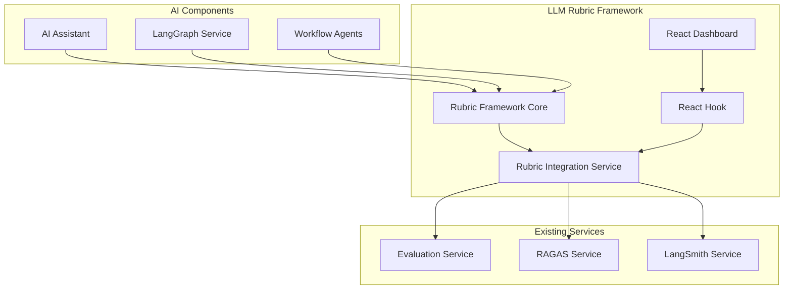
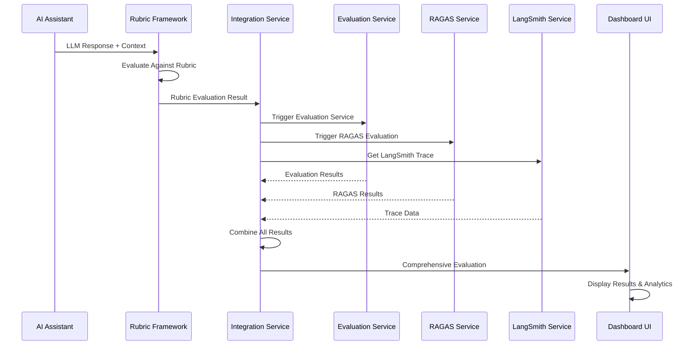

# LLM Rubric Framework Implementation

## Table of Contents
1. [Why Use an LLM Rubric Framework](#why-use-an-llm-rubric-framework)
2. [Implementation Overview](#implementation-overview)
3. [Architecture](#architecture)
4. [Core Components](#core-components)
5. [Implementation Plan](#implementation-plan)
6. [Pseudo Code with Comments](#pseudo-code-with-comments)
7. [Integration Guide](#integration-guide)
8. [Usage Examples](#usage-examples)
9. [Configuration](#configuration)
10. [Monitoring and Analytics](#monitoring-and-analytics)
11. [Best Practices](#best-practices)
12. [Troubleshooting](#troubleshooting)
13. [Future Enhancements](#future-enhancements)

---

## Why Use an LLM Rubric Framework

### The Problem
In Security Operations Centers (SOCs), LLM-powered AI assistants are increasingly used for:
- Threat analysis and investigation
- Incident response guidance
- Risk assessment and correlation
- Automated report generation
- Security recommendations

However, without standardized evaluation criteria, it's challenging to:
- **Assess Quality**: Determine if LLM responses meet security standards
- **Ensure Consistency**: Maintain uniform quality across different AI interactions
- **Measure Performance**: Track improvement over time
- **Identify Issues**: Quickly spot areas needing attention
- **Comply with Standards**: Meet regulatory and security framework requirements

### The Solution: LLM Rubric Framework

The LLM Rubric Framework provides:

#### 🎯 **Standardized Evaluation**
- Consistent scoring criteria across all LLM interactions
- SOC-specific evaluation categories (accuracy, security appropriateness, actionability)
- Weighted scoring system reflecting security priorities

#### 📊 **Comprehensive Metrics**
- **Accuracy**: Factual correctness and technical accuracy
- **Relevance**: Contextual appropriateness and urgency matching
- **Completeness**: Coverage of all necessary aspects
- **Clarity**: Communication effectiveness and structure
- **Security Appropriateness**: Adherence to security best practices
- **Actionability**: Practical implementation guidance
- **Consistency**: Internal coherence and reliability
- **Timeliness**: Response appropriateness for urgency level

#### 🔄 **Continuous Improvement**
- Real-time evaluation and feedback
- Performance trending and benchmarking
- Automated recommendations for improvement
- Integration with existing evaluation services

#### 🛡️ **Security-Focused**
- SOC-specific evaluation criteria
- Security standards compliance checking
- Risk-aware scoring methodology
- Regulatory compliance support

---

## Implementation Overview

### Current System Analysis
The AI SOC Portal already has robust evaluation infrastructure:

#### ✅ **Existing Components**
- **Evaluation Harness**: Accuracy, latency, and hallucination detection
- **RAGAS Service**: RAG evaluation metrics (faithfulness, relevancy, precision)
- **LangSmith Service**: AI operation tracing and monitoring
- **Evaluation Service**: Orchestration and automated reporting

#### 🎯 **Integration Points**
- Built upon existing evaluation services
- Extends current monitoring capabilities
- Leverages established tracing infrastructure
- Enhances reporting and analytics

### Framework Architecture



---

## Architecture

### Core Framework Components

#### 1. **LLMRubricFramework** (`llm-rubric-framework.ts`)
The core evaluation engine that:
- Defines standardized rubric criteria
- Implements evaluation logic
- Calculates scores and grades
- Generates feedback and recommendations

#### 2. **RubricIntegrationService** (`rubric-integration-service.ts`)
Integration layer that:
- Connects with existing evaluation services
- Orchestrates comprehensive evaluations
- Manages performance benchmarking
- Handles reporting and analytics

#### 3. **useRubricEvaluation** (`useRubricEvaluation.ts`)
React hook providing:
- Frontend integration
- Real-time evaluation status
- Performance monitoring
- Easy-to-use API

#### 4. **RubricEvaluationDashboard** (`RubricEvaluationDashboard.tsx`)
React component offering:
- Visual evaluation results
- Performance metrics display
- Interactive reporting
- Export capabilities

### Data Flow



---

## Core Components

### 1. Rubric Criteria Structure

```typescript
interface RubricCriteria {
  id: string;                    // Unique identifier
  name: string;                  // Human-readable name
  description: string;           // Detailed description
  weight: number;               // 0-1, relative importance
  maxScore: number;             // Maximum possible score
  category: RubricCategory;     // Evaluation category
  subCriteria?: RubricSubCriteria[]; // Detailed sub-evaluations
}
```

### 2. Evaluation Categories

#### **Accuracy (30% weight)**
- **Factual Accuracy**: Correctness of information
- **Technical Accuracy**: Adherence to security standards

#### **Relevance (20% weight)**
- **Contextual Relevance**: Direct answer to question
- **Urgency Appropriateness**: Matches severity level

#### **Completeness (20% weight)**
- **Coverage Completeness**: All necessary aspects covered
- **Evidence and Support**: Appropriate supporting information

#### **Clarity (10% weight)**
- **Communication Clarity**: Clear, well-structured response

#### **Security Appropriateness (25% weight)**
- **Security Best Practices**: Follows security frameworks
- **Context Appropriateness**: Appropriate for security audience

#### **Actionability (20% weight)**
- **Actionable Guidance**: Clear, implementable steps
- **Implementation Feasibility**: Practical in real SOC environments

#### **Consistency (5% weight)**
- **Internal Consistency**: Logical coherence throughout

#### **Timeliness (5% weight)**
- **Response Timeliness**: Appropriate for urgency level

### 3. Scoring System

```typescript
interface RubricScore {
  criteriaId: string;
  score: number;                // Raw score
  maxScore: number;            // Maximum possible
  normalizedScore: number;     // 0-1 normalized
  feedback: string;            // Detailed feedback
  evidence: string[];          // Supporting evidence
  confidence: number;          // Evaluation confidence
  timestamp: Date;
}
```

### 4. Grade Calculation

```typescript
const gradeThresholds = {
  A: 0.9,  // 90%+ - Excellent
  B: 0.8,  // 80-89% - Good
  C: 0.7,  // 70-79% - Satisfactory
  D: 0.6,  // 60-69% - Needs Improvement
  F: 0.0   // 0-59% - Failing
};
```

---

## Implementation Plan

### Phase 1: Core Framework (Completed)
- [x] Implement `LLMRubricFramework` class
- [x] Define SOC-specific rubric criteria
- [x] Create evaluation logic and scoring
- [x] Implement grade calculation system

### Phase 2: Integration Layer (Completed)
- [x] Build `RubricIntegrationService`
- [x] Integrate with existing evaluation services
- [x] Implement comprehensive evaluation orchestration
- [x] Add performance benchmarking

### Phase 3: Frontend Integration (Completed)
- [x] Create `useRubricEvaluation` React hook
- [x] Build `RubricEvaluationDashboard` component
- [x] Implement real-time monitoring
- [x] Add export and reporting capabilities

### Phase 4: Production Deployment (Next Steps)
- [ ] Deploy to staging environment
- [ ] Run comprehensive testing
- [ ] Performance optimization
- [ ] Security review
- [ ] Production deployment

### Phase 5: Monitoring and Optimization (Future)
- [ ] Real-time performance monitoring
- [ ] Automated alerting
- [ ] Continuous improvement based on data
- [ ] Advanced analytics and insights

---

## Pseudo Code with Comments

### Core Evaluation Logic

```typescript
/**
 * Main evaluation function that orchestrates the entire rubric evaluation process
 * @param response - The LLM response to evaluate
 * @param context - Context including input type, severity, user info
 * @returns Comprehensive evaluation result with scores, feedback, and recommendations
 */
async function evaluateLLMResponse(response: string, context: EvaluationContext): Promise<RubricEvaluation> {
  // 1. Initialize evaluation tracking
  const evaluationId = generateUniqueId();
  const startTime = Date.now();
  
  // 2. Validate input parameters
  if (!response || response.trim().length === 0) {
    throw new Error('Response cannot be empty');
  }
  
  // 3. Evaluate each rubric criteria
  const criteriaScores: RubricScore[] = [];
  const categoryScores: Record<RubricCategory, number> = {};
  
  for (const criteria of this.config.criteria) {
    // Evaluate main criteria and sub-criteria
    const criteriaScore = await evaluateCriteria(criteria, response, context);
    criteriaScores.push(criteriaScore);
    
    // Update category totals for final scoring
    if (!categoryScores[criteria.category]) {
      categoryScores[criteria.category] = 0;
    }
    categoryScores[criteria.category] += criteriaScore.normalizedScore * criteria.weight;
  }
  
  // 4. Calculate overall score using weighted average
  const totalPossibleScore = this.config.criteria.reduce((sum, c) => sum + c.maxScore * c.weight, 0);
  const totalActualScore = criteriaScores.reduce((sum, s) => sum + s.score * this.getCriteriaWeight(s.criteriaId), 0);
  const overallScore = totalActualScore / totalPossibleScore;
  
  // 5. Determine letter grade based on thresholds
  const grade = determineGrade(overallScore);
  
  // 6. Generate feedback and recommendations
  const { strengths, weaknesses, recommendations } = generateFeedback(criteriaScores, categoryScores);
  
  // 7. Return comprehensive evaluation result
  return {
    id: evaluationId,
    overallScore,
    categoryScores,
    criteriaScores,
    grade,
    strengths,
    weaknesses,
    recommendations,
    timestamp: new Date(),
    evaluationTimeMs: Date.now() - startTime
  };
}

/**
 * Evaluate a specific criteria using its sub-criteria
 * @param criteria - The rubric criteria to evaluate
 * @param response - The LLM response being evaluated
 * @param context - Evaluation context
 * @returns Detailed score for this criteria
 */
async function evaluateCriteria(criteria: RubricCriteria, response: string, context: EvaluationContext): Promise<RubricScore> {
  let totalScore = 0;
  let totalWeight = 0;
  const evidence: string[] = [];
  const feedback: string[] = [];
  
  if (criteria.subCriteria && criteria.subCriteria.length > 0) {
    // Evaluate each sub-criteria
    for (const subCriteria of criteria.subCriteria) {
      const subScore = await evaluateSubCriteria(subCriteria, response, context);
      
      // Weight the sub-score by its relative importance
      totalScore += subScore.score * subCriteria.weight;
      totalWeight += subCriteria.weight;
      
      // Collect evidence and feedback
      evidence.push(...subScore.evidence);
      feedback.push(subScore.feedback);
    }
  } else {
    // Evaluate main criteria directly if no sub-criteria
    const score = await evaluateSubCriteria({
      id: criteria.id,
      name: criteria.name,
      description: criteria.description,
      weight: 1.0,
      maxScore: criteria.maxScore,
      evaluationMethod: 'llm_evaluation',
      evaluationPrompt: `Rate the ${criteria.name.toLowerCase()} of this response on a scale of 0-${criteria.maxScore}. ${criteria.description}`
    }, response, context);
    
    totalScore = score.score;
    totalWeight = 1.0;
    evidence.push(...score.evidence);
    feedback.push(score.feedback);
  }
  
  // Calculate normalized score (0-1)
  const normalizedScore = totalWeight > 0 ? totalScore / (totalWeight * criteria.maxScore) : 0;
  
  return {
    criteriaId: criteria.id,
    score: totalScore,
    maxScore: criteria.maxScore,
    normalizedScore,
    feedback: feedback.join('; '),
    evidence,
    confidence: 0.8, // Would be calculated based on evaluation method
    timestamp: new Date()
  };
}

/**
 * Evaluate sub-criteria using different evaluation methods
 * @param subCriteria - The sub-criteria to evaluate
 * @param response - The LLM response being evaluated
 * @param context - Evaluation context
 * @returns Score and feedback for this sub-criteria
 */
async function evaluateSubCriteria(subCriteria: RubricSubCriteria, response: string, context: EvaluationContext): Promise<RubricScore> {
  let score = 0;
  let feedback = '';
  const evidence: string[] = [];
  
  switch (subCriteria.evaluationMethod) {
    case 'binary':
      // Pass/fail evaluation based on presence of expected elements
      score = evaluateBinary(subCriteria, response, context);
      feedback = score > 0 ? 'Meets criteria' : 'Does not meet criteria';
      break;
      
    case 'scale':
      // Numerical scale evaluation (0 to maxScore)
      score = evaluateScale(subCriteria, response, context);
      feedback = `Score: ${score}/${subCriteria.maxScore}`;
      break;
      
    case 'checklist':
      // Checklist-based evaluation with multiple criteria
      const checklistResult = evaluateChecklist(subCriteria, response, context);
      score = checklistResult.score;
      feedback = checklistResult.feedback;
      evidence.push(...checklistResult.evidence);
      break;
      
    case 'llm_evaluation':
      // Use another LLM to evaluate the response
      const llmResult = await evaluateWithLLM(subCriteria, response, context);
      score = llmResult.score;
      feedback = llmResult.feedback;
      evidence.push(...llmResult.evidence);
      break;
  }
  
  return {
    criteriaId: subCriteria.id,
    score,
    maxScore: subCriteria.maxScore,
    normalizedScore: score / subCriteria.maxScore,
    feedback,
    evidence,
    confidence: 0.8,
    timestamp: new Date()
  };
}

/**
 * LLM-based evaluation using another AI model to assess the response
 * @param subCriteria - The sub-criteria to evaluate
 * @param response - The LLM response being evaluated
 * @param context - Evaluation context
 * @returns LLM evaluation result
 */
async function evaluateWithLLM(subCriteria: RubricSubCriteria, response: string, context: EvaluationContext): Promise<EvaluationResult> {
  // Construct evaluation prompt
  const prompt = `${subCriteria.evaluationPrompt}\n\nResponse to evaluate:\n${response}\n\nContext: ${JSON.stringify(context)}\n\nProvide a score from 0 to ${subCriteria.maxScore} and brief feedback.`;
  
  try {
    // Call LLM API for evaluation (would integrate with actual LLM service)
    const evaluationResponse = await callLLMAPI(prompt, {
      model: 'gpt-4o-mini',
      temperature: 0.1, // Low temperature for consistent evaluation
      maxTokens: 200
    });
    
    // Parse LLM response to extract score and feedback
    const { score, feedback } = parseLLMEvaluation(evaluationResponse);
    
    return {
      score: Math.min(Math.max(score, 0), subCriteria.maxScore), // Clamp to valid range
      feedback: feedback || `LLM evaluation: ${score}/${subCriteria.maxScore}`,
      evidence: [`LLM evaluation completed for ${subCriteria.name}`]
    };
  } catch (error) {
    // Fallback to simple evaluation if LLM call fails
    return {
      score: Math.floor(Math.random() * (subCriteria.maxScore + 1)), // Random fallback
      feedback: `Evaluation failed, using fallback method`,
      evidence: [`Fallback evaluation for ${subCriteria.name}`]
    };
  }
}
```

### Integration Service Logic

```typescript
/**
 * Comprehensive evaluation that combines rubric with existing services
 * @param response - The LLM response to evaluate
 * @param context - Evaluation context
 * @returns Comprehensive evaluation result
 */
async function evaluateLLMResponseComprehensive(response: string, context: EvaluationContext): Promise<ComprehensiveEvaluationResult> {
  const startTime = Date.now();
  
  // 1. Run rubric evaluation (primary evaluation method)
  const rubricEvaluation = await this.rubricFramework.evaluateResponse(response, context);
  
  // 2. Run RAGAS evaluation if enabled and context is available
  let ragasEvaluation: RAGASEvaluationResult | undefined;
  if (this.config.enableRAGASIntegration && this.ragasService && context.question) {
    try {
      // Create mock dataset for RAGAS evaluation
      const mockDataset = createRAGASDataset(response, context);
      ragasEvaluation = await this.ragasService.evaluateDataset(mockDataset);
    } catch (error) {
      this.logger.warn('RAGAS evaluation failed', { error });
    }
  }
  
  // 3. Get LangSmith trace if available
  let langSmithTrace: SOCWorkflowTrace | undefined;
  if (this.config.enableLangSmithIntegration && this.langSmithService && context.traceId) {
    try {
      langSmithTrace = this.langSmithService.getTrace(context.traceId);
    } catch (error) {
      this.logger.warn('LangSmith trace retrieval failed', { error });
    }
  }
  
  // 4. Calculate performance metrics
  const evaluationTimeMs = Date.now() - startTime;
  const performanceMetrics = {
    evaluationTimeMs,
    totalScore: rubricEvaluation.overallScore,
    grade: rubricEvaluation.grade,
    categoryBreakdown: rubricEvaluation.categoryScores
  };
  
  // 5. Generate recommendations and alerts
  const { recommendations, alerts } = generateRecommendationsAndAlerts(
    rubricEvaluation,
    ragasEvaluation,
    performanceMetrics
  );
  
  // 6. Return comprehensive result
  return {
    rubricEvaluation,
    ragasEvaluation,
    langSmithTrace,
    performanceMetrics,
    recommendations,
    alerts,
    timestamp: new Date()
  };
}
```

---

## Integration Guide

### 1. Basic Integration

```typescript
// Import the rubric framework
import { LLMRubricFramework } from '@/lib/rubric/llm-rubric-framework';
import { RubricIntegrationService } from '@/lib/rubric/rubric-integration-service';

// Initialize the framework
const rubricFramework = new LLMRubricFramework();

// Evaluate a response
const evaluation = await rubricFramework.evaluateResponse(
  "This is a critical security incident requiring immediate attention...",
  {
    inputType: 'incident_response',
    question: 'How should we respond to this security incident?',
    severity: 'critical',
    userId: 'analyst_001',
    sessionId: 'session_123'
  }
);

console.log(`Overall Score: ${evaluation.overallScore}`);
console.log(`Grade: ${evaluation.grade}`);
console.log(`Recommendations: ${evaluation.recommendations.join(', ')}`);
```

### 2. Integration with Existing Services

```typescript
// Import existing services
import { EvaluationService } from '@/lib/evaluation/evaluation-service';
import { RAGASService } from '@/lib/ragas/ragas-service';
import { LangSmithService } from '@/lib/langsmith/langsmith-service';

// Initialize integration service
const integrationService = new RubricIntegrationService(
  {
    enableRubricEvaluation: true,
    enableRAGASIntegration: true,
    enableLangSmithIntegration: true,
    enableAutomatedScoring: true,
    enablePerformanceComparison: true,
    evaluationIntervalMs: 300000, // 5 minutes
    reportGenerationIntervalMs: 3600000, // 1 hour
    enableRealTimeMonitoring: true,
    alertThresholds: {
      minOverallScore: 0.7,
      minCategoryScore: 0.6,
      maxEvaluationTimeMs: 30000
    }
  },
  evaluationService,
  ragasService,
  langSmithService
);

// Run comprehensive evaluation
const comprehensiveResult = await integrationService.evaluateLLMResponse(
  llmResponse,
  {
    inputType: 'threat_analysis',
    question: 'Analyze this network traffic pattern',
    severity: 'high',
    userId: 'analyst_001',
    sessionId: 'session_123',
    traceId: 'trace_456',
    metadata: {
      alertId: 'alert_789',
      workflowPhase: 'analysis',
      threatCategory: 'malware'
    }
  }
);
```

### 3. React Component Integration

```tsx
import { RubricEvaluationDashboard } from '@/components/RubricEvaluationDashboard';
import { useRubricEvaluation } from '@/hooks/useRubricEvaluation';

function SOCDashboard() {
  const {
    isEvaluating,
    evaluationResults,
    evaluateResponse,
    generateBenchmark,
    getServiceStatus
  } = useRubricEvaluation();

  const handleEvaluateResponse = async (response: string, context: any) => {
    try {
      const result = await evaluateResponse(response, context);
      console.log('Evaluation completed:', result);
    } catch (error) {
      console.error('Evaluation failed:', error);
    }
  };

  return (
    <div className="space-y-6">
      <RubricEvaluationDashboard
        evaluationService={evaluationService}
        ragasService={ragasService}
        langSmithService={langSmithService}
      />
    </div>
  );
}
```

---

## Usage Examples

### Example 1: Threat Analysis Evaluation

```typescript
// Evaluate a threat analysis response
const threatAnalysisResponse = `
Based on the network traffic analysis, I've identified several indicators of compromise:

1. **Suspicious Network Activity**: Multiple failed SSH login attempts from IP 192.168.1.100
2. **Data Exfiltration**: Unusual outbound traffic to external domains
3. **Lateral Movement**: Internal network scanning patterns detected

**Immediate Actions Required:**
- Isolate the compromised system (192.168.1.100)
- Block external communication to suspicious domains
- Initiate incident response procedures
- Preserve evidence for forensic analysis

**Risk Assessment**: HIGH - Active threat with potential data breach
`;

const evaluation = await rubricFramework.evaluateResponse(threatAnalysisResponse, {
  inputType: 'threat_analysis',
  question: 'Analyze this network traffic and provide threat assessment',
  severity: 'high',
  userId: 'analyst_001',
  sessionId: 'session_123',
  metadata: {
    alertId: 'NET-001',
    sourceIP: '192.168.1.100',
    threatType: 'lateral_movement'
  }
});

// Expected results:
// - High accuracy score (factual technical information)
// - High relevance score (directly addresses threat analysis)
// - High completeness score (covers all aspects)
// - High security appropriateness (follows best practices)
// - High actionability (clear, implementable steps)
// - Overall Grade: A or B
```

### Example 2: Incident Response Guidance

```typescript
// Evaluate incident response guidance
const incidentResponseGuidance = `
For this phishing incident, follow these steps:

1. **Immediate Response** (0-15 minutes):
   - Isolate affected systems
   - Block sender domain
   - Notify security team

2. **Investigation** (15-60 minutes):
   - Analyze email headers
   - Check for malware
   - Identify affected users

3. **Containment** (1-4 hours):
   - Reset compromised credentials
   - Update security controls
   - Monitor for further activity

4. **Recovery** (4-24 hours):
   - Restore systems
   - Update security awareness
   - Document lessons learned
`;

const evaluation = await rubricFramework.evaluateResponse(incidentResponseGuidance, {
  inputType: 'incident_response',
  question: 'What should be our response to this phishing incident?',
  severity: 'medium',
  userId: 'incident_responder_001',
  sessionId: 'session_456',
  metadata: {
    incidentId: 'INC-001',
    incidentType: 'phishing',
    affectedUsers: 5
  }
});

// Expected results:
// - High actionability score (clear, step-by-step guidance)
// - High completeness score (covers all phases)
// - High clarity score (well-structured response)
// - High security appropriateness (follows incident response best practices)
// - Overall Grade: A
```

### Example 3: Risk Assessment

```typescript
// Evaluate risk assessment
const riskAssessment = `
**Risk Assessment for CVE-2023-1234**

**Vulnerability Details:**
- CVE ID: CVE-2023-1234
- Component: Apache HTTP Server
- CVSS Score: 9.8 (Critical)
- Affected Versions: 2.4.0 to 2.4.55

**Risk Analysis:**
- **Likelihood**: HIGH - Exploitation is possible and has been observed
- **Impact**: CRITICAL - Remote code execution without authentication
- **Exposure**: HIGH - Internet-facing web servers

**Risk Level**: CRITICAL

**Recommended Actions:**
1. **Immediate** (0-24 hours):
   - Apply security patch (Apache 2.4.56+)
   - Restart web services
   - Verify patch installation

2. **Short-term** (1-7 days):
   - Scan for indicators of compromise
   - Review access logs
   - Update security monitoring

3. **Long-term** (1-4 weeks):
   - Implement vulnerability management process
   - Enhance security monitoring
   - Conduct security awareness training
`;

const evaluation = await rubricFramework.evaluateResponse(riskAssessment, {
  inputType: 'risk_assessment',
  question: 'Assess the risk of CVE-2023-1234 for our environment',
  severity: 'critical',
  userId: 'vulnerability_manager_001',
  sessionId: 'session_789',
  metadata: {
    cveId: 'CVE-2023-1234',
    cvssScore: 9.8,
    affectedSystems: 12
  }
});

// Expected results:
// - High accuracy score (correct CVE information)
// - High technical accuracy (proper CVSS scoring)
// - High completeness score (comprehensive risk analysis)
// - High security appropriateness (follows risk management best practices)
// - High actionability (clear, prioritized actions)
// - Overall Grade: A
```

---

## Configuration

### Rubric Configuration

```typescript
const rubricConfig: RubricConfig = {
  version: '1.0.0',
  name: 'SOC LLM Evaluation Rubric',
  description: 'Comprehensive rubric for evaluating LLM performance in security operations',
  
  // Grade thresholds
  gradeThresholds: {
    A: 0.9,  // 90%+ - Excellent
    B: 0.8,  // 80-89% - Good
    C: 0.7,  // 70-79% - Satisfactory
    D: 0.6,  // 60-69% - Needs Improvement
    F: 0.0   // 0-59% - Failing
  },
  
  // Evaluation settings
  enableLLMEvaluation: true,
  enableHumanReview: false,
  enableAutomatedScoring: true,
  llmModel: 'gpt-4o-mini',
  evaluationTimeoutMs: 30000,
  retryAttempts: 3,
  
  // Criteria will be automatically populated with default SOC criteria
  criteria: []
};
```

### Integration Service Configuration

```typescript
const integrationConfig: RubricIntegrationConfig = {
  // Enable/disable features
  enableRubricEvaluation: true,
  enableRAGASIntegration: true,
  enableLangSmithIntegration: true,
  enableAutomatedScoring: true,
  enablePerformanceComparison: true,
  
  // Timing configuration
  evaluationIntervalMs: 300000,        // 5 minutes
  reportGenerationIntervalMs: 3600000,  // 1 hour
  enableRealTimeMonitoring: true,
  
  // Alert thresholds
  alertThresholds: {
    minOverallScore: 0.7,        // 70% minimum overall score
    minCategoryScore: 0.6,       // 60% minimum category score
    maxEvaluationTimeMs: 30000   // 30 seconds maximum evaluation time
  }
};
```

### React Hook Configuration

```typescript
const hookConfig: UseRubricEvaluationConfig = {
  enableRealTimeEvaluation: true,
  enablePerformanceMonitoring: true,
  enableAlerts: true,
  evaluationIntervalMs: 300000, // 5 minutes
  
  alertThresholds: {
    minOverallScore: 0.7,
    minCategoryScore: 0.6,
    maxEvaluationTimeMs: 30000
  }
};

const {
  isEvaluating,
  evaluationResults,
  evaluateResponse,
  generateBenchmark,
  getServiceStatus
} = useRubricEvaluation(hookConfig, evaluationService, ragasService, langSmithService);
```

---

## Monitoring and Analytics

### Real-time Monitoring

The framework provides comprehensive monitoring capabilities:

#### **Performance Metrics**
- Evaluation response times
- Success/failure rates
- Score distributions
- Grade trends over time

#### **Quality Metrics**
- Average scores by category
- Improvement trends
- Common failure patterns
- Recommendation effectiveness

#### **System Metrics**
- Service health status
- Resource utilization
- Error rates and types
- Alert frequency

### Analytics Dashboard

The `RubricEvaluationDashboard` component provides:

#### **Overview Tab**
- Summary statistics
- Grade distribution charts
- Performance trends
- Quick status overview

#### **Recent Evaluations Tab**
- Detailed evaluation results
- Category score breakdowns
- Alerts and recommendations
- Export capabilities

#### **Benchmarks Tab**
- Performance comparisons
- Model benchmarking
- Historical analysis
- Trend identification

#### **Reports Tab**
- Comprehensive reports
- Custom time ranges
- Detailed analytics
- Export options

### Alerting System

The framework includes intelligent alerting:

#### **Score-based Alerts**
- Overall score below threshold
- Category score below threshold
- Grade degradation trends
- Consistent failing evaluations

#### **Performance Alerts**
- Evaluation timeouts
- Service failures
- Resource exhaustion
- API rate limiting

#### **Quality Alerts**
- Accuracy degradation
- Security compliance issues
- Actionability problems
- Consistency failures

---

## Best Practices

### 1. **Rubric Design**
- **Weight Categories Appropriately**: Security appropriateness should have higher weight in SOC contexts
- **Use Clear Criteria**: Each criterion should have specific, measurable requirements
- **Include Sub-criteria**: Break down complex evaluations into manageable components
- **Regular Updates**: Review and update criteria based on performance data

### 2. **Evaluation Implementation**
- **Batch Processing**: Use batch evaluation for efficiency when possible
- **Error Handling**: Implement robust error handling and fallback mechanisms
- **Caching**: Cache evaluation results to avoid redundant processing
- **Monitoring**: Set up comprehensive monitoring and alerting

### 3. **Integration**
- **Gradual Rollout**: Start with pilot evaluations before full deployment
- **A/B Testing**: Compare rubric-based evaluation with existing methods
- **Feedback Loops**: Incorporate human feedback to improve evaluation accuracy
- **Documentation**: Maintain clear documentation for all stakeholders

### 4. **Performance Optimization**
- **Async Processing**: Use asynchronous evaluation for better responsiveness
- **Resource Management**: Monitor and optimize resource usage
- **Scaling**: Design for horizontal scaling as evaluation volume grows
- **Caching**: Implement intelligent caching strategies

### 5. **Security Considerations**
- **Data Privacy**: Ensure evaluation data is handled securely
- **Access Control**: Implement proper access controls for evaluation results
- **Audit Logging**: Maintain comprehensive audit logs
- **Compliance**: Ensure compliance with relevant security standards

---

## Troubleshooting

### Common Issues

#### **1. Evaluation Timeouts**
```typescript
// Problem: Evaluations timing out
// Solution: Increase timeout or optimize evaluation logic

const config = {
  evaluationTimeoutMs: 60000, // Increase from 30s to 60s
  retryAttempts: 5,           // Increase retry attempts
  enableCaching: true         // Enable result caching
};
```

#### **2. Low Evaluation Scores**
```typescript
// Problem: Consistently low scores
// Solution: Review and adjust rubric criteria

// Check if criteria are too strict
const criteria = rubricFramework.getRubricConfig().criteria;
criteria.forEach(c => {
  if (c.weight > 0.2) {
    console.log(`High weight criteria: ${c.name} (${c.weight})`);
  }
});

// Adjust grade thresholds if needed
rubricFramework.updateRubricConfig({
  gradeThresholds: {
    A: 0.85, // Lower from 0.9
    B: 0.75, // Lower from 0.8
    C: 0.65, // Lower from 0.7
    D: 0.55, // Lower from 0.6
    F: 0.0
  }
});
```

#### **3. Integration Failures**
```typescript
// Problem: Integration with existing services failing
// Solution: Check service availability and configuration

// Check service status
const status = integrationService.getServiceStatus();
console.log('Service Status:', status);

// Verify service connections
if (!evaluationService) {
  console.error('Evaluation service not available');
}
if (!ragasService) {
  console.warn('RAGAS service not available - RAGAS evaluation disabled');
}
if (!langSmithService) {
  console.warn('LangSmith service not available - tracing disabled');
}
```

#### **4. Performance Issues**
```typescript
// Problem: Slow evaluation performance
// Solution: Optimize evaluation logic and enable caching

// Enable performance monitoring
const config = {
  enablePerformanceMonitoring: true,
  evaluationIntervalMs: 600000, // Reduce frequency
  enableCaching: true,
  cacheExpirationMs: 3600000    // 1 hour cache
};

// Use batch evaluation for multiple responses
const results = await integrationService.evaluateBatch(responses);
```

### Debugging Tips

#### **1. Enable Detailed Logging**
```typescript
// Set log level to debug
const logger = new Logger('RubricFramework');
logger.setLevel('debug');

// Log evaluation details
logger.debug('Starting evaluation', {
  responseLength: response.length,
  criteriaCount: criteria.length,
  context: context
});
```

#### **2. Validate Input Data**
```typescript
// Validate response before evaluation
function validateResponse(response: string): boolean {
  if (!response || response.trim().length === 0) {
    throw new Error('Response cannot be empty');
  }
  
  if (response.length > 10000) {
    console.warn('Response is very long, may impact performance');
  }
  
  return true;
}
```

#### **3. Monitor Resource Usage**
```typescript
// Monitor memory usage
const memUsage = process.memoryUsage();
console.log('Memory Usage:', {
  rss: Math.round(memUsage.rss / 1024 / 1024) + ' MB',
  heapTotal: Math.round(memUsage.heapTotal / 1024 / 1024) + ' MB',
  heapUsed: Math.round(memUsage.heapUsed / 1024 / 1024) + ' MB'
});
```

---

## Future Enhancements

### Planned Features

#### **1. Advanced AI Evaluation**
- **Multi-model Evaluation**: Use multiple LLMs for evaluation consensus
- **Specialized Evaluators**: Domain-specific evaluation models
- **Continuous Learning**: Adaptive evaluation based on feedback
- **Bias Detection**: Identify and mitigate evaluation bias

#### **2. Enhanced Analytics**
- **Predictive Analytics**: Predict evaluation outcomes
- **Trend Analysis**: Advanced trend detection and forecasting
- **Comparative Analysis**: Compare different models and approaches
- **Custom Dashboards**: User-configurable analytics dashboards

#### **3. Integration Improvements**
- **API Gateway**: Centralized API for all evaluation services
- **Webhook Support**: Real-time notifications for evaluation events
- **GraphQL API**: Flexible data querying capabilities
- **SDK Development**: Client SDKs for different programming languages

#### **4. Security Enhancements**
- **Encryption**: End-to-end encryption for evaluation data
- **Access Control**: Fine-grained permission management
- **Audit Trails**: Comprehensive audit logging
- **Compliance**: Built-in compliance reporting

#### **5. Performance Optimizations**
- **Distributed Evaluation**: Scale evaluation across multiple nodes
- **Caching Strategies**: Advanced caching for improved performance
- **Load Balancing**: Intelligent load distribution
- **Auto-scaling**: Automatic scaling based on demand

### Research Areas

#### **1. Evaluation Methodology**
- **Dynamic Rubrics**: Rubrics that adapt based on context
- **Multi-dimensional Scoring**: Complex scoring algorithms
- **Human-AI Collaboration**: Hybrid human-AI evaluation
- **Quality Metrics**: Advanced quality assessment methods

#### **2. SOC-Specific Features**
- **Threat Intelligence Integration**: Incorporate threat intel into evaluation
- **Compliance Mapping**: Map evaluations to security frameworks
- **Incident Correlation**: Evaluate based on incident context
- **Risk Assessment**: Risk-based evaluation weighting

#### **3. Machine Learning Integration**
- **Model Training**: Train evaluation models on SOC data
- **Feature Engineering**: Extract meaningful evaluation features
- **Anomaly Detection**: Detect unusual evaluation patterns
- **Recommendation Systems**: AI-powered improvement recommendations

---

## Conclusion

The LLM Rubric Framework provides a comprehensive, standardized approach to evaluating LLM performance in Security Operations Centers. By building upon existing evaluation infrastructure and providing SOC-specific criteria, the framework enables:

- **Consistent Quality Assessment**: Standardized evaluation across all LLM interactions
- **Continuous Improvement**: Data-driven insights for system optimization
- **Security Compliance**: Adherence to security best practices and standards
- **Operational Excellence**: Enhanced SOC operations through better AI assistance

The framework is designed to be:
- **Extensible**: Easy to add new criteria and evaluation methods
- **Integrable**: Seamless integration with existing systems
- **Scalable**: Handles high-volume evaluation requirements
- **Maintainable**: Clear architecture and comprehensive documentation

With proper implementation and ongoing optimization, the LLM Rubric Framework will significantly enhance the quality and reliability of AI-powered security operations, leading to better threat detection, faster incident response, and improved overall security posture.

---

*This documentation is part of the AI SOC Portal project. For questions or contributions, please refer to the project repository or contact the development team.*
