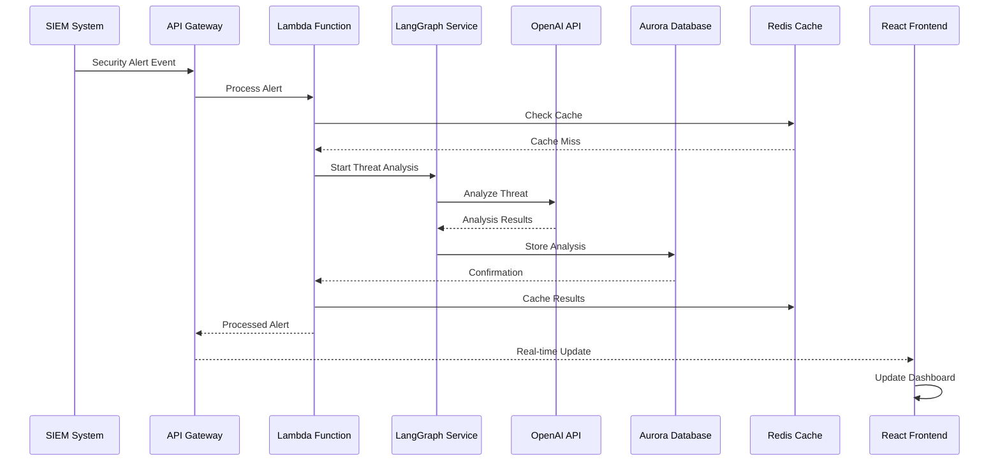
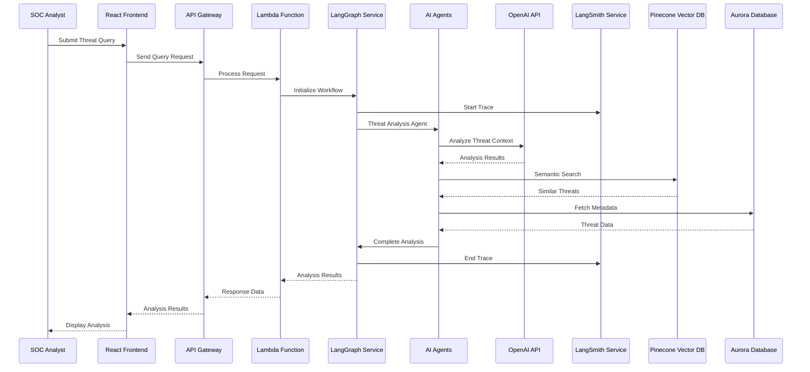
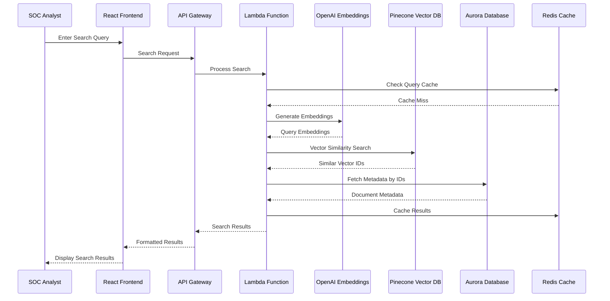
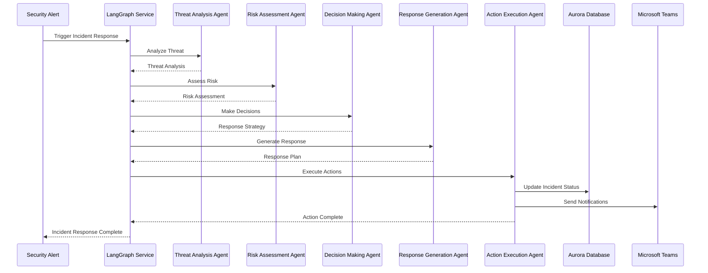

# AI-First SOC Portal - End-to-End Technology Flow Diagram

## 🎯 Complete System Architecture Flow

This document provides a detailed end-to-end flow diagram showing how all technologies in the AI-First SOC Portal work together to process security data and provide intelligent threat analysis.

## 📊 Detailed Technology Flow Diagram

```mermaid
graph TB
    %% User Interface Layer
    subgraph "🎯 User Interface Layer"
        UI[React Frontend<br/>TypeScript + Vite<br/>shadcn/ui + Tailwind]
        AI_Chat[AI Assistant<br/>LangChain + GPT-4o-mini<br/>Real-time Chat]
        Dashboard[SOC Dashboard<br/>Recharts + TanStack Query<br/>Real-time Updates]
        ThreatMap[Threat Map<br/>@xyflow/react<br/>Interactive Visualization]
        Reports[Report Generator<br/>React Hook Form + Zod<br/>Automated Reports]
        Collaboration[Collaboration Panel<br/>Real-time Comments<br/>Multi-tier Workflow]
    end

    %% Authentication & Security Layer
    subgraph "🔐 Authentication & Security Layer"
        Auth[Supabase Auth<br/>JWT Tokens<br/>Multi-factor Auth]
        RBAC[Role-Based Access Control<br/>Multi-tier SOC Roles<br/>Row Level Security]
        HTTPS[HTTPS/TLS<br/>End-to-End Encryption<br/>Secure Transport]
    end

    %% API Gateway Layer
    subgraph "🌐 API Gateway Layer"
        API[API Gateway<br/>REST Endpoints<br/>Rate Limiting]
        CORS[CORS Policy<br/>Security Headers<br/>Request Validation]
        LoadBalancer[Load Balancer<br/>Traffic Distribution<br/>Health Checks]
    end

    %% AI Processing Layer
    subgraph "🧠 AI Processing Layer"
        Lambda[Lambda Functions<br/>Python 3.11<br/>Serverless Compute]
        LangGraph[LangGraph Service<br/>Workflow Orchestration<br/>Multi-agent Coordination]
        LangSmith[LangSmith Service<br/>AI Observability<br/>Performance Monitoring]
        Agents[AI Agents<br/>Threat Analysis Agent<br/>Risk Assessment Agent<br/>Decision Making Agent<br/>Response Generation Agent]
    end

    %% External AI Services
    subgraph "🤖 External AI Services"
        OpenAI[OpenAI API<br/>GPT-4o-mini<br/>Natural Language Processing]
        Embeddings[Text Embeddings<br/>Vector Generation<br/>Semantic Understanding]
        GPT4[GPT-4o-mini<br/>Threat Analysis<br/>Report Generation]
    end

    %% Data Storage Layer
    subgraph "💾 Data Storage Layer"
        Aurora[Aurora Serverless<br/>PostgreSQL + Vector Extension<br/>ACID Compliance]
        Pinecone[Pinecone<br/>Vector Database<br/>Similarity Search]
        Redis[Redis Cache<br/>ElastiCache<br/>Session Storage]
    end

    %% Data Processing Layer
    subgraph "⚡ Data Processing Layer"
        Contextualization[Data Contextualization<br/>LangChain Chains<br/>Context Enrichment]
        Enrichment[Threat Intelligence Enrichment<br/>IOC Processing<br/>Threat Actor Analysis]
        Correlation[Threat Correlation<br/>Pattern Recognition<br/>Attack Chain Analysis]
        AnomalyDetection[Anomaly Detection<br/>ML Models<br/>Behavioral Analysis]
    end

    %% Security Data Sources
    subgraph "🔒 Security Data Sources"
        SIEM[SIEM Systems<br/>Security Events<br/>Log Aggregation]
        SOAR[SOAR Platforms<br/>Incident Data<br/>Response Workflows]
        EDR[EDR Solutions<br/>Endpoint Events<br/>Behavioral Data]
        ThreatIntel[Threat Intelligence Feeds<br/>IOC Data<br/>Threat Actor Intel]
        Network[Network Monitoring<br/>Traffic Analysis<br/>Flow Data]
    end

    %% Evaluation & Monitoring
    subgraph "📊 Evaluation & Monitoring"
        CloudWatch[CloudWatch<br/>Metrics + Logs<br/>Performance Monitoring]
        Teams[Microsoft Teams<br/>Real-time Notifications<br/>Escalation Workflows]
        RAGAS[RAGAS Framework<br/>AI Evaluation<br/>Performance Metrics]
        LIME[LIME + SHAP<br/>Model Explainability<br/>Decision Transparency]
    end

    %% Infrastructure Layer
    subgraph "☁️ AWS Infrastructure"
        VPC[VPC + Security Groups<br/>Network Isolation<br/>Private Subnets]
        IAM[IAM Roles & Policies<br/>Access Control<br/>Least Privilege]
        CloudFormation[CloudFormation<br/>Infrastructure as Code<br/>Automated Deployment]
        Monitoring[CloudWatch<br/>System Monitoring<br/>Alert Management]
    end

    %% Data Flow Connections - User Interactions
    UI --> Auth
    AI_Chat --> Auth
    Dashboard --> Auth
    ThreatMap --> Auth
    Reports --> Auth
    Collaboration --> Auth
    
    Auth --> RBAC
    RBAC --> HTTPS
    
    UI --> API
    AI_Chat --> API
    Dashboard --> API
    ThreatMap --> API
    Reports --> API
    Collaboration --> API
    
    API --> CORS
    CORS --> LoadBalancer
    LoadBalancer --> Lambda
    
    %% AI Processing Flow
    Lambda --> LangGraph
    LangGraph --> Agents
    Agents --> OpenAI
    Agents --> Embeddings
    Agents --> GPT4
    
    LangGraph --> LangSmith
    LangSmith --> CloudWatch
    
    %% Data Storage Flow
    Lambda --> Aurora
    Lambda --> Pinecone
    Lambda --> Redis
    
    Pinecone --> Lambda
    Aurora --> Lambda
    Redis --> Lambda
    
    %% Data Processing Flow
    Lambda --> Contextualization
    Contextualization --> Enrichment
    Enrichment --> Correlation
    Correlation --> AnomalyDetection
    
    %% Security Data Ingestion
    SIEM --> Lambda
    SOAR --> Lambda
    EDR --> Lambda
    ThreatIntel --> Lambda
    Network --> Lambda
    
    %% Monitoring and Evaluation
    Lambda --> CloudWatch
    CloudWatch --> Teams
    Agents --> RAGAS
    Agents --> LIME
    
    %% Infrastructure Management
    VPC --> Lambda
    IAM --> Lambda
    CloudFormation --> VPC
    CloudFormation --> IAM
    Monitoring --> CloudWatch
    
    %% Styling
    classDef frontend fill:#e1f5fe,stroke:#01579b,stroke-width:2px
    classDef auth fill:#f3e5f5,stroke:#4a148c,stroke-width:2px
    classDef api fill:#e8f5e8,stroke:#1b5e20,stroke-width:2px
    classDef ai fill:#fff3e0,stroke:#e65100,stroke-width:2px
    classDef storage fill:#fce4ec,stroke:#880e4f,stroke-width:2px
    classDef processing fill:#f1f8e9,stroke:#33691e,stroke-width:2px
    classDef security fill:#ffebee,stroke:#b71c1c,stroke-width:2px
    classDef monitoring fill:#e0f2f1,stroke:#004d40,stroke-width:2px
    classDef infrastructure fill:#f9fbe7,stroke:#827717,stroke-width:2px
    
    class UI,AI_Chat,Dashboard,ThreatMap,Reports,Collaboration frontend
    class Auth,RBAC,HTTPS auth
    class API,CORS,LoadBalancer api
    class Lambda,LangGraph,LangSmith,Agents,OpenAI,Embeddings,GPT4 ai
    class Aurora,Pinecone,Redis storage
    class Contextualization,Enrichment,Correlation,AnomalyDetection processing
    class SIEM,SOAR,EDR,ThreatIntel,Network security
    class CloudWatch,Teams,RAGAS,LIME monitoring
    class VPC,IAM,CloudFormation,Monitoring infrastructure
```

## 🔄 Detailed Process Flows

### 1. **Real-time Alert Processing Flow**

### 2. **AI-Powered Threat Analysis Flow**

### 3. **Semantic Search Flow**

### 4. **Incident Response Workflow**

## 🎯 Technology Integration Points

### **Frontend-Backend Integration**
- **React Query**: Manages server state and caching
- **API Gateway**: Provides RESTful endpoints
- **WebSocket**: Real-time updates and notifications
- **Authentication**: JWT-based authentication flow

### **AI Model Integration**
- **LangChain**: Orchestrates AI workflows
- **LangGraph**: Manages complex multi-agent workflows
- **LangSmith**: Provides observability and monitoring
- **OpenAI**: Powers natural language processing

### **Data Flow Integration**
- **Vector Search**: Pinecone for semantic similarity
- **Relational Data**: Aurora for structured data
- **Caching**: Redis for performance optimization
- **Real-time**: WebSocket for live updates

### **Security Integration**
- **Authentication**: Supabase Auth with RLS
- **Encryption**: HTTPS/TLS for data in transit
- **Access Control**: Role-based permissions
- **Audit**: Comprehensive logging and monitoring

## 📊 Performance Characteristics

### **Response Times**
- **API Gateway**: < 10ms
- **Lambda Functions**: < 100ms
- **Vector Search**: < 200ms
- **Database Queries**: < 50ms
- **AI Processing**: < 2s

### **Throughput**
- **Concurrent Users**: 1000+
- **API Requests**: 10,000+ per minute
- **Vector Searches**: 1,000+ per second
- **Real-time Updates**: 100+ per second

### **Scalability**
- **Auto-scaling**: Lambda functions scale automatically
- **Database**: Aurora Serverless scales on demand
- **Vector DB**: Pinecone handles millions of vectors
- **Cache**: Redis scales horizontally

---

*This flow diagram represents the complete end-to-end technology architecture of the AI-First SOC Portal, showing how all components work together to provide intelligent security operations capabilities.*
