# AI-First SOC Portal - Technology Stack Analysis

## 🎯 Executive Summary

This document provides a comprehensive analysis of the technology stack used in the AI-First SOC Portal, detailing the rationale behind each technology choice, their specific functionality within the system, and how they work together to create a next-generation security operations center platform.

## 📊 Technology Stack Overview

The AI-First SOC Portal employs a modern, cloud-native architecture built on cutting-edge technologies that enable intelligent automation, real-time threat analysis, and collaborative incident response. The stack is designed for scalability, performance, and security.

---

## 🎨 Frontend Technology Stack

### Core Framework & Build Tools

#### **React 18.3.1** - Component-Based UI Framework
**Why Chosen:**
- **Component Reusability**: Enables building modular, reusable UI components perfect for SOC dashboards
- **Virtual DOM**: Provides optimal performance for real-time data updates and large datasets
- **Rich Ecosystem**: Extensive library ecosystem for security-specific components
- **Developer Experience**: Excellent tooling and debugging capabilities

**Functionality in SOC Portal:**
- Powers all interactive components (AlertFeed, AIAssistant, ThreatMap)
- Enables real-time updates for security alerts and incidents
- Provides responsive design for multi-device access
- Supports complex state management for SOC workflows

#### **TypeScript 5.5.3** - Type-Safe Development
**Why Chosen:**
- **Type Safety**: Prevents runtime errors in critical security operations
- **Better IDE Support**: Enhanced autocomplete and error detection
- **Maintainability**: Easier code maintenance and refactoring
- **Team Collaboration**: Clear interfaces and contracts between components

**Functionality in SOC Portal:**
- Ensures type safety for security data structures (alerts, incidents, threats)
- Provides IntelliSense for API integrations
- Enables compile-time error detection for critical security functions

#### **Vite 5.4.1** - Modern Build Tool
**Why Chosen:**
- **Fast Development**: Lightning-fast hot module replacement
- **Optimized Builds**: Efficient production builds with tree-shaking
- **Modern Standards**: Native ES modules support
- **Plugin Ecosystem**: Rich plugin ecosystem for React and TypeScript

**Functionality in SOC Portal:**
- Enables rapid development and testing of SOC components
- Optimizes bundle size for production deployments
- Provides fast refresh for real-time development

### UI Framework & Design System

#### **shadcn/ui + Radix UI** - Accessible Component Library
**Why Chosen:**
- **Accessibility**: WCAG-compliant components essential for enterprise SOC environments
- **Customization**: Highly customizable design system
- **Performance**: Lightweight, tree-shakeable components
- **Modern Design**: Clean, professional interface suitable for security operations

**Functionality in SOC Portal:**
- Provides consistent, accessible UI components across all SOC interfaces
- Enables rapid development of complex dashboards and forms
- Ensures compliance with accessibility standards for enterprise environments

#### **Tailwind CSS 3.4.11** - Utility-First Styling
**Why Chosen:**
- **Rapid Development**: Quick styling without custom CSS
- **Consistency**: Design system consistency across components
- **Performance**: Purged CSS for optimal bundle size
- **Responsive Design**: Built-in responsive utilities

**Functionality in SOC Portal:**
- Enables rapid styling of SOC-specific components
- Provides consistent design tokens for severity levels (critical, high, medium, low)
- Supports dark theme optimized for 24/7 SOC operations
- Enables responsive design for mobile and tablet access

### State Management & Data Fetching

#### **TanStack Query 5.56.2** - Server State Management
**Why Chosen:**
- **Caching**: Intelligent caching for API responses
- **Background Updates**: Automatic data synchronization
- **Error Handling**: Robust error handling and retry logic
- **Optimistic Updates**: Immediate UI feedback for better UX

**Functionality in SOC Portal:**
- Manages real-time alert and incident data
- Provides intelligent caching for threat intelligence feeds
- Enables background synchronization of security metrics
- Handles offline scenarios gracefully

#### **React Hook Form 7.53.0** - Form Management
**Why Chosen:**
- **Performance**: Minimal re-renders for better performance
- **Validation**: Built-in validation with Zod integration
- **Accessibility**: Accessible form components
- **Developer Experience**: Simple API for complex forms

**Functionality in SOC Portal:**
- Powers incident creation and management forms
- Handles complex alert filtering and search forms
- Provides validation for security data input
- Enables efficient form state management

### Visualization & Charts

#### **Recharts 2.12.7** - Data Visualization
**Why Chosen:**
- **React Integration**: Native React components
- **Responsive**: Automatic responsive behavior
- **Customizable**: Highly customizable charts
- **Performance**: Optimized for large datasets

**Functionality in SOC Portal:**
- Powers KPI dashboards and performance metrics
- Visualizes threat trends and attack patterns
- Displays security posture analytics
- Provides interactive charts for incident analysis

#### **@xyflow/react 12.8.2** - Node-Based Workflows
**Why Chosen:**
- **Workflow Visualization**: Perfect for SOC playbook visualization
- **Interactive**: Drag-and-drop workflow creation
- **Customizable**: Highly customizable nodes and edges
- **Performance**: Optimized for complex workflows

**Functionality in SOC Portal:**
- Visualizes incident response workflows
- Enables drag-and-drop playbook creation
- Shows threat correlation graphs
- Provides interactive workflow management

### Routing & Navigation

#### **React Router DOM 6.26.2** - Client-Side Routing
**Why Chosen:**
- **Declarative**: Declarative routing configuration
- **Nested Routes**: Support for complex nested routes
- **Code Splitting**: Automatic code splitting support
- **History Management**: Flexible history management

**Functionality in SOC Portal:**
- Enables single-page application navigation
- Supports deep linking to specific alerts and incidents
- Provides breadcrumb navigation for complex SOC workflows
- Enables bookmarkable URLs for reports and dashboards

---

## 🖥️ Backend Technology Stack

### Serverless Architecture

#### **AWS Lambda (Python 3.11)** - Serverless Compute
**Why Chosen:**
- **Cost Efficiency**: Pay-per-execution pricing model
- **Auto Scaling**: Automatic scaling based on demand
- **No Infrastructure Management**: Focus on business logic
- **High Availability**: Built-in fault tolerance

**Functionality in SOC Portal:**
- Powers semantic search and AI processing
- Handles real-time alert processing
- Executes automated incident response workflows
- Processes threat intelligence data ingestion

#### **AWS API Gateway** - API Management
**Why Chosen:**
- **RESTful APIs**: Standard REST API endpoints
- **Authentication**: Built-in authentication and authorization
- **Rate Limiting**: Protection against abuse
- **Monitoring**: Comprehensive API monitoring and logging

**Functionality in SOC Portal:**
- Exposes secure APIs for frontend consumption
- Handles authentication and authorization
- Provides rate limiting for security
- Enables API versioning and management

### Database & Storage

#### **Aurora Serverless PostgreSQL** - Primary Database
**Why Chosen:**
- **Serverless**: Automatic scaling and management
- **PostgreSQL**: Rich feature set and extensions
- **Vector Support**: Native vector operations for embeddings
- **High Availability**: Multi-AZ deployment

**Functionality in SOC Portal:**
- Stores alerts, incidents, and user data
- Supports vector embeddings for semantic search
- Provides ACID compliance for critical security data
- Enables complex queries for threat analysis

#### **Pinecone** - Vector Database
**Why Chosen:**
- **Vector Search**: Optimized for similarity search
- **Scalability**: Handles millions of vectors
- **Real-time**: Sub-second search performance
- **Managed Service**: No infrastructure management

**Functionality in SOC Portal:**
- Stores embeddings for semantic search
- Enables similarity search across security data
- Powers AI-powered threat correlation
- Supports real-time vector updates

#### **Redis (ElastiCache)** - Caching Layer
**Why Chosen:**
- **Performance**: Sub-millisecond response times
- **Caching**: Intelligent caching strategies
- **Session Storage**: Reliable session management
- **Pub/Sub**: Real-time messaging capabilities

**Functionality in SOC Portal:**
- Caches frequently accessed security data
- Stores session information and user preferences
- Provides real-time notifications and updates
- Optimizes API response times

### Infrastructure as Code

#### **AWS CloudFormation** - Infrastructure Management
**Why Chosen:**
- **Infrastructure as Code**: Version-controlled infrastructure
- **Repeatability**: Consistent deployments across environments
- **Cost Management**: Resource tagging and cost allocation
- **Compliance**: Audit trails and compliance reporting

**Functionality in SOC Portal:**
- Provisions all AWS resources automatically
- Enables consistent deployments across environments
- Provides disaster recovery capabilities
- Supports compliance and audit requirements

---

## 🤖 AI & Machine Learning Stack

### Core AI Framework

#### **LangChain 0.3.7** - LLM Application Framework
**Why Chosen:**
- **Modularity**: Flexible, modular architecture
- **Integration**: Seamless integration with multiple LLM providers
- **Tools**: Rich ecosystem of tools and utilities
- **Community**: Large, active community and documentation

**Functionality in SOC Portal:**
- Powers AI assistant and threat analysis
- Enables chain-of-thought reasoning for security analysis
- Provides tools for data processing and analysis
- Supports multiple AI models and providers

#### **LangGraph 0.2.50** - Workflow Orchestration
**Why Chosen:**
- **Workflow Management**: Complex multi-agent workflows
- **State Management**: Sophisticated state management
- **Conditional Logic**: Dynamic workflow routing
- **Human-in-the-Loop**: Support for human intervention

**Functionality in SOC Portal:**
- Orchestrates complex SOC workflows
- Manages multi-agent threat analysis
- Enables human-in-the-loop decision making
- Provides workflow visualization and monitoring

#### **LangSmith 0.1.0** - AI Observability
**Why Chosen:**
- **Tracing**: Complete AI operation tracing
- **Monitoring**: Real-time performance monitoring
- **Debugging**: Advanced debugging capabilities
- **Optimization**: Performance optimization insights

**Functionality in SOC Portal:**
- Provides complete observability into AI operations
- Enables performance monitoring and optimization
- Supports debugging and troubleshooting
- Provides analytics and insights

### AI Models & Providers

#### **OpenAI GPT-4o-mini** - Primary LLM
**Why Chosen:**
- **Performance**: High-quality responses for security analysis
- **Cost Efficiency**: Optimized for cost-effective operations
- **Speed**: Fast response times for real-time operations
- **Reliability**: Proven reliability for enterprise use

**Functionality in SOC Portal:**
- Powers AI assistant for threat analysis
- Generates incident reports and recommendations
- Provides natural language processing for security data
- Enables automated threat classification

#### **OpenAI Text Embeddings** - Vector Generation
**Why Chosen:**
- **Quality**: High-quality embeddings for semantic search
- **Consistency**: Consistent embedding generation
- **Scalability**: Handles large-scale embedding generation
- **Integration**: Seamless integration with vector databases

**Functionality in SOC Portal:**
- Generates embeddings for semantic search
- Enables similarity search across security data
- Powers threat correlation and analysis
- Supports automated data classification

### Evaluation & Monitoring

#### **RAGAS** - RAG Evaluation Framework
**Why Chosen:**
- **Standardization**: Industry-standard evaluation metrics
- **Comprehensive**: Multiple evaluation dimensions
- **Automation**: Automated evaluation processes
- **SOC-Specific**: Tailored for security use cases

**Functionality in SOC Portal:**
- Evaluates AI system performance
- Provides metrics for faithfulness, relevancy, and accuracy
- Enables continuous improvement of AI systems
- Supports SOC-specific evaluation scenarios

#### **LIME & SHAP** - Model Explainability
**Why Chosen:**
- **Interpretability**: Explains AI model decisions
- **Transparency**: Provides transparency for security decisions
- **Compliance**: Supports regulatory compliance requirements
- **Trust**: Builds trust in AI systems

**Functionality in SOC Portal:**
- Explains AI threat analysis decisions
- Provides transparency for security recommendations
- Supports compliance and audit requirements
- Builds analyst trust in AI systems

---

## 🔧 Development & DevOps Stack

### Development Tools

#### **ESLint 9.9.0** - Code Quality
**Why Chosen:**
- **Code Quality**: Enforces coding standards
- **Error Prevention**: Catches errors before runtime
- **Consistency**: Ensures consistent code style
- **Team Collaboration**: Shared coding standards

**Functionality in SOC Portal:**
- Maintains code quality across the development team
- Prevents common security-related coding errors
- Ensures consistent code style and patterns
- Supports automated code review processes

#### **TypeScript ESLint** - Type Safety
**Why Chosen:**
- **Type Checking**: Advanced type checking capabilities
- **Rule Customization**: Customizable linting rules
- **Performance**: Optimized for TypeScript projects
- **Integration**: Seamless integration with TypeScript

**Functionality in SOC Portal:**
- Provides advanced type checking for security-critical code
- Enforces type safety best practices
- Prevents type-related runtime errors
- Supports complex type definitions for security data

### Build & Deployment

#### **PostCSS 8.4.47** - CSS Processing
**Why Chosen:**
- **CSS Optimization**: Optimizes CSS for production
- **Plugin Ecosystem**: Rich plugin ecosystem
- **Performance**: Fast CSS processing
- **Standards**: Modern CSS standards support

**Functionality in SOC Portal:**
- Optimizes CSS for production builds
- Provides vendor prefixing and optimization
- Supports modern CSS features
- Enables CSS customization and theming

#### **Autoprefixer** - CSS Compatibility
**Why Chosen:**
- **Browser Compatibility**: Automatic vendor prefixing
- **Maintenance**: Reduces CSS maintenance overhead
- **Standards**: Follows CSS standards
- **Performance**: Optimized for performance

**Functionality in SOC Portal:**
- Ensures cross-browser compatibility
- Reduces CSS maintenance overhead
- Supports modern CSS features across browsers
- Optimizes CSS for performance

---

## 🔒 Security & Authentication Stack

### Authentication & Authorization

#### **Supabase Auth** - User Management
**Why Chosen:**
- **Security**: Enterprise-grade security features
- **Scalability**: Handles large user bases
- **Integration**: Seamless integration with frontend
- **Compliance**: SOC 2 Type II compliant

**Functionality in SOC Portal:**
- Manages user authentication and authorization
- Provides role-based access control
- Enables single sign-on (SSO) integration
- Supports multi-factor authentication

#### **Row Level Security (RLS)** - Data Security
**Why Chosen:**
- **Data Protection**: Row-level data protection
- **Multi-tenancy**: Secure multi-tenant architecture
- **Compliance**: Supports compliance requirements
- **Performance**: Optimized for performance

**Functionality in SOC Portal:**
- Ensures data isolation between users and organizations
- Provides fine-grained access control
- Supports compliance and audit requirements
- Enables secure multi-tenant operations

### Data Protection

#### **HTTPS/TLS** - Transport Security
**Why Chosen:**
- **Encryption**: End-to-end encryption
- **Standards**: Industry-standard security
- **Performance**: Optimized for performance
- **Compliance**: Meets compliance requirements

**Functionality in SOC Portal:**
- Encrypts all data in transit
- Protects sensitive security data
- Ensures secure API communications
- Supports compliance requirements

#### **Database Encryption** - Data at Rest
**Why Chosen:**
- **Data Protection**: Encrypts data at rest
- **Compliance**: Meets compliance requirements
- **Performance**: Minimal performance impact
- **Transparency**: Transparent to applications

**Functionality in SOC Portal:**
- Encrypts all stored security data
- Protects sensitive information
- Supports compliance requirements
- Provides transparent encryption

---

## 📊 Monitoring & Observability Stack

### Application Monitoring

#### **CloudWatch** - AWS Monitoring
**Why Chosen:**
- **Integration**: Native AWS integration
- **Comprehensive**: Complete monitoring coverage
- **Alerting**: Advanced alerting capabilities
- **Cost**: Cost-effective monitoring solution

**Functionality in SOC Portal:**
- Monitors application performance and health
- Provides real-time metrics and logs
- Enables proactive alerting and notifications
- Supports capacity planning and optimization

#### **Microsoft Teams Integration** - Notification System
**Why Chosen:**
- **Integration**: Seamless integration with existing workflows
- **Real-time**: Instant notifications and alerts
- **Collaboration**: Enhanced team collaboration
- **Customization**: Customizable notification channels

**Functionality in SOC Portal:**
- Provides real-time security alerts and notifications
- Enables team collaboration and communication
- Supports escalation workflows
- Integrates with existing SOC workflows

### Performance Monitoring

#### **Custom Metrics** - SOC-Specific Monitoring
**Why Chosen:**
- **Relevance**: SOC-specific metrics and KPIs
- **Customization**: Tailored to security operations
- **Insights**: Actionable insights for improvement
- **Compliance**: Supports compliance reporting

**Functionality in SOC Portal:**
- Tracks SOC-specific KPIs and metrics
- Monitors threat detection and response times
- Provides insights for process improvement
- Supports compliance and audit reporting

---

## 🔄 End-to-End Data Flow Architecture

### Complete System Flow Diagram

```mermaid
graph TB
    %% User Interface Layer
    subgraph "🎯 User Interface Layer"
        UI[React Frontend<br/>TypeScript + Vite]
        AI_Chat[AI Assistant<br/>LangChain + GPT-4o-mini]
        Dashboard[SOC Dashboard<br/>Recharts + Tailwind]
        ThreatMap[Threat Map<br/>@xyflow/react]
        Reports[Report Generator<br/>React Hook Form]
    end

    %% Authentication Layer
    subgraph "🔐 Authentication Layer"
        Auth[Supabase Auth<br/>JWT + RLS]
        RBAC[Role-Based Access<br/>Multi-tier SOC]
    end

    %% API Gateway Layer
    subgraph "🌐 API Gateway Layer"
        API[API Gateway<br/>REST + Rate Limiting]
        CORS[CORS + Security<br/>Headers]
    end

    %% AI Processing Layer
    subgraph "🧠 AI Processing Layer"
        Lambda[Lambda Functions<br/>Python 3.11]
        LangGraph[LangGraph<br/>Workflow Orchestration]
        LangSmith[LangSmith<br/>AI Observability]
        Agents[AI Agents<br/>Threat Analysis]
    end

    %% External AI Services
    subgraph "🤖 External AI Services"
        OpenAI[OpenAI API<br/>GPT-4o-mini + Embeddings]
        Embeddings[Text Embeddings<br/>Vector Generation]
        GPT4[GPT-4o-mini<br/>Natural Language Processing]
    end

    %% Data Storage Layer
    subgraph "💾 Data Storage Layer"
        Aurora[Aurora Serverless<br/>PostgreSQL + Vector]
        Pinecone[Pinecone<br/>Vector Database]
        Redis[Redis Cache<br/>ElastiCache]
    end

    %% Data Processing Layer
    subgraph "⚡ Data Processing Layer"
        Contextualization[Data Contextualization<br/>LangChain]
        Enrichment[Threat Intelligence<br/>Enrichment]
        Correlation[Threat Correlation<br/>LangGraph Agents]
        AnomalyDetection[Anomaly Detection<br/>ML Models]
    end

    %% Security Data Sources
    subgraph "🔒 Security Data Sources"
        SIEM[SIEM Logs<br/>Security Events]
        SOAR[SOAR Incidents<br/>Response Data]
        EDR[EDR Events<br/>Endpoint Data]
        ThreatIntel[Threat Intelligence<br/>Feeds]
        Network[Network Data<br/>Traffic Analysis]
    end

    %% Monitoring & Observability
    subgraph "📊 Monitoring & Observability"
        CloudWatch[CloudWatch<br/>Metrics + Logs]
        Teams[Microsoft Teams<br/>Notifications]
        RAGAS[RAGAS<br/>AI Evaluation]
        LIME[LIME + SHAP<br/>Explainability]
    end

    %% Infrastructure Layer
    subgraph "☁️ AWS Infrastructure"
        VPC[VPC + Security Groups<br/>Network Isolation]
        IAM[IAM Roles & Policies<br/>Access Control]
        CloudFormation[CloudFormation<br/>Infrastructure as Code]
        Monitoring[CloudWatch<br/>Monitoring]
    end

    %% Data Flow Connections
    UI --> Auth
    Auth --> RBAC
    UI --> API
    API --> CORS
    API --> Lambda
    Lambda --> LangGraph
    LangGraph --> Agents
    Agents --> OpenAI
    OpenAI --> Embeddings
    OpenAI --> GPT4
    Lambda --> Pinecone
    Lambda --> Aurora
    Lambda --> Redis
    Pinecone --> Lambda
    Aurora --> Lambda
    Redis --> Lambda
    LangGraph --> LangSmith
    LangSmith --> CloudWatch
    Lambda --> CloudWatch
    CloudWatch --> Teams
    Agents --> RAGAS
    Agents --> LIME
    SIEM --> Lambda
    SOAR --> Lambda
    EDR --> Lambda
    ThreatIntel --> Lambda
    Network --> Lambda
    Lambda --> Contextualization
    Contextualization --> Enrichment
    Enrichment --> Correlation
    Correlation --> AnomalyDetection
    VPC --> Lambda
    IAM --> Lambda
    CloudFormation --> VPC
    CloudFormation --> IAM
    Monitoring --> CloudWatch
```



### Detailed Data Flow Process

#### 1. **Data Ingestion Flow**
```
Security Data Sources → Lambda Functions → Data Validation → Aurora PostgreSQL → Vector Embeddings → Pinecone
```

#### 2. **Real-time Alert Processing**
```
SIEM/SOAR → API Gateway → Lambda → Threat Analysis Agent → Decision Making Agent → Response Generation Agent → Aurora → Redis Cache → Frontend
```

#### 3. **AI-Powered Analysis Flow**
```
User Query → Frontend → API Gateway → Lambda → LangGraph Workflow → OpenAI GPT-4o-mini → LangSmith Tracing → Response → Frontend
```

#### 4. **Semantic Search Flow**
```
Search Query → Frontend → API Gateway → Lambda → OpenAI Embeddings → Pinecone Vector Search → Aurora Metadata → Redis Cache → Frontend
```

#### 5. **Incident Response Workflow**
```
Incident Detection → Correlation Agent → Risk Assessment Agent → Decision Making Agent → Response Generation Agent → Action Execution Agent → Aurora → Notifications
```

---

## 🎯 Technology Selection Rationale

### Why This Stack?

#### **Modern & Future-Proof**
- Built on cutting-edge technologies that will remain relevant for years
- Modular architecture allows for easy technology updates
- Cloud-native design ensures scalability and reliability

#### **Security-First Design**
- Every component chosen with security in mind
- Built-in security features at every layer
- Compliance-ready architecture

#### **Performance Optimized**
- Serverless architecture for cost efficiency
- Intelligent caching strategies
- Optimized for real-time operations

#### **Developer Experience**
- Modern tooling and frameworks
- Excellent documentation and community support
- Rapid development and deployment capabilities

#### **Enterprise Ready**
- Scalable to handle enterprise workloads
- Built-in monitoring and observability
- Compliance and audit capabilities

---

## 🔮 Future Technology Considerations

### Emerging Technologies

#### **Edge Computing**
- Move AI processing closer to data sources
- Reduce latency for real-time threat detection
- Improve resilience and availability

#### **Advanced AI Models**
- Integration with newer, more capable models
- Custom model training on organizational data
- Multi-modal AI capabilities

#### **Enhanced Security**
- Zero-trust architecture implementation
- Advanced threat detection capabilities
- Automated security response

### Scalability Enhancements

#### **Microservices Architecture**
- Break down monolithic components
- Independent scaling and deployment
- Improved fault isolation

#### **Advanced Caching**
- Multi-layer caching strategies
- Intelligent cache invalidation
- Global content delivery

---

## 📚 Conclusion

The AI-First SOC Portal technology stack represents a carefully curated selection of modern, enterprise-grade technologies that work together to create a powerful, scalable, and secure security operations platform. Each technology choice is justified by specific requirements and provides unique value to the overall system.

The stack is designed to:
- **Scale**: Handle enterprise-level workloads and data volumes
- **Perform**: Deliver real-time performance for critical security operations
- **Secure**: Provide comprehensive security at every layer
- **Innovate**: Enable cutting-edge AI capabilities for threat analysis
- **Maintain**: Support long-term maintenance and evolution

This technology foundation provides the platform for continued innovation and enhancement of security operations capabilities, positioning the SOC Portal as a leader in next-generation security operations centers.

---

*Last Updated: Based on comprehensive analysis of the complete technology stack implementation*
